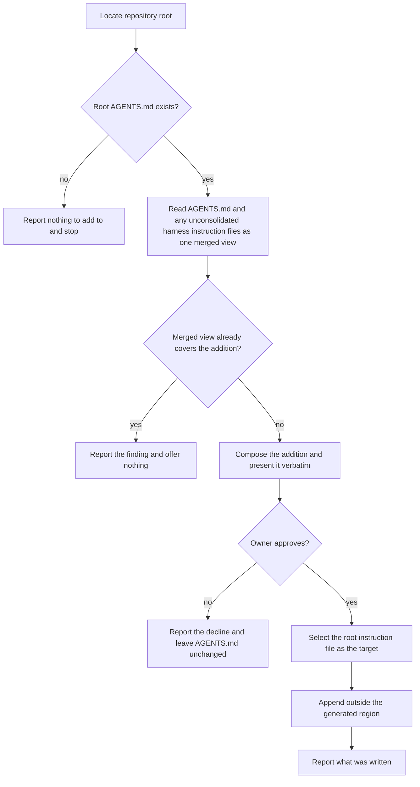
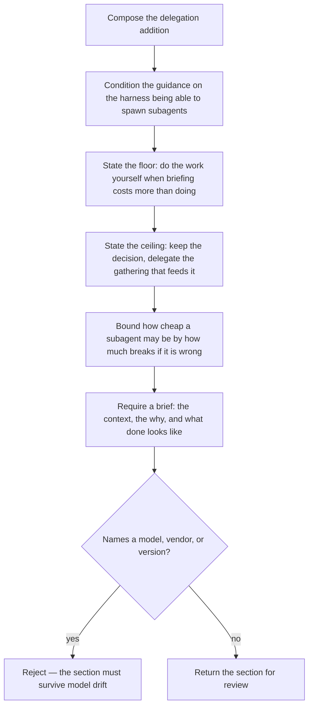

# 35 — drafted spec for `harness-enhance` (paused, not ratified)

Design material for a future SDD mission. **This is not a spec node** — it failed the spec gate
twice and was deliberately kept out of `.agents/spec/` rather than landed half-graded. The
implementation shipped without it; picking the spec work back up starts here.

## Why it paused

Two cold spec-judge rounds returned `ALIGNED: false`. Round 2 carried regression provenance —
one finding recurred inside the fix for itself, and another defect was introduced by a round-1
fix — which stops the grill loop for a re-plan rather than another round. The owner chose to
ship the implementation plainly and revisit the corpus separately.

Root cause of both rounds: the conductor authored inline without loading the oracle, builder,
and architect spec bars. Every finding in round 2 sat inside one of those three unloaded bars.
Any resumed mission should load all seven governances before authoring a line.

## Outstanding blocking findings

1. **Consolidation has no home.** Round 1 had it specified in both `harness-init` and
   `harness-enhance`. The round-2 fix pointed at `harness-init` without checking that node
   specifies it — it does not (no use case, no CFG step, no scenario; only a `When` clause
   mentions it). The seam direction is right: enhance reads, init writes. The write side needs
   specifying in `harness-init` before enhance can reference it.
2. **A sentence of the frozen text has no scenario.** The composing sub-graph covers the
   condition, floor, ceiling, blast radius, and brief — but not "delegate bulk-mechanical work
   and research whose answer is far smaller than the reading behind it." A section reading
   "delegate everything you can" plus the other four sentences passes all six content scenarios.
3. **`opens by conditioning its guidance on the harness having subagents` is false against the
   frozen text.** It claims the opening clause conditions *every instruction below it*; the
   frozen text conditions one sentence. The other four are unconditioned imperatives. Match the
   scenario to the text, not the text to the scenario — the wording is frozen.
4. **The scenario map is not 1:1 in either node.** Uncovered edges: `harness-init`'s `R→S` and
   `R→T`; `harness-enhance`'s `G→H` (verbatim presentation), `K→L` (the post-write report), and
   `S→T` (the drift rejection branch — the regression guard's own negative).
5. **The actor enumeration does not close.** The diff reviewer is named as needing the finding
   reported, but no use case has it as actor and no scenario makes a finding visible to someone
   reading the change. When nothing is written there is no diff at all; the need may be
   unservable by this design.

Cheaper alternative the judge offered for finding 4's init half: cut `R/S/T` and end that graph
at `Q`. The owner's accept/decline is seam-co-owned; init's own decision ends at "offer."

## Deferred observations

- The material/non-material discriminator governs two capabilities but lives only in shipped
  implementation prose; the root spec says such a rule belongs under `design/`, still a stub.
- Node paths skew from the declared `mirror-source` map (`harness-init` vs `skills/init/`).
- `skills/harness-init/` conflates the CLI and the skill; the CLI scenarios belong under `cli/`.
- The plural `addition` abstraction is unbought — one addition exists and every scenario
  hardcodes it.

## Drafted node — `README.md`

````markdown
---
spec-type: behavioral
concept: harness-compatibility
---

# harness-enhance

## What

`harness-enhance` offers additions to a consumer repository's existing canonical instructions. Where `harness-init` consolidates what the repository already has and bridges it to each harness, `harness-enhance` proposes content the repository does not have yet. The two are separate because the opinion is separable: initialization must run everywhere and invent nothing, while an addition is worth having only where its subject is missing.

Every addition is **offered, never written on sight**. An addition asserts something about how the repository is worked in, so it is material under the discriminator the initializer applies — it holds whether or not the tool ever ran — and material content needs approval.

The skill **reads** to decide and **writes only what was approved**. Where harness instruction files still hold content bound for `AGENTS.md`, it reads them alongside `AGENTS.md` as one merged view, because that is the text the agent will eventually see. It does not consolidate them; consolidation belongs to `harness-init` and has one home.

The skill carries one addition today: a `## Delegation` section telling an agent when to hand work to a subagent and how to brief it.

**Actors**

- **invoking agent** — runs the skill, reads the merged instructions, and composes the offer.
- **repository owner** — approves or declines each offer; the only actor whose consent puts material content in `AGENTS.md`.
- **diff reviewer** — reads the resulting change without invoking the skill, and needs the finding reported whether or not anything was written.
- **downstream agent** — every later session that loads `AGENTS.md`; affected by the addition without ever invoking the skill, and the reason the emitted wording must survive model drift.

**Key terms**

- **addition** — a named block of instruction content the skill can offer, with the detection that decides whether offering it makes sense.
- **merged view** — the root `AGENTS.md` together with any harness instruction files whose content still belongs in it; the text detection reads, and the text the downstream agent eventually sees.
- **coverage** — whether the merged view already tells the agent what an addition would tell it, judged by meaning rather than by heading or wording.
- **generated region** — the marked block the initializer maintains for its own bookkeeping; additions are user content and never go inside it.

## Use Cases

| Entry point | Trigger | Inputs | Outcome | Extensions |
| --- | --- | --- | --- | --- |
| the enhance skill | An agent is asked to improve a repository's agent configuration | Consumer root and its merged view | Offers each uncovered addition and writes those the owner approves | no root `AGENTS.md` → report and stop; coverage already present → report and offer nothing; offer declined → report and write nothing |
| the enhance skill | `harness-init` finishes and the owner accepts its offer to continue | Consumer root and its merged view | Same, as the step after initialization | harness instruction files not yet consolidated → read them into the merged view without consolidating |
| composing an addition | An addition is about to be offered for review | The addition's frozen wording | The section text, or a rejection when it would not survive model drift | names a model, vendor, or version → reject rather than offer |

## Control Flow

### Offering an addition



Detection decides every run; there is no first-run path and no memory of a previous decline. A repository whose approved section was later deleted reads as uncovered at `E`, and the addition is offered again — absence is the whole state. Every run reaches a report, at `C`, `F`, `I`, or `L`.

Only the root instruction file is a target at `J`. A nested `AGENTS.md` governs its own subtree, and delegation guidance is not subtree-scoped.

### Composing the delegation addition



Each step of this graph is a property the wording was measured to need. `N` is what lets one shared file serve a harness that has no subagents. `S` is the regression guard: the wording this section replaced named models, and produced a plan assigning work to a model the session could not spawn.

## Scenario map

### the enhance skill

| Edge | Path (Given) | Scenario |
| --- | --- | --- |
| `B` no root AGENTS.md | the repository has no root instruction file | `reports and stops when there is no instruction file to add to` |
| `D` read the merged view | harness instruction files are not yet consolidated | `judges coverage across instructions that are not yet consolidated` |
| `E` uncovered | the merged view lacks the subject | `offers an addition the merged instructions do not already cover` |
| `E` covered | the merged view carries the subject | `withholds an offer the merged instructions already cover` |
| `E` covered | the subject appears under another heading | `judges coverage by meaning rather than by matching words` |
| `F` / `L` report | either outcome | `reports the finding whether or not it offers` |
| `H` approves | the owner approves | `writes the section only after explicit approval` |
| `I` declines | the owner declines | `reports the decline and leaves the instruction file unchanged` |
| `K` append | a generated region exists | `writes the section outside the generated region` |
| `J` select target | a nested instruction file exists | `targets the root instruction file only` |
| `E` every run | the skill offered and was declined before | `reports a detection finding on every invocation` |
| `E` uncovered | an approved section was removed | `offers again once an approved section is removed` |

### composing an addition

| Edge | Path (Given) | Scenario |
| --- | --- | --- |
| `S` drift guard | the offered section | `names no model, vendor, or version` |
| `N` self-gating | the offered section | `opens by conditioning its guidance on the harness having subagents` |
| `O` floor | the offered section | `tells the agent when to do the work itself` |
| `P` ceiling | the offered section | `keeps the decision with the delegating agent` |
| `Q` blast radius | the offered section | `makes how cheap a subagent may be follow from how much breaks` |
| `R` brief | the offered section | `requires every spawned subagent to be briefed` |

## References

- [AGENTS.md](https://agents.md/) defines the open, project-level instruction format the additions are written into.
````

## Drafted suite — `harness-enhance.feature`

````gherkin
Feature: Offer opinionated additions to an existing canonical instruction file

  # ── the enhance skill ──

  @behavior
  Scenario: reports and stops when there is no instruction file to add to
    Given a consumer repository has no root `AGENTS.md`
    When the agent runs the enhance skill
    Then the skill reports that there is nothing to add to and offers no addition

  @behavior
  Scenario: judges coverage across instructions that are not yet consolidated
    Given a consumer repository has harness instruction files whose content belongs in `AGENTS.md`
    When the agent runs the enhance skill before those files have been consolidated
    Then the skill judges coverage across those files and `AGENTS.md` together and consolidates nothing

  @behavior
  Scenario: offers an addition the merged instructions do not already cover
    Given a consumer repository has an `AGENTS.md` with no delegation guidance
    When the agent runs the enhance skill
    Then the skill offers the delegation section

  @behavior
  Scenario: withholds an offer the merged instructions already cover
    Given a consumer repository has an `AGENTS.md` that already tells the agent when to hand work to a subagent
    When the agent runs the enhance skill
    Then the skill offers no delegation section

  @behavior
  Scenario: judges coverage by meaning rather than by matching words
    Given a consumer repository has an `AGENTS.md` covering delegation under a heading other than `Delegation`
    When the agent runs the enhance skill
    Then the skill treats the guidance as present

  @behavior
  Scenario: reports the finding whether or not it offers
    Given a consumer repository has an `AGENTS.md`
    When the agent runs the enhance skill
    Then the skill reports what it read and why it did or did not offer

  @behavior
  Scenario: writes the section only after explicit approval
    Given the enhance skill has offered the delegation section
    When the user approves the offer
    Then the section is appended to the root `AGENTS.md`

  @behavior
  Scenario: reports the decline and leaves the instruction file unchanged
    Given the enhance skill has offered the delegation section
    When the user declines the offer
    Then the skill reports the decline and `AGENTS.md` is unchanged

  @behavior
  Scenario: writes the section outside the generated region
    Given a consumer repository has an `AGENTS.md` containing a generated region
    When the user approves the delegation section
    Then the section is written outside that region and the region is unchanged

  @behavior
  Scenario: targets the root instruction file only
    Given a consumer repository has a root `AGENTS.md` and a nested `AGENTS.md`
    When the user approves the delegation section
    Then only the root file receives the section

  @behavior
  Scenario: reports a detection finding on every invocation
    Given a consumer repository where the enhance skill has already offered and been declined
    When the agent runs the enhance skill again
    Then the skill reports a detection finding for this run

  @behavior
  Scenario: offers again once an approved section is removed
    Given a consumer repository whose `AGENTS.md` had the delegation section and no longer does
    When the agent runs the enhance skill
    Then the skill offers the delegation section

  # ── composing an addition ──

  @behavior
  Scenario: names no model, vendor, or version
    Given the delegation section the enhance skill offers
    When the agent composes it for review
    Then it names no model, no vendor, and no version

  @behavior
  Scenario: opens by conditioning its guidance on the harness having subagents
    Given the delegation section the enhance skill offers
    When the agent composes it for review
    Then it opens with a clause conditioning every instruction below it on the harness being able to spawn subagents

  @behavior
  Scenario: tells the agent when to do the work itself
    Given the delegation section the enhance skill offers
    When the agent composes it for review
    Then it states that work costing less to do than to brief is done by the agent itself

  @behavior
  Scenario: keeps the decision with the delegating agent
    Given the delegation section the enhance skill offers
    When the agent composes it for review
    Then it states that the judgment calls and the final decision are kept and the gathering that feeds them is delegated

  @behavior
  Scenario: makes how cheap a subagent may be follow from how much breaks
    Given the delegation section the enhance skill offers
    When the agent composes it for review
    Then it states that the cheaper the subagent, the less should break if its answer is wrong

  @behavior
  Scenario: requires every spawned subagent to be briefed
    Given the delegation section the enhance skill offers
    When the agent composes it for review
    Then it requires the context, the why, and what done looks like for each subagent spawned
````
