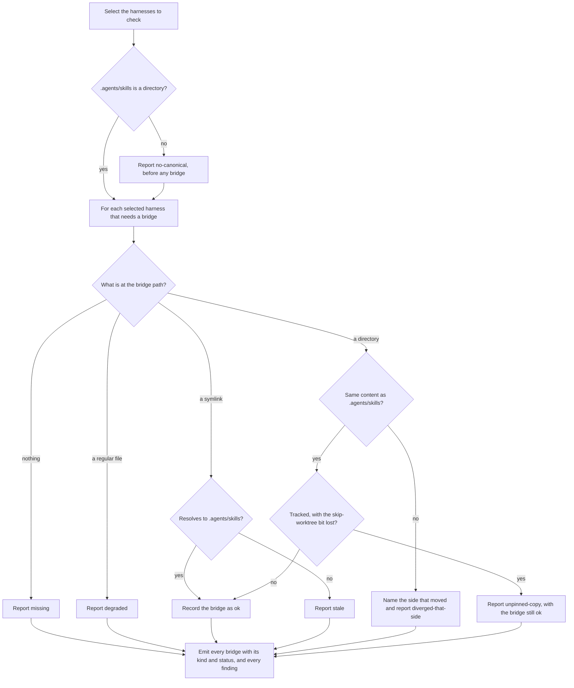

# bridge-resolution

## What

The `doctor` command's oldest half: reporting whether every **skills bridge** this repository needs still **resolves into `.agents/skills`**.

A harness that cannot read the canonical skills directory is given a projection pointing at it — `.claude/skills` is the shipped case. When that projection stops resolving, nothing says so. The harness finds no directory, or finds one holding something other than the canonical skills, and loads zero project skills without a warning anywhere. Every fault here is that silence made visible.

It exists because the failure is **invisible at the point of use**. A person who has just cloned a repository on Windows sees a `.claude/skills` entry in their file listing and has no reason to doubt it; it is a regular file holding the text `../.agents/skills`, and their agent has loaded nothing. The command's job is to name that, and to name it in a form its caller can act on without reading the file itself.

**Resolution is a question about the path, not about the content.** Whether a skill under `.agents/skills` is well-formed is the configuration sibling's; whether a harness can *reach* `.agents/skills` through this path is here. The two are separable in exactly one direction: a bridge can resolve perfectly into a directory full of skills no harness will load, which is why both halves exist and why neither subsumes the other.

**Key terms**

- **skills bridge** — the projection a harness needs at its own path in order to see `.agents/skills`. Repository-relative, as the registry declares it.
- **canonical skills directory** — `.agents/skills`, the one directory every bridge points at.
- **resolves** — the harness reading through this path reaches the canonical skills directory and sees what it holds.
- **bridge problem** — one named way a bridge fails to resolve, or resolves and is still unsafe: `no-canonical`, `missing`, `degraded`, `stale`, `diverged-bridge`, `diverged-canonical`, `diverged-both`, `diverged-unknown`, `unpinned-copy`.
- **divergence direction** — which side of a copied bridge moved since the newest commit where the two held identical content: `bridge`, `canonical`, `both`, or `unknown`.

**Non-goals**

- **Repairing.** The command never writes. No repair here is the command's to perform, and which surface owns each one is `../../workflows/detect-and-repair/`'s — six of the nine name the `init` skill, and three name nobody.
- **Judging what a bridge contains.** A resolving bridge full of skills no harness will load is the configuration sibling's finding, at `../configuration-diagnosis/`. Nothing here reads a `SKILL.md`.
- **Instruction bridges.** `AGENTS.md` is reached by a different mechanism with its own status vocabulary; it is `../instruction-bridges/`.
- **The shape of the report.** Which sections exist and what a finding row carries is `../diagnosis-report/`. This node decides *what is wrong*, not *how it is said*.
- **User-scope bridges.** The registry records what each harness needs in the user's home directory. `doctor` diagnoses a repository, and never looks outside it.
- **Choosing a repair between two good ones.** Where the newer edit lives on a two-sided divergence is not decidable from the filesystem, and the command declines rather than picking.

## Use Cases

**Actors**

- **`doctor` skill** — presents the report to an agent and routes each finding to the skill that owns its repair.
- **person at a shell** — runs the command after a clone that "did not work" and reads what is wrong.
- **session-start hook** — runs the command unattended at the start of every session; affected by the outcome without reading it, and the reason the command must never write.
- **`repair` skill** — reads the findings and hands every one of these on to `init`. It is an actor here only in that this node's findings must be **recognisable as bridge findings** without being repaired.
- **`init` skill** — owns the repair for every problem here that rebuilding the bridge fixes, which is six of the nine.

**Goals, and where each is served**

| Actor | Goal | Entry point |
| --- | --- | --- |
| `doctor` skill | learn which bridges do not resolve, and hand each to the skill that rebuilds it | `buddy-agent-harness doctor` |
| person at a shell | find out why a freshly cloned repository loads no skills | `buddy-agent-harness doctor --format text` |
| session-start hook | learn of a broken bridge with no risk of a write | `buddy-agent-harness doctor` |
| `repair` skill | tell a bridge finding from one it owns, without inspecting the bridge | the `problem` name each finding carries |
| `init` skill | be named as the owner of the repairs rebuilding fixes | the repair each finding carries |

**Entry point**

| Entry point | Trigger | Inputs | Outcome |
| --- | --- | --- | --- |
| `buddy-agent-harness doctor` | a caller asks whether this repository's skills bridges still resolve | the repository root, and the harnesses to check | every enabled harness's bridge reported with its `kind` and `status`, and a finding for each that does not resolve or resolves unsafely |

**Surface**

This capability binds **`--harness`**, which its configuration sibling deliberately ignores. Naming a harness that has no directory on disk is a legitimate request here, and legitimately produces a `missing` finding: the caller is asking to be told the bridge is absent. A harness is checked when it is one of the two defaults, when `--harness` names it, or when its own detection directory is present.

A harness that reads `.agents/skills` natively has **no bridge**, and is neither reported nor projected into. It is not a silent omission — it is the registry answering that this harness needs nothing.

`--root` and `--format` are honored, and belong to `../diagnosis-report/` rather than here.

**Extensions**

- **The canonical directory does not exist.** Reported **once**, before the bridges, because no bridge can resolve into a directory that is not there. The bridges are still inspected and still reported: a caller learns the whole shape of the repository from one run, not the first thing wrong with it.
- **The repository is not a git repository.** Divergence direction cannot be established and reads `unknown`; the skip-worktree question cannot be asked, so `unpinned-copy` is not reported. Both degrade to "cannot tell" rather than throwing, so the command still answers on a tarball or a worktree without git.
- **A copy is in sync.** Not a fault. It is what `init --copy` produces, and the only thing said about it is whether the git index still protects it.
- **A symlink written as an absolute path.** Resolves, so it is `ok`. The bridge is judged by where it lands, never by how it is spelled.
- **A symlink whose target no longer exists.** Does not resolve, so it is `stale` — the same finding as one pointing at the wrong place, because the caller's repair is the same.

## Control Flow

Each bridge is inspected independently, so one run reports as many faults as it finds. No branch writes, and a branch that cannot answer reports the "cannot tell" value rather than guessing.

## Scenario map

### `buddy-agent-harness doctor`

| Edge | Path (Given) | Scenario |
| --- | --- | --- |
| A→D | a harness that reads the canonical directory itself | `reports a resolving symlink and leaves harnesses that read the canonical directory out` |
| A→D | `--harness` names harnesses beyond the defaults | `checks every bridge the requested harnesses add` |
| A→D | a requested harness that needs no projection | `adds no bridge for a harness that reads the canonical directory itself` |
| B→C | no `.agents/skills` directory | `reports a missing canonical directory once, before the bridges` |
| C→D | no `.agents/skills` directory and a bridge on disk | `reads a bridge against a canonical directory that is not there` |
| E→F | nothing at the bridge path | `reports an absent bridge as missing` |
| E→G | a regular file holding the target path | `detects a symlink checked out as a regular file and names the copy repair` |
| H→I | a symlink resolving to the canonical directory | `reports a resolving symlink and leaves harnesses that read the canonical directory out` |
| H→I | a symlink written as an absolute path | `reports a symlink written as an absolute path as resolving` |
| H→K | a symlink pointing elsewhere | `reports a symlink pointing somewhere other than the canonical directory` |
| H→K | a symlink whose target no longer exists | `reports a correctly named symlink whose target no longer exists` |
| J→L | only the bridge moved | `names the bridge when only the bridge moved` |
| J→L | only the canonical directory moved | `names the canonical directory when only it moved` |
| J→L | both sides moved | `refuses to guess when both sides moved` |
| J→L | a file added to the bridge | `detects an added file in the bridge as movement on the bridge side` |
| J→L | no commit where the two agreed | `reports an unknown direction when git records no commit where the two agreed` |
| J→L | a repository with no commits | `reports an unknown direction in a repository with no commits at all` |
| J→L | the two paths were never committed together | `reports an unknown direction when the two paths were never committed together` |
| J→L | only one side appears in history | `reports an unknown direction when only one side is present in history` |
| J→L | a copy differing only in file names | `flags a copy that differs only in file names` |
| J→L | a copy holding a different number of files | `flags a copy holding a different number of files` |
| M→N | a tracked copy whose skip-worktree bit was cleared | `reports a tracked copy whose skip-worktree bit has been lost, and clears it once set` |
| M→I | an untracked copy inside a repository | `leaves an untracked copy inside a repository alone` |
| M→I | an in-sync copy outside a git repository | `accepts an in-sync copy outside a repository without flagging the skip-worktree bit` |
| L→O | a diverged bridge | `names which side moved for every diverged bridge` |

## References

- `../../../../src/skill-projection/skill-projection.ts` backs the resolution test: `linksTo` compares **resolved** paths, which is why an absolute link, a Windows junction, and a link reached through a symlinked parent all read as resolving. It is the same test `init` uses to decide a projection is already correct, so a bridge `init` would leave alone never reports as one `doctor` wants rebuilt.
- `../../../../src/harness-registry/harness-registry.ts` is the source of which harnesses need a bridge at all. Gemini CLI lost its projection at E-GEM-02 because it reads the `.agents/skills` alias at project scope; it still needs an instruction bridge, which is the sibling node's.
- `.research/agentic-configuration-standards/` carries the per-harness sources behind that registry.
