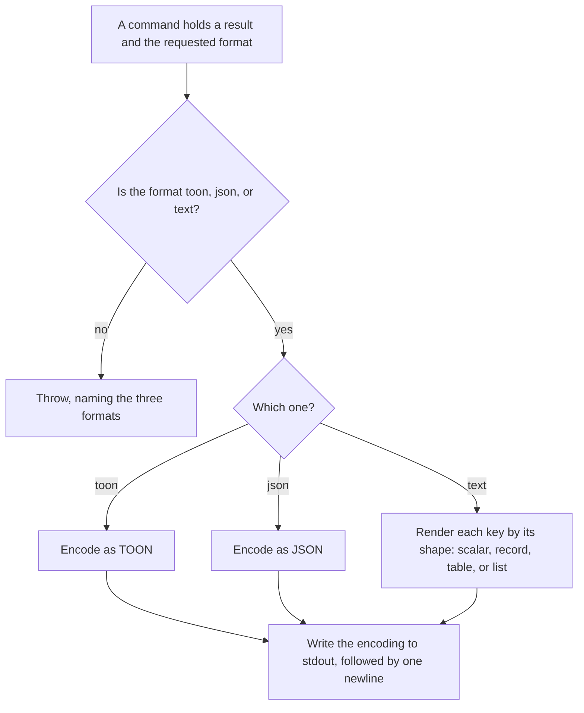
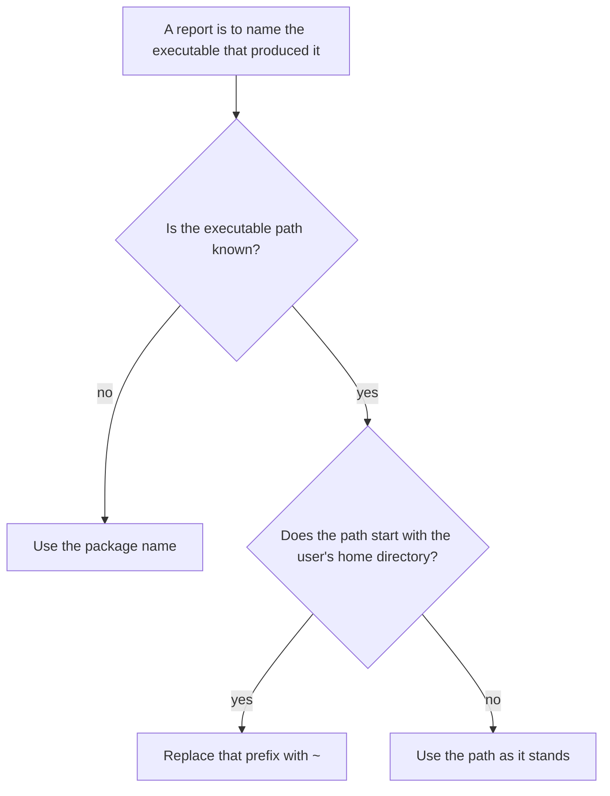

# command-output

## What

How a command's result becomes the **bytes on stdout**.

Both commands the package publishes end the same way: they build a plain object and hand it here. `../diagnosis-report/` says what `doctor`'s object holds and `../../skills/harness-init/` says what `init`'s holds; neither says how either becomes text, and the answer is the same code for both. A layer both commands write through belongs to neither of them, which is the whole argument for the node — the alternative is one command's node quietly specifying the other's output.

**It is one boundary, deliberately.** Internal logic stays on plain objects and nothing below the command touches stdout, so a caller that is not a process can run the whole command and get a value back rather than a stream (`../entry-point/`). Adding a second place that writes would put a line of some other shape in the middle of what an agent is parsing.

**The default consumer is a program.** TOON is the default because an agent parses it, JSON is for everything else, and text exists for reading over someone's shoulder. That ordering is why an unsupported format is an **error** rather than a fallback: a caller that misspelled `--format` and got TOON anyway would parse the wrong thing and never learn why. One function decides that for both commands, which is why the refusal is specified here and the format list a given command advertises is that command's.

**Text is rendered from the shape, not from the report.** The renderer knows nothing about findings, bridges, or harnesses. It knows four shapes — a scalar, a nested record, a list of records, a list of primitives — and renders each one way. A field added to `doctor`'s report therefore renders without this layer being touched, which is the same property `../diagnosis-report/` exists to protect one level up.

**Key terms**

- **result** — the plain object a command built: the thing to be encoded, whatever it holds.
- **format** — one of `toon`, `json`, `text`. Nothing else is a format, including the absence of a value.
- **block** — what one top-level key of the result renders as in text: one line, or several.
- **cell** — one column's value in one row of a rendered table. A row that lacks the column has an empty one.
- **executable path** — the absolute path of the binary that ran, with the user's home directory collapsed to `~`. What `doctor` reports as `bin`.

**Non-goals**

- **What the result holds.** `../diagnosis-report/` for `doctor`'s, `../../skills/harness-init/` for `init`'s. Nothing here reads a key by name.
- **Which formats a command advertises, and its default.** The command's own surface. What is stated here is that the set is `toon`, `json`, `text`, that it is the same set for both, and that anything outside it is refused.
- **The TOON grammar.** Supplied by `@toon-format/toon`. This node owns which encoder is called with what, never how TOON itself is spelled.
- **The exit code, and where an error line goes.** A rejected format throws; that the command catches it, writes to stderr, and exits non-zero is `../entry-point/`'s and the command's.
- **Being reachable as data.** The layer is not on the package's public surface. A consumer that wants the report rather than the bytes uses the exported report builder — `../entry-point/`.

## Use Cases

**Actors**

- **`doctor` command and `init` command** — the only callers of the encoder. They hand over a result and a format string and write nothing themselves. The executable path is asked for by `doctor` alone today, because it is the only report that names the binary that produced it; it lives here because collapsing a path is a formatting decision rather than a diagnostic one.
- **`doctor` skill** — parses the default TOON output. The consumer the default exists for, and the reason an unknown format is not quietly satisfied.
- **person at a shell** — reads `--format text`, and is the only reason the text renderer exists at all. Also the reader who has to **act on** a report produced somewhere else: a path carrying someone's home directory is one they cannot paste, and a report naming no binary at all is one they cannot reproduce.
- **another program** — reads `--format json`, and needs the stream to hold the encoded result and nothing else.

**Goals, and where each is served**

| Actor | Goal | Entry point |
| --- | --- | --- |
| both commands | encode a result without knowing how any format is spelled | the result and the format |
| `doctor` skill | parse one document per run, in the format it asked for | the encoded line on stdout |
| person at a shell | read the same result as aligned columns rather than as a wire format | `--format text` |
| another program | never be handed a format it did not ask for | the refusal of an unsupported format |
| person at a shell | rerun what produced a report they were handed, without editing someone's home directory out of the path first | the executable path in the report |

**Entry point**

| Entry point | Trigger | Inputs | Outcome |
| --- | --- | --- | --- |
| a command writing its result | a command has finished its work and holds the object to report | the result object and the requested format | one encoded document written to stdout, followed by a newline |
| a command naming the binary that ran | a reader needs to rerun what produced a report, on a machine that may not be theirs | the user's home directory and the executable path | a path they can paste: the home directory collapsed to `~`, and never an empty field |

Each entry point enters its own sub-graph in `## Control Flow`: the first *Writing a result*, the second *Naming the binary that ran*.

**Surface**

Three things, and nothing else crosses the boundary: the **format check**, which answers with a format or throws; the **write**, which encodes a result and puts it on stdout; and the **executable path**, which collapses a home directory. There is no option, no configuration, and no state.

**How each shape renders as text**

- A **scalar** is `key: value`. A **nested record** is its key and its JSON on one line, because a person reading over someone's shoulder is better served by one honest line than by a layout the renderer invented for it.
- A **list of records** is a header row and one row per record, every column padded to its widest cell. The columns are the union of the keys the rows carry, so a record missing one leaves a blank cell rather than shifting the row left.
- A **list of primitives** is a bulleted line each. An **empty list** is `key: (none)` — the same reasoning as the healthy answer in `../diagnosis-report/`: a key with nothing after it reads as a bug, and the reader should not have to decide which.
- A **blank line** separates a multi-line block from its neighbours. Without it, a scalar printed after a table reads as one more row of that table.

**Extensions**

- **The format is not one of the three.** An error, never a silent fallback — and the same for an absent value, which is not the same thing as the command's default.
- **A record in a list carries a key the others do not.** The column exists for every row; the rows that lack it carry a blank cell.
- **A value is `undefined` in a cell.** Rendered as nothing rather than as the word.
- **The executable is not known.** The package name stands in, so the report still names something rather than carrying an empty field.
- **The executable is outside the user's home directory, or there is no home directory to collapse.** The path is written as it is.

## Control Flow

Two entry points with genuinely different decisions, so one sub-graph each.

### Writing a result

### Naming the binary that ran

`Q`'s known-path branch carries no outcome of its own — it is settled one decision later at `S` — so the two rows there cover it rather than a row of its own manufacturing a distinction the code does not make.

The two graphs never meet, and that is the point: the path is collapsed **before** the result is built rather than while it is encoded, so it is a value in the result like any other and the encoder never reads a key by name. A run with no home directory to collapse takes the same branch as a path outside it — there is no prefix to match, which is one decision rather than two.

## Scenario map

### a command writing its result

| Edge | Path (Given) | Scenario |
| --- | --- | --- |
| B→D | each supported format | `accepts every supported format` |
| B→C | a value outside the set, and no value at all | `rejects anything else rather than falling back silently` |
| E, F, H | one result and each format in turn | `encodes TOON, JSON, and text on stdout` |
| G | a list of records under one key | `aligns a list of records into a table under its key` |
| G | a record missing a column its neighbour carries | `leaves a cell blank where a record is missing that column` |
| G | a list of strings, and an empty list | `bullets a list of primitives and marks an empty one` |
| G | a number, a boolean, and a nested record | `renders scalars as key and value, and a nested object as JSON` |
| G | a table between two scalars | `separates a multi-line block from its neighbours but keeps scalars together` |

### a command naming the binary that ran

| Edge | Path (Given) | Scenario |
| --- | --- | --- |
| S→T | an executable under the user's home directory | `collapses the home directory` |
| S→U | an executable elsewhere, and a run with no home directory | `leaves a path outside the home directory alone` |
| Q→R | no executable path at all | `falls back to the package name when the executable is unknown` |

## References

- `../../../../src/command-output/command-output.ts` is the whole layer: the format check, the stdout write, the text renderer, and the home collapse.
- `../diagnosis-report/` states which of these formats `doctor` advertises and why the healthy answer is stated outright rather than left empty; this node states how any of it is encoded.
- AXI §10 backs the home collapse: a path that embeds a username is one a reader cannot paste back.
