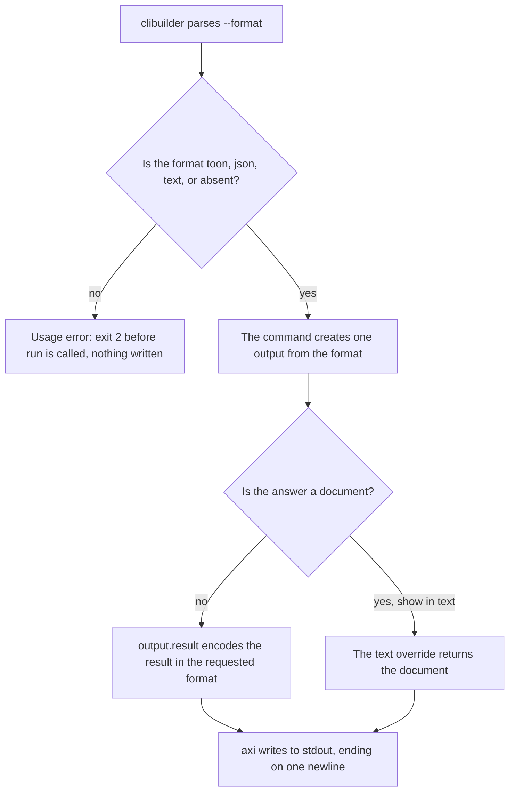
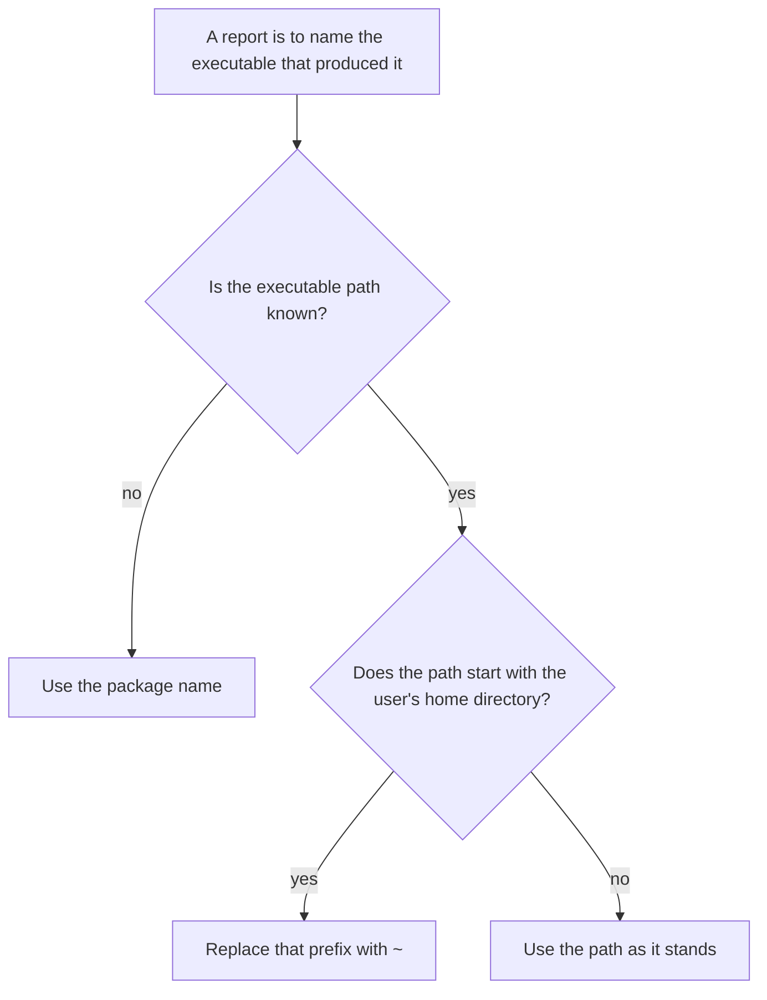

# command-output

## What

How a command's result becomes the **bytes on stdout**.

Every command the package publishes ends the same way: it builds a plain object and hands it to one output. `../diagnosis-report/` says what `doctor`'s object holds and `../../skills/harness-init/` says what `init`'s holds; neither says how either becomes text, and the answer is the same call for every command. A layer all commands write through belongs to none of them, which is the whole argument for the node — the alternative is one command's node quietly specifying the others' output.

**It is one boundary, deliberately.** Internal logic stays on plain objects and nothing below the command touches stdout, so a caller that is not a process can run the whole command and get a value back rather than a stream (`../entry-point/`). Adding a second place that writes would put a line of some other shape in the middle of what an agent is parsing.

**The boundary is this module, not one function in it.** A command has two things it can have to say. Most have a **result**: a plain object, encoded in the requested format. One has a **document**: a governance (`../governance-overrides/`), which already is the answer and is written exactly as it was read, because a Markdown body run through TOON or through the text renderer comes back as one escaped line. Both writes go through axi's output and a run makes exactly one of them, which is what keeps the property the paragraph above is about.

**The default consumer is a program.** TOON is the default because an agent parses it, JSON is for everything else, and text exists for reading over someone's shoulder. That ordering is why an unsupported format is an **error** rather than a fallback: a caller that misspelled `--format` and got TOON anyway would parse the wrong thing and never learn why. The refusal is a **usage error**: every command declares the same `--format` option, so clibuilder rejects an unknown value with exit code 2 before the command's `run` is called: no report is written, only clibuilder's usage text.

**The encoding is not this node's.** `@clibuilder/axi` supplies the TOON and JSON encoding, the text renderer, the format list, the refusal, and both writes. This node owns which axi call a command makes, never how anything is encoded: a command builds its plain object, creates one output from its `--format`, and hands the object to it.

**Key terms**

- **result** — the plain object a command built: the thing to be encoded, whatever it holds.
- **document** — text that is already the answer, written verbatim rather than encoded.
- **format** — one of `toon`, `json`, `text`. Nothing else is a format, including the absence of a value.
- **executable path** — the absolute path of the binary that ran, with the user's home directory collapsed to `~`. What `doctor` reports as `bin`.

**Non-goals**

- **What the result holds.** `../diagnosis-report/` for `doctor`'s, `../../skills/harness-init/` for `init`'s. Nothing here reads a key by name.
- **A command's default format.** The command's own surface. What is stated here is that the set is `toon`, `json`, `text` for every command and that anything outside it is a usage error.
- **How anything is encoded or rendered.** The TOON grammar, JSON, the text renderer's tables and bullets, and the stdout writes are supplied by `@clibuilder/axi`. This node owns which axi call a command makes, never how it encodes.
- **Applying the exit code.** That the usage code 2 reaches the process is `../entry-point/`'s.
- **Being reachable as data.** The layer is not on the package's public surface. A consumer that wants the report rather than the bytes uses the exported report builder — `../entry-point/`.

## Use Cases

**Actors**

- **every command** — `doctor`, `init`, `mcp`, `dep-plugins`, and `governance`. They hand a result to the output built from their `--format` and write nothing themselves. The executable path is asked for by `doctor` alone today, because it is the only report that names the binary that produced it; it lives here because collapsing a path is a formatting decision rather than a diagnostic one.
- **`doctor-buddy-agent-harness` skill** — parses the default TOON output. The consumer the default exists for, and the reason an unknown format is not quietly satisfied.
- **person at a shell** — reads `--format text`. Also the reader who has to **act on** a report produced somewhere else: a path carrying someone's home directory is one they cannot paste, and a report naming no binary at all is one they cannot reproduce.
- **another program** — reads `--format json`, and needs the stream to hold the encoded result and nothing else.
- **`governance show`** — the one caller with a document rather than a result: it overrides the text renderer so the document is written verbatim. What it puts on stdout is what an agent is about to follow, so nothing may be added to it or escaped inside it.

**Goals, and where each is served**

| Actor | Goal | Entry point |
| --- | --- | --- |
| every command | write a result without knowing how any format is spelled | the output built from `--format` |
| `doctor-buddy-agent-harness` skill | parse one document per run, in the format it asked for | the encoded line on stdout |
| another program | never be handed a format it did not ask for | the usage error for an unsupported format |
| `governance show` | hand over a Markdown document unchanged | the text override that writes the document |
| person at a shell | rerun what produced a report they were handed, without editing someone's home directory out of the path first | the executable path in the report |

**Entry point**

| Entry point | Trigger | Inputs | Outcome |
| --- | --- | --- | --- |
| a command writing its result | a command has finished its work and holds the object to report | the result object and the requested format | one encoded document written to stdout through axi, followed by a newline |
| a command writing a document | a command's whole answer is text that was already written, and encoding it would damage it | the document, as the text override of the result | the text written to stdout exactly as it stands, ending on a newline |
| a command naming the binary that ran | a reader needs to rerun what produced a report, on a machine that may not be theirs | the user's home directory and the executable path | a path they can paste: the home directory collapsed to `~`, and never an empty field |

Each entry point enters a sub-graph in `## Control Flow`: the first two *Writing a result or a document*, the third *Naming the binary that ran*.

**Surface**

Two things live here, and nothing else crosses the boundary: the **axi call** each command makes (an output created from `--format`, then one `result`), with `governance show` passing a text override so its document is written as it stands; and the **home collapse**, which shortens a path under the user's home directory. There is no option, no configuration, and no state.

The home collapse is one function used twice: `doctor` asks for it for the executable that produced a report, where an unknown path falls back to the package name, and `../governance-overrides/` asks for it for the layer directories it reports. The fallback belongs to the executable, not to the collapse.

**Extensions**

- **A document does not end in a newline.** axi's document write adds one, so the stream ends where a reader expects and a shell prompt does not land mid-line.
- **The format is not one of the three.** A usage error, never a silent fallback: clibuilder exits with code 2 before `run` is called and nothing is written. An absent value is not an error; it selects the command's default.
- **The executable is not known.** The package name stands in, so the report still names something rather than carrying an empty field.
- **The executable is outside the user's home directory, or there is no home directory to collapse.** The path is written as it is.

## Control Flow

Two sub-graphs, because the decisions are genuinely different. The result path and the document path share the one output and its write, which is the point of a single boundary.

### Writing a result or a document

```mermaid
flowchart TD
  A[clibuilder parses --format] --> B{Is the format toon, json, text, or absent?}
  B -->|no| C[Usage error: exit 2 before run is called, nothing written]
  B -->|yes| D[The command creates one output from the format]
  D --> E{Is the answer a document?}
  E -->|no| F[output.result encodes the result in the requested format]
  E -->|yes, show in text| G[The text override returns the document]
  F --> H[axi writes to stdout, ending on one newline]
  G --> H
```

### Naming the binary that ran

```mermaid
flowchart TD
  P[A report is to name the executable that produced it] --> Q{Is the executable path known?}
  Q -->|no| R[Use the package name]
  Q -->|yes| S{Does the path start with the user's home directory?}
  S -->|yes| T[Replace that prefix with ~]
  S -->|no| U[Use the path as it stands]
```

The document path is chosen by the format: `show`'s `text` renderer returns the document, which axi writes as it stands, while its other two formats encode the wrapped report. Nothing else in this node reads the format.

`Q`'s known-path branch carries no outcome of its own — it is settled one decision later at `S` — so the two rows there cover it rather than a row of its own manufacturing a distinction the code does not make.

The two graphs never meet, and that is the point: the path is collapsed **before** the result is built rather than while it is encoded, so it is a value in the result like any other and no encoder reads a key by name. A run with no home directory to collapse takes the same branch as a path outside it — there is no prefix to match, which is one decision rather than two.

## Scenario map

### a command writing its result

| Edge | Path (Given) | Scenario |
| --- | --- | --- |
| B→C | an unknown `--format` value | `applies a rejected invocation's usage code to the process` (`../entry-point/`) |
| G, H | `governance show` in text | `writes the document itself, and nothing else, by default` (`../governance-overrides/`) |

### a command naming the binary that ran

| Edge | Path (Given) | Scenario |
| --- | --- | --- |
| S→T | an executable under the user's home directory | `collapses the home directory` |
| S→U | an executable elsewhere, and a run with no home directory | `leaves a path outside the home directory alone` |
| Q→R | no executable path at all | `falls back to the package name when the executable is unknown` |
| S→T, S→U | a path that is not an executable | `collapses the home directory out of any path, not only the executable` |

## References

- `../../../../src/command-output/command-output.ts` holds the home collapse and the executable path; the format option, the encoding, the text renderer, and both writes come from `@clibuilder/axi`.
- `../entry-point/` applies the usage code clibuilder returns for a rejected format.
- `../governance-overrides/` is the caller of the document write, and states why a governance is written rather than encoded.
- `../diagnosis-report/` states why the healthy answer is stated outright rather than left empty; this node states which axi call carries it.
- AXI §10 backs the home collapse: a path that embeds a username is one a reader cannot paste back.
