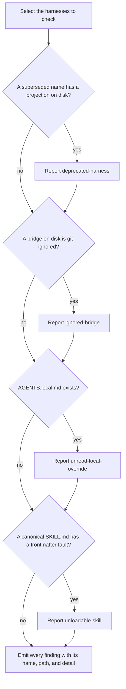

# configuration-diagnosis

## What

The `doctor` command's second half: reporting agent configuration that is **present and wrong**, as against a bridge that no longer resolves.

`doctor` already answers "does this bridge still resolve into `.agents/skills`?" This capability answers a different question about the same repository — "is the configuration around those bridges still right?" A retired harness name, an instruction file that never reaches `AGENTS.md`, a bridge the repository git-ignores, a local-override file no harness reads, a skill whose frontmatter makes every harness skip it. Each of these resolves fine, and each is still wrong.

It exists so that **detection has one home** — the property is `../../workflows/detect-and-repair/`'s, which owns the seam between the surface that finds and the surfaces that write.

What separates this capability from its two siblings is that every fault here repairs through **`repair`**, uniformly. Neither sibling family is uniform in the same way, and the mapping is the seam node's to state.

**Non-goals**

- **Repairing.** The command never writes. Each finding carries the repair as text, for a person at a shell or for the `repair` skill to act on.
- **Offering a command for a fault here.** Every fault in this family is present-and-wrong configuration a person authored, so correcting one is judgment. None of them carries a runnable command, and inventing one would be worse than carrying none.
- **Bridge resolution.** Whether a bridge resolves is the sibling capability's, at `../bridge-resolution/`; whether a harness can read `AGENTS.md` is `../instruction-bridges/`.
- **The shape of the report.** Which sections exist and what a finding row carries is `../diagnosis-report/`.
- **Judging content.** Whether an instruction is *good* is nobody's business here. Every fault below is decidable by reading the file, never by weighing what it says.
- **Reporting absence.** Configuration that does not exist is `init`'s to create. Every fault here is something present.

**Key terms**

- **configuration fault** — one named way present configuration is wrong: `deprecated-harness`, `ignored-bridge`, `unread-local-override`, `unloadable-skill`.
- **superseded harness** — a registry name marked as replaced by another.
- **repair** — what resolves one fault *of this family*, in two parts: a **command** that runs verbatim and completes it, and an **instruction** in the imperative. Here the command is always empty, because every correction in this family is judgment. The two-field shape itself is shared with the other finding families and is not this node's to define.

## Use Cases

**Actors**

- **`repair` skill** — reads the findings to know what to correct; the primary consumer.
- **person at a shell** — runs the command directly and reads the repair text.
- **session-start hook** — runs the command unattended on every session; affected by the outcome without reading it, and the reason the command must never write.
- **`doctor` skill** — presents the report to an agent, and routes each finding to `init` or `repair` by family.

**Goals, and where each is served**

| Actor | Goal | Entry point |
| --- | --- | --- |
| `repair` skill | know every correctable fault without detecting anything itself | `buddy-agent-harness doctor` |
| person at a shell | see what is wrong and what fixes it | `buddy-agent-harness doctor --format text` |
| session-start hook | learn of a fault without any risk of a write | `buddy-agent-harness doctor` |
| `doctor` skill | route each finding to the skill that repairs it | the repair each finding carries |

**Entry point**

| Entry point | Trigger | Inputs | Outcome |
| --- | --- | --- | --- |
| `buddy-agent-harness doctor` | a caller asks what is wrong with this repository's agent configuration | the repository root | every configuration fault reported alongside the bridge findings, each carrying its `problem` name, its `path`, and a `detail` in prose, with a repair whose instruction names the skill that owns it |

**Surface**

This capability adds **no new option**, and deliberately ignores one the sibling capability uses. It reports through the existing `findings` and `help` sections and honors `--root` and `--format`.

It does **not** honor `--harness`. Every check here requires a projection to exist on disk, and a projection cannot exist without its harness's own detection directory — which already selects that harness. A preference could therefore never add a finding, so accepting one would be surface that does nothing. `--harness` still binds the sibling bridge capability, where preferring an absent harness legitimately produces a `missing` finding.

A fault is never reported without the repair that resolves it, and every finding carries its **`problem` name** in the emitted report rather than only in the internal result. Both are cross-family properties of the seam, stated once at `../../workflows/detect-and-repair/` rather than restated per family.

The repair is **two fields, not a sentence**, for the same reason the `problem` name is a field: the caller has to route, and routing on prose is guessing. What it routes on here is whether it may act — an empty **command** means the correction is judgment, and the caller hands the finding to the skill named in the **instruction** rather than assembling something to run. Every fault in this family has an empty command, so this capability's whole contribution to `help` is instructions; the sibling bridge capability is where a real invocation appears. Nothing wraps an instruction: it reads as an imperative on its own, and a `Run` in front of one that was never a command is what this replaced.

**Extensions**

- **The repository is not a git repository.** No ignore rule can be read, so `ignored-bridge` is not reported rather than guessed at.
- **A skill's `description` is missing rather than misquoted.** Still reported: it costs the skill just as surely. The repair is not this capability's problem, but the report must not imply one exists.

## Control Flow

Each check is independent, so one run reports as many faults as it finds, across families. No check writes, and a check that cannot answer — no git repository, unparseable settings — reports nothing rather than guessing.

## Scenario map

### `buddy-agent-harness doctor`

| Edge | Path (Given) | Scenario |
| --- | --- | --- |
| A→J | configuration is current | `reports nothing for a repository whose configuration is current` |
| B→C | a superseded name has a projection | `reports a projection under a harness name that has been superseded` |
| B→D | a superseded name has a detection directory but no projection | `leaves a superseded harness alone when it has no projection on disk` |
| D→E | a rule on the bridge's parent directory | `reports a bridge a .gitignore rule on its parent directory swallows` |
| D→F | the bridge is tracked | `leaves a tracked bridge alone` |
| D→F | the repository is not a git repository | `reports nothing outside a git repository, where no rule can be read` |
| F→G | an AGENTS.local.md exists | `reports an AGENTS.local.md, which no harness reads` |
| H→I | a description carrying an unquoted colon | `reports a skill whose description carries an unquoted colon` |
| H→J | the description quotes its colon | `accepts a description that quotes its colon` |
| H→I | no description key | `reports a skill with no description` |
| H→I | a description key with an empty value | `reports a skill whose description key is present but empty` |
| H→I | no frontmatter block | `reports a skill with no frontmatter block at all` |
| H→J | a name that mismatches its directory | `leaves a name that does not match its directory alone` |
| H→J | a non-SKILL.md file under the canonical directory | `ignores files under the canonical directory that are not a SKILL.md` |
| →J | one fault of each of the four kinds | `offers no runnable command for any of the four faults, because correcting one is judgment` |
| →J | the repair text on a reported fault | `carries each repair as a bare imperative, with nothing wrapping it` |
| →J | faults from three different families are present at once | `reports every fault it finds in one pass, across families` |

## References

- `../../../../skills/init/references/frontmatter.md` backs the `unloadable-skill` fault set: of the frontmatter problems a harness can meet, only unparseable YAML and a missing `description` cause it to skip the skill. A mismatched or over-long `name` is a warning and still loads, which is why neither is reported.
