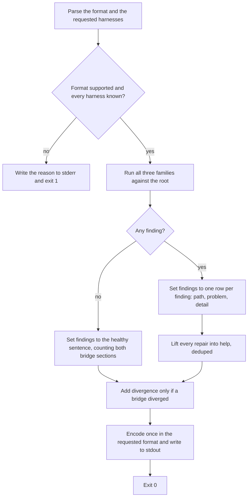

# diagnosis-report

## What

The **one output shape** every `doctor` finding is reported through, whichever of the three families it came from.

The command asks three independent questions about a repository — do the skills bridges resolve, can each harness read `AGENTS.md`, is the configuration around them right — and answers all three in a single report. The families do not share a check, a vocabulary, or a repair owner. They share this: the sections the report has, what a finding row carries, how the healthy answer is stated, and how the whole thing is encoded.

That shape had no owner, and the cost was concrete. When a field was added to `findings`, nothing in the corpus said what the report was supposed to contain, so the change could be checked only against whichever tests happened to exist. A field belonging to every family at once belongs to none of them in particular, which is why it is a node rather than a paragraph repeated three times.

**The default consumer is a program, not a person.** TOON is the default format because an agent parses it; `--format text` exists for reading over someone's shoulder, and `--format json` for anything else. Every decision below follows from that ordering: a section a program can branch on beats prose it would have to parse, and the healthy answer is stated outright rather than left as an empty list, because an empty section is indistinguishable from a section the caller asked for wrongly.

**Key terms**

- **report** — what one `doctor` run writes to stdout: one object, encoded once.
- **section** — a top-level key of that object: `bin`, `bridges`, `instructions`, `divergence`, `findings`, `help`.
- **finding row** — one entry in `findings`: a `path`, a `problem` name, and a `detail` in prose.
- **healthy answer** — what `findings` holds when nothing is wrong: a sentence stating the zero with its context, in place of the rows.

**Non-goals**

- **Deciding what is wrong.** Every fault is a detecting node's: `../bridge-resolution/`, `../instruction-bridges/`, `../configuration-diagnosis/`.
- **Deciding who repairs it.** `../../workflows/detect-and-repair/`. This node states which fields exist; that node states which of them a consumer may route on.
- **The encoder itself.** `--format` is `doctor`'s surface and is specified here, but the TOON/JSON/text encoder and its table alignment are shared with the `init` command and have no node yet — see the Backfill note in `../README.md`.
- **The `init` command's report.** A different report with a different shape.

## Use Cases

**Actors**

- **`doctor` skill** — parses the default TOON output. The consumer the shape is designed for.
- **`repair` skill** — reads the same report to learn what to correct.
- **person at a shell** — reads `--format text`, and is the reason the report is legible at all rather than only parseable.
- **session-start hook** — runs the command and is affected by its **exit code** without reading a byte of the report.

**Goals, and where each is served**

| Actor | Goal | Entry point |
| --- | --- | --- |
| `doctor` skill | branch on the report without parsing prose | the sections and the `problem` name |
| `repair` skill | read one report covering every family | `buddy-agent-harness doctor` |
| person at a shell | read the same report without parsing it | `buddy-agent-harness doctor --format text` |
| session-start hook | not be told the tool is broken when the repository is | the exit code |

**Entry point**

| Entry point | Trigger | Inputs | Outcome |
| --- | --- | --- | --- |
| `buddy-agent-harness doctor` | a caller asks what is wrong with this repository's agent configuration | the repository root and the output format | one encoded report on stdout, holding every family's findings, and exit 0 |

**Surface**

- **`--root`** names the repository or package directory, defaulting to the current directory.
- **`--harness`** is the detecting nodes' and is passed through unread by this node, except that a name the registry does not carry is **rejected** rather than ignored.
- **`--format`** takes `toon` (the default), `json`, or `text`. Anything else is an **error**, never a silent fallback: a caller that misspelled a format and got TOON anyway would parse the wrong thing and never learn why.

**Sections, and why each is separate**

`bin` names the executable that produced the report, with the user's home directory collapsed to `~`. A report that a caller cannot trace back to the binary that wrote it cannot be reproduced.

`bridges` and `instructions` are two sections rather than one. They share no `kind` and no `status` vocabulary, and merging them would force a consumer to know which vocabulary applied before it could read a row.

`divergence` appears **only when a bridge has diverged**. It is the one section that is conditional, because it answers a question that has no meaning otherwise.

`findings` holds either the rows or the healthy sentence, never both and never neither.

`help` lifts the repairs out of the finding rows, so a row stays to the diagnosis itself, and **dedupes**: several findings often share one repair, and repeating it reads as more work than there is.

**Extensions**

- **Nothing is wrong.** `findings` holds a sentence stating the count and what it covers, counting the skills bridges and the instruction bridges together — a reader learns nothing is wrong from one number rather than by adding two. The count is worded for one bridge as well as for many.
- **Findings exist.** The exit code stays **0**. The diagnosis succeeded; a non-zero code reads to an agent as "this command is broken, try something else", which sends it looking for another way to ask instead of at the report it was just handed.
- **The diagnosis fails, the format is invalid, or a harness is not supported.** The message goes to **stderr** and the exit code is **1**. That is the only thing that distinguishes a broken tool from a broken repository.
- **Two findings share a repair.** One `help` entry. Every repair embeds its own path, so two findings about different paths cannot collapse into one.

## Control Flow

## Scenario map

### `buddy-agent-harness doctor`

| Edge | Path (Given) | Scenario |
| --- | --- | --- |
| A→D | no `--root` and no `--harness` | `diagnoses the working directory in TOON by default` |
| A→D | an explicit root and requested harnesses | `passes an explicit root and the requested harnesses through` |
| B→C | an unsupported format, an unknown harness, or a diagnosis that throws | `reports an invalid format, an unsupported harness, and a failed diagnosis` |
| E→F | nothing wrong | `states the healthy answer outright rather than leaving findings empty` |
| E→F | one bridge and no instruction bridges | `counts the instruction bridges alongside the skills bridges` |
| E→G, G→H | findings from more than one family | `moves each repair into help and keeps findings to the diagnosis and its name` |
| I | a diverged bridge, and a report with none | `adds a divergence section only when a bridge has diverged` |
| J | each supported format | `encodes the report in the requested format and nothing else` |
| K | findings and no findings | `exits 0 whether or not it found something` |
| →J | any | `names the executable that produced the report, with the home directory collapsed` |

## References

- `../../../../src/command-output/command-output.ts` holds the encoder shared with the `init` command, including the `~` collapse in `bin` (AXI §10) and the text renderer's table alignment.
- AXI §5 backs the healthy answer: the zero is stated with its context so an agent does not re-run with other flags to confirm that an empty section really meant "nothing wrong".
