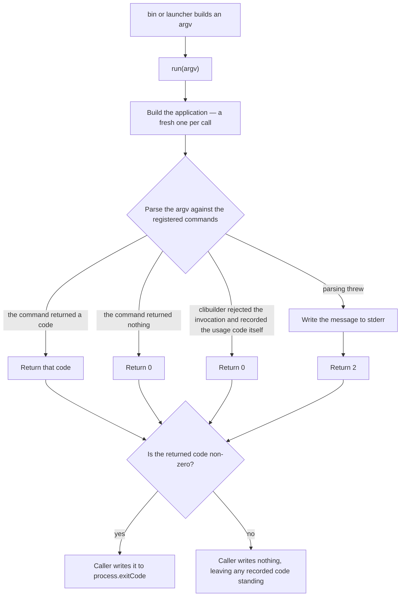

# entry-point

## What

Make the CLI's product reachable **in process**: what a command prints, and what it computed, both available to a caller that is not the operating system.

`bin/buddy-agent-harness.mjs` is the process boundary — the only place that reads `process.argv` or writes `process.exitCode`. Everything under `src/` is the application: it is handed an argv, and it hands back an exit code.

The boundary exists because callers that are not the process need to run a command. The shipped skills are exactly that. Each ships a launcher that runs a subcommand of the CLI it shipped beside, and with no callable entry point the only way to reach a subcommand was to **mutate global `process.argv` and side-effect-import the executable** — a workaround that ships identically in every skill and multiplies with each new one. The same absence makes the entry point unreachable from a test without stubbing one global and reading another back.

Reachability has two halves, because a caller wants one of two things:

| Layer | Answers | Consumer |
| --- | --- | --- |
| `diagnoseBridges` / `diagnoseInstructions` / `initializeHarnesses` | the raw diagnosis | already reachable, unchanged |
| the `doctor` report builder | the assembled report **as a value** | a consumer that wants the answer |
| `run(argv)` | that report serialized, plus an exit code | a consumer that wants **exactly what the command prints** |

Each layer is a thin composition of the one below it. Before this node only the first was reachable, so a caller that wanted the assembled report had to run the CLI and re-parse its own tool's TOON, and a caller that wanted what the command prints had to be a process.

**Non-goals**

- **Exporting the application object.** `run` is exported; the `clibuilder` builder is not. Exporting it would make `clibuilder`'s builder shape part of this package's public API, so a `clibuilder` major would become a major here — a large surface to owe consumers for an internal convenience.
- **Deciding what a command prints.** Each command owns its own output and its own format handling. This node owns how a command is *reached* and how its outcome is *reported back*.
- **Specifying the report's shape.** The rows and sections of the `doctor` report are [`../diagnosis-report/`](../diagnosis-report/README.md)'s. This node owns that the report is reachable as a value, and that passing through the export does not reshape it.
- **Removing every `process` read from the application.** `doctor` reports the path it was invoked as, and `clibuilder` gives a command no way to learn that except `process.argv[1]`. That one read stays, and is named here so it is a stated exception rather than an unnoticed leak. What leaves the application entirely is `process.exitCode`: no command writes it after this node, and the only sources that still hold a write are `bin`, the generated launchers, and the renderer whose template emits them.
- **Replacing the process boundary.** `bin` keeps reading `process.argv` and writing `process.exitCode`. The point is that it is the only thing that does.

**Key terms**

- **entry point** — `run(argv)`: argv in, exit code out.
- **launcher** — the `scripts/<subcommand>.mjs` a skill ships and runs in preference to `npx`.
- **exit code** — `0` the command did what was asked, `1` it was called correctly and could not complete, `2` it was called wrongly and the same invocation cannot succeed.

## Use Cases

**Actors**

- **skill launcher** — runs one subcommand of the CLI that shipped beside it; the caller the entry point exists for.
- **`bin/buddy-agent-harness.mjs`** — the process boundary; turns a process into a call, and a returned code back into a process outcome.
- **package consumer** — imports the package and wants either the report as a value or exactly what the command prints.
- **agent parsing `doctor`** — never calls the entry point, and is affected by it: its stream must carry the report and nothing else.
- **test** — invokes a command directly, which before this node meant stubbing a global and reading another one back.

**Goals, and where each is served**

| Actor | Goal | Entry point |
| --- | --- | --- |
| skill launcher | run one subcommand without touching a global or importing an executable | `run([...process.argv.slice(0, 2), '<subcommand>', ...process.argv.slice(2)])` |
| `bin/buddy-agent-harness.mjs` | turn the process's argv into a call, and the call's result into an exit code | `run(process.argv)` |
| package consumer | get the assembled report as a value, without re-parsing the tool's own output | the exported report builder |
| package consumer | get exactly what the command prints, and learn how it went | `run(argv)` |
| agent parsing `doctor` | read a stream carrying the report and nothing else | failures are written to `stderr` |
| test | drive a command and read its outcome without stubbing `process` | `run(argv)` |

The structural scenarios — the `process.exitCode` scan, the launcher source reads, the generator's
target list — introduce no further actor. Each discharges a goal already listed above: they are how
the `skill launcher`'s "without touching a global" and `bin`'s "the only writer" are held to over
time, rather than asserted once and left to erode.

**Entry point**

| Entry point | Trigger | Inputs | Outcome |
| --- | --- | --- | --- |
| `run(argv)` | a caller wants a command run and its outcome reported back | a full argv, executable and script included, as the process would supply it | the command's output on its own streams, and the exit code **returned** |
| the report builder | a caller wants the assembled report rather than the bytes it would print as | the invoked path to report as `bin`, and a diagnosis | the report as a value, in the shape [`../diagnosis-report/`](../diagnosis-report/README.md) states |

**Surface**

`run` takes the **whole** argv, not the arguments after the script. It is handed what `process.argv` holds, so a caller composes an invocation by building an array rather than by splicing a global, and so the shape a caller passes is the shape the process would have passed.

`run` **returns** the exit code rather than writing it. Returning it is what makes the entry point callable more than once in a process and testable without reading a global back — and it is why the commands themselves return their codes too: a command that wrote `process.exitCode` would report its failure past the caller instead of to it.

`index.ts` re-exports `run` and the report builder. It does not export the application object.

The version `--version` reports is read from the package manifest, so it cannot restate a number the package has moved past.

No option, argument, or flag is added, removed, or renamed. Every existing invocation keeps its meaning.

**Extensions**

- **The command reports a failure.** It returns a non-zero code rather than writing one, so the code reaches the caller through the return.
- **The command found problems.** Exit code stays `0`: the diagnosis succeeded. A non-zero code reads to an agent as "this command is broken, try something else".
- **`--version` or `--help`.** Answered by the application; exit code `0`. Asking for help is not a usage error.
- **The invocation itself is wrong.** `clibuilder` answers an unknown option or unknown command by printing help and writing the usage code to `process.exitCode` **itself**, returning nothing. `run` therefore returns `0` on a path where the process must still exit `2`. `bin` and the launchers close the gap by applying the returned code **only when it is non-zero**, so the code `clibuilder` already recorded is not overwritten. This is the one exit path `run`'s return does not carry; it is `clibuilder`'s own reporting contract, and correcting it belongs upstream.
- **The report is fetched as a value rather than printed.** The builder returns it unchanged — the same union in `findings`, the same sections absent rather than empty. Passing through the export is not an opportunity to normalize it.

## Control Flow

The application is built **inside** `run`, not once at module load: `cli()` builds state, and state built at import time is shared by every later call and by every test in the file.

`J` is the only decision the **caller** makes, and it exists solely for edge `G`. Everywhere else applying the code unconditionally would be equivalent.

## Scenario map

A row carries a CFG edge when the scenario exercises the runtime flow, and `—` when it is a
structural assertion the graph does not model — a source read, a generated artifact, or an
export. Both kinds are booleans; only the first has a path through the graph.

### `run(argv)`

| Edge | Path (Given) | Scenario |
| --- | --- | --- |
| A→B | a launcher's argv | `takes the whole argv, so a caller composes one instead of splicing the global` |
| B→C | two calls in one process | `builds the application per call, so one invocation cannot leak into the next` |
| D→F | a command that returns nothing | `returns 0 when the command did what was asked` |
| D→E | a command that reports a failure | `returns the code the command reported` |
| D→F | a diagnosis that found problems | `keeps the exit code at 0 when the diagnosis found problems` |
| D→F | `--version` | `reports the version the package manifest carries` |
| D→G | an option no command declares | `returns 0 when clibuilder rejected the invocation and recorded the code itself` |
| D→H | parsing threw an Error | `writes the failure to stderr, not to the stream the report is parsed from` |
| D→H | parsing threw a non-Error | `still reports a failure it cannot read a message from` |
| H→I | the message has been written | `returns the usage code when the invocation could not be parsed` |

### the process boundary

| Edge | Path (Given) | Scenario |
| --- | --- | --- |
| J→K | a non-zero code | `applies a reported failure to the process` |
| G→J, J→L | a zero returned over a code clibuilder recorded | `leaves a usage code clibuilder recorded on the process alone` |
| — | the shipped application sources | `writes process.exitCode nowhere but bin, the launchers, and the renderer that emits them` |
| — | the entry point's own module | `neither reads process.argv nor writes process.exitCode` |

### the skill launchers

| Edge | Path (Given) | Scenario |
| --- | --- | --- |
| — | a generated launcher's composed argv | `builds its argv with the subcommand inserted, mutating nothing` |
| — | a generated launcher's imports | `calls the entry point instead of importing the executable for its side effect` |
| — | the generator's target list | `generates every shipped launcher, so no skill hand-rolls a second call form` |

### the reachable surface

| Edge | Path (Given) | Scenario |
| --- | --- | --- |
| — | the exported `run` | `exports run, and does not export the application object` |
| — | the exported report builder | `exports the report builder, so the report is reachable as a value` |
| — | a report carrying no findings | `carries the healthy sentence through the export, not an empty list` |
| — | a report with nothing to diverge or repair | `leaves the sections that do not apply absent through the export, not empty` |

## References

- [`../diagnosis-report/`](../diagnosis-report/README.md) specifies the shape the report builder returns — the `findings` union, and `divergence`/`help` being absent rather than empty. This node specifies only that the builder is exported and that passing through the export does not reshape it.
- [`../configuration-diagnosis/`](../configuration-diagnosis/README.md) is the sibling this node's shape is modelled on.
