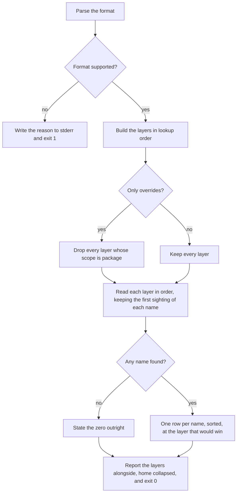
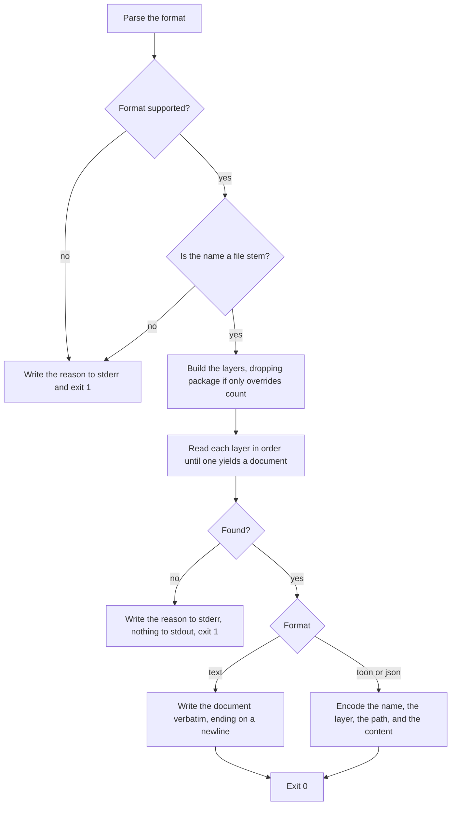

# governance-overrides

## What

Where a **governance** comes from when someone has overridden it, and how a caller reads it.

A governance is a version-pinned Markdown rule set that a skill loads — `skill-design`,
`agent-tool-output`. Every skill ships its own committed copy, and that copy is the default: it is
the version the skill was tested against. An override is how a repository, a person, or a machine
owner replaces that copy without rebuilding the skill.

This node owns the **override layers** and the command over them. It does not own the copy inside a
skill, and it can never return one. That is the whole point of the boundary: a skill asks this
command whether an override exists, and an answer drawn from some other package's shipped copy would
silently replace the version the skill was built against with a newer or older one.

**The default consumer is a skill, and it is paying for the question.** Step 2 of the lookup order
runs this command on every governance a skill reads, and almost always finds nothing. So it runs
from an already-installed copy rather than through `npx`, and the answer a skill needs — *is there an
override* — is carried by the **exit code**, which costs nothing to read.

**An override is a choice, never a fault.** `doctor` reports what the layers hold and stops there.
Nothing here diagnoses.

**Key terms**

- **governance** — a Markdown rule set, addressed by a name that is a file stem. `<name>.md` inside
  a layer.
- **layer** — one directory a governance can come from, and the name a report gives it: `project`,
  `user`, `managed`, `package`.
- **override layer** — `project`, `user`, and the two machine-wide layers: the ones someone can write
  to. `package` is not one.
- **lookup order** — project, then user, then the machine-wide layer this package owns, then the one
  `universal-plugin` wrote, then package. The first layer holding the name wins and the rest are not
  read.
- **managed layer** — the machine-wide directory this package owns, and where a machine owner should
  put a governance now. A **default**, not enforcement: it sits after the project and the user
  layers, so a repository and a person both outrank it.
- **deprecated managed layer** — the machine-wide directory `universal-plugin` wrote. Still read, one
  layer below, and reported as deprecated wherever it appears.

**Non-goals**

- **The copy inside a skill.** The skill's own default, read by the skill from its own folder. This
  command never reaches into `skills/`, which is what makes `--overrides-only` a guarantee rather
  than a hope.
- **Putting the copies there.** The build step that refreshes `<skill>/references/governances/` is
  `universal-plugin`'s.
- **Which runner a skill uses.** `upx --local-only`, a bare `command -v` hit, or neither: the skill's
  own business. What is specified here is that any non-zero exit means "no override", so a skill that
  cannot run the command at all takes the same branch as one that ran it and found nothing.
- **What a governance says.** Text in, text out. Nothing here parses a document.
- **The encoder.** `../command-output/` — including the verbatim document write that `show` uses.

## Use Cases

**Actors**

- **a skill resolving a governance** — runs `show <name> --overrides-only` and reads the exit code.
  It wants the document on stdout and nothing else on it, because what it reads is what it is about
  to follow.
- **person at a shell** — runs `list` to learn what is in play and where to write an override, and
  `show` to read one.
- **an agent working outside a skill** — reads a governance it was told to follow, with no skill
  folder to read it from.
- **`doctor`** — reports the overrides the layers hold, as a section of its own report.
- **`init`** — creates the project layer, so a repository has one obvious place to put an override.

**Goals, and where each is served**

| Actor | Goal | Entry point |
| --- | --- | --- |
| a skill | learn whether an override exists without paying for a registry lookup | the exit code of `show --overrides-only` |
| a skill | never be handed a governance some package shipped in place of the copy it was tested with | `--overrides-only` |
| machine owner | keep the governances they installed before this command existed | the deprecated machine-wide layer |
| machine owner | learn that there is a better place to put them | the status on that layer, and the path on a row from it |
| person at a shell | read a governance as the Markdown it is | `show <name>` |
| person at a shell | learn which layers exist and which one is answering | `list` |
| another program | take the document and the layer it came from together | `show --format json` |
| `doctor` | report what is overridden without calling any of it a fault | the override layers |
| `init` | leave a repository with somewhere to put an override | the project layer |

**Entry point**

| Entry point | Trigger | Inputs | Outcome |
| --- | --- | --- | --- |
| `governance list` | a caller asks what governances are in play and where a new one would go | the root, and whether only overrides count | every name at the layer that would win, plus the layers in lookup order, and exit 0 |
| `governance show <name>` | a caller needs one governance's text, or only needs to know whether an override exists | the name, the root, the format, and whether only overrides count | the document on stdout and exit 0, or nothing on stdout, a reason on stderr, and a non-zero exit |

**Surface**

- **`--root`** names the repository or package directory the project layer resolves against.
  Defaults to the current directory.
- **`--overrides-only`** drops the `package` layer. It is a filter over the **scope**, not a slice
  of the list, so a layer added in the middle later cannot quietly become an override.
- **`--format`** takes `toon`, `json`, or `text`. `list` defaults to `toon`, the format an agent
  parses. `show` defaults to `text`, because for `show` the document **is** the result: a Markdown
  body run through TOON or through the text renderer comes back as one escaped line.

**Where each layer is**

`project` is `<root>/.agents/governances/`, in the canonical tree beside the skills. `user` is
`~/.agents/governances/`, the same path under the home directory.

**There are two machine-wide layers, and that is deliberate.** `managed` is the directory this
package owns and the one a machine owner should write to now. `managed-deprecated` is the directory
`universal-plugin` wrote, still read one layer below it, so a machine already carrying governances
keeps resolving them rather than losing them the day the command changed hands. Neither renaming
outright nor keeping only the old name would do both. Each differs per platform in the same shape:

| Scope | Linux | macOS | Windows |
| --- | --- | --- | --- |
| `managed` | `/etc/buddy-agent-harness/governances` | `/Library/Application Support/BuddyAgentHarness/governances` | `%ProgramData%\BuddyAgentHarness\governances` |
| `managed-deprecated` | `/etc/universal-plugin/governances` | `/Library/Application Support/UniPlugin/governances` | `%ProgramData%\UniPlugin\governances` |

The deprecation is **said, not enforced**. The old location still answers, so nothing is broken and
there is nothing to repair — which is why it is a status on the layer rather than a finding. `list`
carries it on that layer's row and on no other, and a row from that layer names the directory it was
read from, so an admin learns both that there is somewhere else to put it and where it currently is.

`package` is beside this package's own manifest, found by walking up to it rather than by a relative
path, because this code sits at three different depths in `src/`, in the bundle, and in a
skill-script bundle.

**Extensions**

- **The name is a path, or a file name.** Rejected, naming what a name is. Not sanitized: a caller
  that meant a path asked the wrong question, and quietly answering a different one is how a name
  built from somebody else's input reads a file outside the layer. A name ending in `.md` is caught
  before the pattern would accept it and send the lookup after `<name>.md.md`.
- **A layer is missing, unreadable, or not a directory.** Empty. The managed layer is absent on most
  machines, and a permission error on a root-owned directory must not end a run that had three other
  places to look.
- **An entry cannot be read as a document.** Passed over, and the next layer is still asked. One bad
  entry does not end the search.
- **No layer holds the name.** Nothing on stdout, the reason on stderr, non-zero exit. A caller
  reading the document off stdout must never receive prose about not having found one.
- **Nothing is overridden anywhere.** `list` states the zero outright and exits 0.
- **A document does not end in a newline.** One is added, so the stream ends where a reader expects.

## Control Flow

Two entry points, one sub-graph each.

### Listing what the layers hold

### Showing one governance

The two graphs share the layer construction and nothing else. `list` never reads a document and
`show` never reads a directory, which is why one search and one listing rather than a shared walk.

## Scenario map

### `governance list`

| Edge | Path (Given) | Scenario |
| --- | --- | --- |
| D→L | any run | `names every layer in lookup order` |
| D→L | any run | `marks the layer universal-plugin wrote as deprecated, and says so on it alone` |
| H→K | one name in two layers | `reports each governance at the layer that would win` |
| K | names out of order across layers | `sorts the names rather than reporting them in layer order` |
| H | a directory and a non-Markdown file beside the documents | `counts only Markdown files as governances` |
| E→F | `--overrides-only` | `leaves the package layer out when only overrides were asked for` |
| I→J | no layer holds anything | `states the zero outright rather than leaving the section empty` |
| L | a layer under the user's home directory | `collapses the home directory out of the reported paths` |
| B→C | an unsupported format | `rejects an unsupported output format rather than falling back` |
| D | no `--root` | `resolves the project layer against the working directory when no root is named` |
| D | each platform | `names a machine-wide directory this package owns, per platform` |
| D | each platform | `still names the directory universal-plugin wrote, per platform` |
| D | Windows with no `%ProgramData%` | `falls back to the default program data directory when Windows does not name one` |
| D | the whole list | `searches the directory this package owns before the one universal-plugin wrote` |
| E→F | `--overrides-only` | `drops the package layer from the override set, leaving the ones someone can write to` |
| →L | a failure with no message | `reports a failure it cannot read a message from` |

### `governance show`

| Edge | Path (Given) | Scenario |
| --- | --- | --- |
| U→V | a governance in a layer | `writes the document itself, and nothing else, by default` |
| V | a document with no trailing newline | `ends the document with a newline even when the file does not` |
| U→W | `--format json` | `wraps the document with the layer it came from when asked for a machine format` |
| R, S | the same name in two layers | `stops at the first layer that holds the name` |
| R | an earlier layer without the name | `falls through to a later layer` |
| R | only the deprecated machine-wide layer holds the name | `reads the deprecated machine-wide layer when the one above it is empty` |
| R | both machine-wide layers hold the name | `prefers the layer this package owns over the deprecated one` |
| R | an entry that is not a readable document | `passes over an entry it cannot read and asks the next layer` |
| S→T | `--overrides-only` and no override | `exits non-zero, writing nothing to stdout, when no override layer holds the name` |
| S→T | no layer at all holds it | `exits non-zero when no layer at all holds the name` |
| P→O | a name with a path separator, `..`, or a `.md` suffix | `rejects a name that is a path rather than reading outside the layer` |
| N→O | an unsupported format | `rejects an unsupported output format rather than falling back` |
| →T | a failure with no message | `reports a failure it cannot read a message from` |

### the project layer, at `init` and at `doctor`

| Edge | Path (Given) | Scenario |
| --- | --- | --- |
| — | a repository with no project layer | `creates the project override layer and reports what it holds` |
| — | a repository holding an override | `reports the overrides the layers hold without turning any of them into a finding` |
| — | a report naming a layer | `names the directory each override was read from` |
| — | no override anywhere | `states the zero outright when no layer holds an override` |

## References

- `../../../../src/governance-overrides/governance-overrides.ts` is the resolver: the layers, the
  lookup order, the name check, and the two reads.
- `../../../../src/governance-overrides/governance.command.ts` is the command surface.
- `../command-output/` owns the encoder and the verbatim document write `show` uses in `text`.
- `../diagnosis-report/` states the `governances` section of `doctor`'s report; `../../skills/harness-init/`
  states that `init` creates the project layer and counts it.
- `../../../../../../.agents/plans/governance-retrieval.design.md` is the design this implements,
  including the three-step lookup order a skill follows and why step 2 never runs through `npx`.
- AXI §5 backs the stated zero; AXI §10 backs the home collapse.
