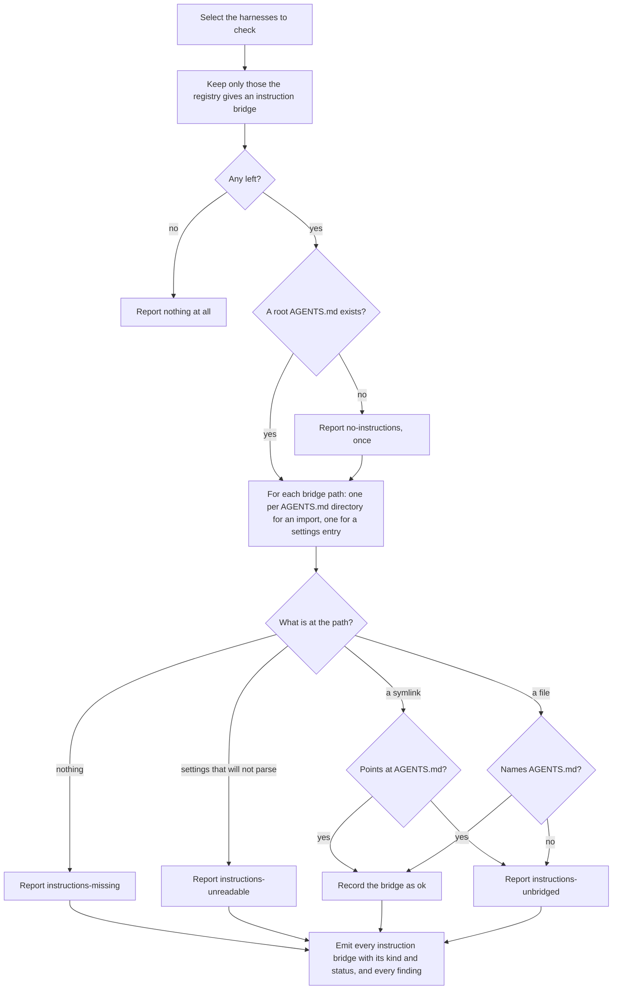

# instruction-bridges

## What

The `doctor` command's third question about the same repository: whether every enabled harness can still **read `AGENTS.md`**.

A harness that cannot read the canonical instructions where they lie is given a bridge to them — a `CLAUDE.md` whose body imports `AGENTS.md`, or an `AGENTS.md` entry inside `.gemini/settings.json`. When that bridge is gone or was never completed, the harness reads **none** of the repository's instructions and says nothing about it.

It is a separate node from `../bridge-resolution/` rather than a case of it, and the separation is not tidiness. Nothing is shared: a different `kind` vocabulary (`import`, `symlink`, `settings-entry`, `file`, `none`), a different `status` vocabulary (`ok`, `missing`, `unbridged`, `unreadable`), a different unit of iteration — an import bridge is checked **once per directory holding an `AGENTS.md`** rather than once per harness — and a repair that is never a rebuild, because the file carries content a person wrote.

**`unbridged` is the case that has no counterpart on the skills side.** The file is present, it is the right size, it opens and reads like instructions, and it names `AGENTS.md` nowhere: a `CLAUDE.md` someone overwrote with real content, or a settings file another tool rewrote. Nothing about it looks wrong. It is why this half is checked at all rather than inferred from the file existing.

**Key terms**

- **instruction bridge** — what a harness needs in order to read `AGENTS.md`: an import line, a symlink, or an entry in a settings array. What it is differs per harness, which is why the registry records the variant rather than a bare path.
- **canonical instructions** — the root `AGENTS.md`, and every nested `AGENTS.md` in the tree.
- **instruction problem** — one named way an instruction bridge fails: `no-instructions`, `instructions-missing`, `instructions-unbridged`, `instructions-unreadable`.
- **unbridged** — the file is present and does not name `AGENTS.md`, so the harness reads none of it.

**Non-goals**

- **Repairing.** Never. Rewriting an instruction file touches prose a person authored; see `../../workflows/detect-and-repair/` for who owns it.
- **Reading what the instructions say.** Whether the bridge exists is decidable by reading the file; whether the instructions are any good is nobody's business here.
- **Nested bridges beyond their own directory.** An import bridges the `AGENTS.md` **beside** it and nothing deeper, so the check is per directory rather than per harness, and a nested `AGENTS.md` with no stub of its own is a finding rather than covered by the root one.
- **User-scope instruction bridges.** They exist and the registry describes them. `doctor` diagnoses a repository, so the check is project scope only.
- **Skills bridges.** `../bridge-resolution/`.
- **The shape of the report.** `../diagnosis-report/`.

## Use Cases

**Actors**

- **`doctor` skill** — presents the report and routes each finding to the skill that owns it.
- **person at a shell** — runs the command when a harness "is ignoring `AGENTS.md`".
- **session-start hook** — runs the command unattended; affected by the outcome without reading it.
- **`init` skill** — owns every repair here, and is the reason each finding names a skill rather than a command.
- **downstream agent** — every later session started in a harness whose bridge is broken. It never invokes the command and is the actor the findings exist for: it silently loads none of the repository's instructions, and the session that suffers it is not the session that broke the bridge.

**Goals, and where each is served**

| Actor | Goal | Entry point |
| --- | --- | --- |
| `doctor` skill | learn which harnesses cannot reach `AGENTS.md` | `buddy-agent-harness doctor` |
| person at a shell | find out why a harness is ignoring the repository's instructions | `buddy-agent-harness doctor --format text` |
| session-start hook | learn of a broken instruction bridge with no risk of a write | `buddy-agent-harness doctor` |
| `init` skill | be named as the owner of every repair here | the repair each finding carries |

**Entry point**

| Entry point | Trigger | Inputs | Outcome |
| --- | --- | --- | --- |
| `buddy-agent-harness doctor` | a caller asks whether every harness can still read this repository's instructions | the repository root, and the harnesses to check | one row per instruction bridge with its `kind` and `status`, and a finding for each that does not bridge |

**Surface**

No option of its own. Harness selection is shared with `../bridge-resolution/` and so is `--harness`; `--root` and `--format` belong to `../diagnosis-report/`.

The set checked is narrower than the selected set: only harnesses the registry records an instruction bridge for. Cursor, Codex, and Copilot CLI read `AGENTS.md` where it lies and are never bridged, so nothing is reported for them — an answer from the registry, not an omission.

**Extensions**

- **No harness in the selected set needs an instruction bridge.** Nothing is reported at all — **not even a missing `AGENTS.md`**. Every other harness reads `AGENTS.md` where it lies, so its absence in that repository is one `init` has not run in, not a broken bridge, and reporting it would name a fault nothing is suffering.
- **There is no root `AGENTS.md`, and something does bridge into it.** Reported **once**, as `no-instructions`, because every bridge then points at nothing.
- **A settings file does not parse.** `unreadable`. Nothing is inferred from a file whose contents could not be read, and the repair fixes the JSON first.
- **A settings file is absent, or holds the key with the wrong value.** Absent reads as `missing`; present without `AGENTS.md` in the array reads as `unbridged`. Neither throws.
- **A nested `AGENTS.md` under a dot-directory or `node_modules`.** Not bridged. `.agents/AGENTS.md` is canonical shared instructions rather than subtree-scoped, so bridging it would claim a scope it does not have.
- **A directory that cannot be listed.** Reads as holding nothing rather than failing the run.

## Control Flow

Each bridge is inspected independently, so one run reports as many faults as it finds, and a run can report a bridged root beside an unbridged nested directory.

## Scenario map

### `buddy-agent-harness doctor`

| Edge | Path (Given) | Scenario |
| --- | --- | --- |
| C→D | no selected harness needs an instruction bridge | `reports nothing at all, not even a missing AGENTS.md` |
| E→F | something bridges in, and there is no root `AGENTS.md` | `reports a repository with no AGENTS.md once, and checks no bridge into it` |
| G | an `AGENTS.md` in a nested directory | `checks one bridge per nested AGENTS.md, and none where there is no AGENTS.md` |
| G | an `AGENTS.md` under a dot-directory or `node_modules` | `ignores AGENTS.md under a dot-directory or node_modules` |
| G | a directory that cannot be listed | `reads a directory it cannot list as holding nothing` |
| G | a harness the repository does not enable | `is checked only for the harnesses this repository enables` |
| H→I | nothing at the bridge path | `reports a missing instruction bridge` |
| K→M | a file whose body is the import | `accepts a file whose body is the import` |
| K→M | an import with harness-specific notes below it | `accepts an import carrying Claude-specific notes below it` |
| J→M, J→N | a symlink to `AGENTS.md`, and one pointing elsewhere | `accepts a symlink to AGENTS.md and rejects one pointing elsewhere` |
| K→N | a bridge file overwritten with real content | `reports a bridge overwritten with real content as unbridged` |
| K→M | `AGENTS.md` in `context.fileName` beside the harness default | `accepts AGENTS.md in context.fileName beside the harness default` |
| K→M | a settings file carrying comments | `accepts a settings file carrying comments` |
| K→N | a settings file rewritten without the entry | `reports a settings file another tool rewrote without the entry` |
| H→L, H→I | a missing key, a missing file, and unparsable JSON | `reads a missing key, a missing file, and unparsable JSON without throwing` |

## References

- `../../../../src/harness-registry/instruction-bridge.ts` is why the registry models a variant rather than a path: a skills projection is one shape, and an instruction bridge is at least two. A second bare path field would have described Claude Code and lied about Gemini CLI.
- `../../../../src/diagnose-bridges/agents-files.ts` backs the per-directory iteration and the pruning rule.
