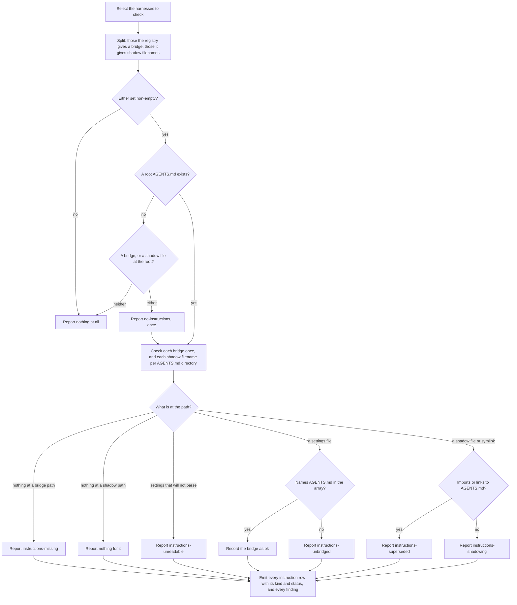

# instruction-bridges

## What

The `doctor` command's third question about the same repository: whether every enabled harness can still **read `AGENTS.md`**.

Two ways the answer is no, and they are opposites.

A harness that cannot read the canonical instructions where they lie is given a **bridge** to them — an `AGENTS.md` entry inside `.gemini/settings.json` is the only one left. When that bridge is gone or was never completed, the harness reads **none** of the repository's instructions and says nothing about it.

A harness that reads `AGENTS.md` by itself needs no bridge and can still be stopped, by a file it prefers sitting in the same directory. Claude Code reads `AGENTS.md` only where it finds no `CLAUDE.md`, `.claude/CLAUDE.md`, or `CLAUDE.local.md` there or above it. That file is a **shadow**: nothing is missing, nothing looks wrong, and the canonical file is unread.

It is a separate node from `../bridge-resolution/` rather than a case of it, and the separation is not tidiness. Nothing is shared: a different `kind` vocabulary (`import`, `symlink`, `settings-entry`, `file`, `none`), a different `status` vocabulary (`ok`, `missing`, `unbridged`, `unreadable`, `shadowing`, `superseded`), a different unit of iteration — a shadow is checked **once per directory holding an `AGENTS.md`** rather than once per harness — and a repair that is never a rebuild, because the file carries content a person wrote.

**`unbridged` and `shadowing` are the cases that have no counterpart on the skills side.** The file is present, it is the right size, it opens and reads like instructions, and the harness is reading none of the repository's instructions anyway: a settings file another tool rewrote, or a `CLAUDE.md` holding a project overview somebody added years ago. Nothing about either looks wrong. It is why this half is checked at all rather than inferred from the file existing.

**`superseded` is the one finding here that is not a fault.** A `CLAUDE.md` that imports `AGENTS.md`, or symlinks to it, still delivers the canonical file — it is the bridge this tool wrote before Claude Code read `AGENTS.md` itself, and the one reason to keep it is a session that cannot: an old version, a third-party provider, telemetry or hooks disabled. It is reported so `init` can offer the removal, never so anything can make it.

**Key terms**

- **instruction bridge** — what a harness needs in order to read `AGENTS.md`: an entry in a settings array, or the import line and symlink a harness needed before it read the file itself. What it is differs per harness, which is why the registry records the variant rather than a bare path.
- **shadow** — a file whose presence in a directory stops a harness reading the `AGENTS.md` beside it. Declared per harness in the registry, because which filenames count is the harness's rule.
- **canonical instructions** — the root `AGENTS.md`, and every nested `AGENTS.md` in the tree.
- **instruction problem** — one named way a harness ends up reading none of `AGENTS.md`: `no-instructions`, `instructions-missing`, `instructions-unbridged`, `instructions-unreadable`, `instructions-shadowing`, `instructions-superseded`.
- **unbridged** — the file is present and does not name `AGENTS.md`, so the harness reads none of it.
- **shadowing** — a shadow file carrying its own content, read *instead of* the `AGENTS.md` beside it.
- **superseded** — a shadow file that imports or links to `AGENTS.md`, so the canonical file still arrives. Working, redundant, and nobody's to delete unasked.

**Non-goals**

- **Repairing.** Never. Rewriting an instruction file touches prose a person authored; see `../../workflows/detect-and-repair/` for who owns it.
- **Reading what the instructions say.** Whether the bridge exists is decidable by reading the file; whether the instructions are any good is nobody's business here.
- **Nested files beyond their own directory.** A shadow suppresses the `AGENTS.md` **beside** it and nothing deeper, so the check is per directory rather than per harness, and a `CLAUDE.md` in one subtree says nothing about another.
- **User-scope instruction bridges.** They exist and the registry describes them. `doctor` diagnoses a repository, so the check is project scope only.
- **Skills bridges.** `../bridge-resolution/`.
- **The shape of the report.** `../diagnosis-report/`.

## Use Cases

**Actors**

- **`doctor-buddy-agent-harness` skill** — presents the report and routes each finding to the skill that owns it.
- **person at a shell** — runs the command when a harness "is ignoring `AGENTS.md`".
- **session-start hook** — runs the command unattended; affected by the outcome without reading it.
- **`init-buddy-agent-harness` skill** — owns every repair here, and is the reason each finding names a skill rather than a command. What it does on arrival is `../../skills/init-buddy-agent-harness/`.
- **downstream agent** — every later session started in a harness whose bridge is broken. It never invokes the command and is the actor the findings exist for: it silently loads none of the repository's instructions, and the session that suffers it is not the session that broke the bridge.

**Goals, and where each is served**

| Actor | Goal | Entry point |
| --- | --- | --- |
| `doctor-buddy-agent-harness` skill | learn which harnesses cannot reach `AGENTS.md` | `buddy-agent-harness doctor` |
| person at a shell | find out why a harness is ignoring the repository's instructions | `buddy-agent-harness doctor --format text` |
| session-start hook | learn of a broken instruction bridge with no risk of a write | `buddy-agent-harness doctor` |
| `init-buddy-agent-harness` skill | be named as the owner of every repair here | the repair each finding carries |

**Entry point**

| Entry point | Trigger | Inputs | Outcome |
| --- | --- | --- | --- |
| `buddy-agent-harness doctor` | a caller asks whether every harness can still read this repository's instructions | the repository root, and the harnesses to check | one row per instruction bridge with its `kind` and `status`, and a finding for each that does not bridge |

**Surface**

No option of its own. Harness selection is shared with `../bridge-resolution/` and so is `--harness`; `--root` and `--format` belong to `../diagnosis-report/`.

The set checked is narrower than the selected set, and narrower per question: bridges for the harnesses the registry gives one, shadows for the harnesses it gives shadow filenames. Cursor, Codex, and Copilot CLI read `AGENTS.md` where it lies and prefer no file over it, so nothing is reported for them — an answer from the registry, not an omission.

**Extensions**

- **No harness in the selected set needs a bridge, and nothing shadows the canonical file.** Nothing is reported at all — **not even a missing `AGENTS.md`**. A repository with no instruction file of any kind has none to consolidate and nothing pointing at one, so its absence is a repository `init` has not run in, not a fault, and reporting it would name one nothing is suffering.
- **There is no root `AGENTS.md`, and something depends on one.** Reported **once**, as `no-instructions`. Two things count as depending on it: a bridge, which then points at nothing, and a shadow file, which is then not shadowing anything — it is the only instructions the repository has, in the one place a single harness reads. The bridges themselves are still judged on their own terms: a settings entry naming `AGENTS.md` is a claim about which file to read, and it stays `ok` whether or not that file exists.
- **A shadow file beside no `AGENTS.md`.** Not a shadow row. The `no-instructions` finding above is the whole report on it; `init` consolidates it into the file that is missing.
- **A settings file does not parse.** `unreadable`. Nothing is inferred from a file whose contents could not be read, and the repair fixes the JSON first.
- **A settings file is absent, or holds the key with the wrong value.** Absent reads as `missing`; present without `AGENTS.md` in the array reads as `unbridged`. Neither throws.
- **A nested `AGENTS.md` under a dot-directory or `node_modules`.** Not checked. `.agents/AGENTS.md` is canonical shared instructions rather than subtree-scoped, and a vendored file is not this repository's to diagnose.
- **A directory that cannot be listed.** Reads as holding nothing rather than failing the run.

## Control Flow

Each path is inspected independently, so one run reports as many faults as it finds, and a run can report a clean root beside a shadowed nested directory.

## Scenario map

### `buddy-agent-harness doctor`

| Edge | Path (Given) | Scenario |
| --- | --- | --- |
| C→D | no selected harness needs a bridge, and none is shadowed | `reports nothing at all, not even a missing AGENTS.md` |
| F→G | no root `AGENTS.md`, and a shadow file standing in for it | `reports the missing AGENTS.md rather than the file standing in for it` |
| F→G | no root `AGENTS.md`, and a bridge pointing into it | `keeps a settings entry ok when the file it names does not exist` |
| I→K | a root `AGENTS.md` and no file any harness would read instead | `reports nothing where no shadowing file exists` |
| H | an `AGENTS.md` in a nested directory, and a directory with none | `checks each directory holding an AGENTS.md, and none without one` |
| H | an `AGENTS.md` under a dot-directory or `node_modules` | `ignores AGENTS.md under a dot-directory or node_modules` |
| H | a directory that cannot be listed | `reads a directory it cannot list as holding nothing` |
| H | every shadow filename the registry records | `checks every filename the harness would read instead of AGENTS.md` |
| H | a harness the repository does not enable | `is checked only for the harnesses this repository enables` |
| I→J | nothing at the bridge path | `reads a missing key, a missing file, and unparsable JSON without throwing` |
| N→R | a shadow file carrying its own content | `reports a file carrying its own content as shadowing` |
| N→Q | a shadow file whose body is the import | `reports a file whose body is the import as superseded rather than shadowing` |
| N→Q | an import with harness-specific notes below it | `reads an import carrying harness-specific notes below it as superseded` |
| N→Q, N→R | a symlink to `AGENTS.md`, and one pointing elsewhere | `separates a symlink to AGENTS.md from one pointing elsewhere` |
| M→O | `AGENTS.md` in `context.fileName` beside the harness default | `accepts AGENTS.md in context.fileName beside the harness default` |
| M→O | a settings file carrying comments | `accepts a settings file carrying comments` |
| M→P | a settings file rewritten without the entry | `reports a settings file another tool rewrote without the entry` |
| I→L, I→J | a missing key, a missing file, and unparsable JSON | `reads a missing key, a missing file, and unparsable JSON without throwing` |

## References

- `../../../../src/harness-registry/instruction-bridge.ts` is why the registry models a variant rather than a path: a skills projection is one shape, and an instruction bridge is not. A bare path field would have described the import bridge Claude Code needed and lied about Gemini CLI's settings entry.
- `../../../../src/harness-registry/harness-registry.ts` holds `shadowedBy`, the opposite axis: a harness has a bridge or shadow filenames, never both.
- `../../../../src/diagnose-bridges/agents-files.ts` backs the per-directory iteration and the pruning rule.
