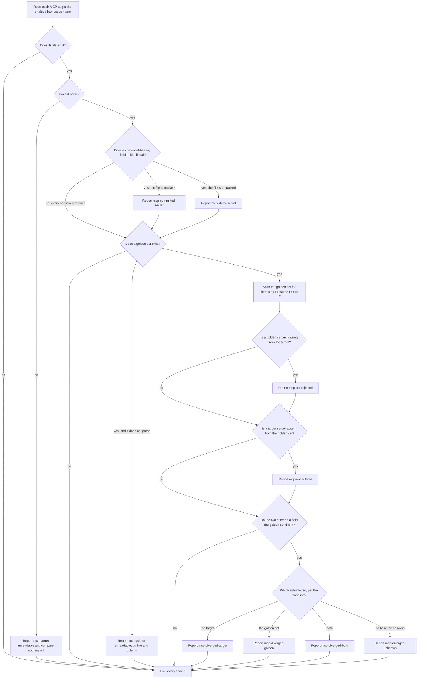

# mcp-diagnosis

## What

The `doctor` command's third half: reporting how a repository's **golden MCP server set** and the
per-harness MCP configuration files have drifted apart, and reporting literal credentials sitting
in either.

A **golden set** is a file the user authors at `.agents/buddy-agent-harness/mcp.toml`, holding one
canonical entry per MCP server in the superset of fields the supported hosts accept. It is the
premise this capability rests on: `init` reports MCP configuration rather than converting it
because converting a config someone wrote for one harness into another's format has to invent
values they never wrote. A set the user authored inverts that — a field they filled in is
transcription, not invention. **No golden file means no MCP diagnosis**, and nothing here invents
anything either.

The path is tool-namespaced deliberately. `.agents/` is the shared standard surface, and claiming
an unqualified name there for one tool's superset would squat a namespace belonging to the
standard. `.research/mcp-canonical-location/` records that no standard names a location and that
the filename converging in practice (`.mcp.json` at the repository root) is already Claude Code's
own project config.

Drift runs **both directions** and is the point. A user edits `.cursor/mcp.json` because that is
the file open in front of them; a harness rewrites its own config. Either way the golden set is
now wrong, and nothing says so.

**Non-goals**

- **Projecting.** Nothing here writes a harness's MCP config. Forward projection needs an
  approval-gated, write-capable home, and `doctor` is read-only and hook-safe.
- **Reconciling.** Pulling a target-side change back into the golden set is per server and per
  field, approval-gated, and refuses to auto-merge a three-way conflict. That is the same
  write-capable home's work. This capability is what it reads its work from.
- **User scope.** `~/.codex/config.toml`, `~/.claude.json`, and `claude_desktop_config.json` hold
  much of the world's MCP configuration and are described and diagnosable, never written. Reading
  them is out of scope here too: a repository tool reporting on a user's home directory in output
  that lands in every session's transcript is a wider blast radius than this capability needs.
- **Judging a server.** Whether a server should be configured at all is nobody's business here.
- **Reporting absence.** A repository with no golden set gets no MCP finding. Only the literal-
  credential checks run without one, because a credential in a file is wrong whether or not this
  project is managing that file.

**Key terms**

- **golden set** — `.agents/buddy-agent-harness/mcp.toml`, the user-authored canonical server set.
- **MCP target** — a harness's project-scope MCP configuration file, its config key, and its
  format, as its own vendor documents them.
- **canonical model** — the parsed, normalized shape both sides are compared in. Comparison is
  semantic: no two of these files are ever byte-equal, so bytes cannot be the test.
- **last-projected record** — `.agents/buddy-agent-harness/mcp.projected.json`, the per-target
  record of what was last written, and the baseline for a target git cannot speak for. Nothing
  writes it here, because nothing projects here; it is read where it is found, and a repository
  that has never been projected into simply has none.
- **credential-bearing field** — a field whose name marks it as carrying a secret, plus the
  userinfo component of a URL and a credential-named query parameter in one. A name qualifies two
  ways: a word that never appears inside an innocent word (`token`, `secret`, `password`, `passwd`,
  `credential`) anywhere in it, or one of the ambiguous words (`key`, `auth`, `authorization`,
  `bearer`) as a whole segment of it. The split is what keeps `MONKEY_PATCH` and `AUTHOR` out
  while keeping `MYTOKEN` in, and a scanner that cries wolf on a hook-run command is one people
  stop reading.
- **reference** — a value that names a secret instead of holding one: `${VAR}`, `$VAR`,
  `${env:VAR}`, `${input:...}`.

## Use Cases

**Actors**

- **person authoring the golden set** — writes the file, and needs to be told when a harness no
  longer matches it.
- **the write-capable repair surface** — reads these findings to know what to project and what to
  reconcile; it detects nothing itself.
- **session-start hook** — runs the command unattended on every session. It is why nothing here
  writes, and why no secret may enter a finding.
- **`doctor` skill** — presents the report and routes each finding.

**Goals, and where each is served**

| Actor | Goal | Entry point |
| --- | --- | --- |
| person authoring the golden set | learn that a harness copy no longer matches what they wrote | `buddy-agent-harness doctor` |
| person authoring the golden set | learn that a credential is sitting in a config file, without being shown it again | `buddy-agent-harness doctor` |
| the write-capable repair surface | know every drifted server and which side moved | `buddy-agent-harness doctor` |
| session-start hook | learn of drift with no risk of a write and no secret in the transcript | `buddy-agent-harness doctor` |
| `doctor` skill | route each finding to whoever repairs it, and know not to read a withheld value back | the repair each finding carries |

**Entry point**

| Entry point | Trigger | Inputs | Outcome |
| --- | --- | --- | --- |
| `buddy-agent-harness doctor` | a caller asks what is wrong with this repository's agent configuration | the repository root | every MCP drift and every literal credential reported alongside the existing findings, each carrying its `problem` name, a locator, a `detail` in prose, and a repair |

**Surface**

No new option. Findings are reported through the existing `findings` and `help` sections and
honor `--root` and `--format`, exactly as the configuration half does.

It does **not** honor `--harness`, and the reason is the configuration half's with one extra step.
Every check here requires an MCP file to exist on disk, and every harness that documents one is
already selected without a preference. Claude Code and Cursor are selected unconditionally, whatever
is or is not present. Codex and Gemini CLI keep their MCP file **inside their own detection
directory**, so the file cannot exist without that directory selecting them. Preferring a harness
could therefore never add a finding.

Every MCP repair is an **instruction** and never a `command`. Not one of them is a shell invocation
that completes the repair: editing a config the user wrote is judgment, and rotating a credential
happens at its issuer rather than in this repository. A `command` here would invite a caller to run
prose.

A finding's `path` carries a **locator**, not only a file: `.cursor/mcp.json#servers.linear` names
the server, and `.cursor/mcp.json#servers.linear.headers.Authorization` names the field. The file
alone would be useless in a file holding twenty servers, and the locator is what a caller routes
on. It is a single string so the report shape is unchanged.

**A locator never carries a value.** Not a whole one, and not a prefix. `sk-ab…` is a leak into
the same transcript and buys nothing the field path does not.

**Extensions**

- **The golden set does not parse.** Reported by position — line and column — and never by
  content. The line a TOML parser echoes in its own error message is exactly the line holding the
  secret, so the parser's message and its code block are both unusable and neither is read.
- **A harness's MCP file does not parse.** That target is reported unreadable and skipped. No
  position, because none is available without reading the parser's message.
- **The repository is not a git repository.** Tracking cannot be read, so a literal credential is
  reported at its untracked severity rather than guessed at, and the git baseline is unavailable.
- **A harness has no documented project-scope MCP file.** Copilot CLI and Devin Desktop are in
  this position. They take no MCP entry and are never reported against — a documented absence, not
  a gap.
- **A field the golden set leaves unset.** Never a divergence, however the target fills it. A
  target's own default and a user's deliberate edit are indistinguishable in that position, and
  treating the pair as a difference is what makes a golden set accumulate noise on every
  round-trip. The golden set speaks only about fields it fills in. The same rule applies inside
  `env` and `headers`, per name.
- **A harness with no MCP file at all.** Nothing that could have drifted, so nothing is reported.
  Writing that file for the first time is projection, which is a write.
- **A credential in the golden set itself.** Reported like any other. A user pastes a token into
  whichever file is open, and the golden set is a file.
- **A last-projected record that does not parse.** Ignored, and the baseline falls through to git
  or to `unknown`. It is a cache of an answer rather than the answer, and a diagnosis that dies
  because its cache is corrupt is worse than one that says it cannot tell.
- **A URL that does not parse.** Not reported. It is malformed rather than leaky, and guessing at
  its structure with a pattern is how a scanner starts matching the thing it must not touch.

## Control Flow

A harness naming no MCP file at all never enters the graph, so nothing is reported for it.

The credential test at **E** runs on every file that parses, the golden set included at **J** — a
user pastes a token into whichever file is open, and the golden set is a file. It runs whether or
not a golden set exists, because a credential is wrong regardless of who is managing the file.

The baseline at **P** is asked of the **last-projected record** first, because it records exactly
what was written and answers exactly. Where the record has nothing for that server, a **tracked**
target falls back to git: the newest commit where the two sides agreed on that field, then which
working tree still matches it. Where neither can answer, the direction is `unknown` and the finding
says so rather than picking one.

Every check is independent, and a check that cannot answer reports nothing rather than guessing.

## Scenario map

### `buddy-agent-harness doctor`

| Edge | Path (Given) | Scenario |
| --- | --- | --- |
| A→Z | a harness with no documented project MCP file | `reports nothing for a harness with no project-scope MCP file` |
| B→Z | a golden set and a harness with no MCP file | `reports nothing for a harness whose MCP file does not exist yet` |
| C→D | a target whose JSON does not parse | `reports an unreadable target and compares nothing in it` |
| C→D | a target whose TOML does not parse | `reports an unreadable TOML target` |
| E→G | a literal token and no golden set | `reports a literal credential with no golden set present` |
| E→G | a literal token in an untracked target | `reports a literal credential in an MCP config` |
| E→G | a literal token outside a git repository | `reports a literal credential at untracked severity outside a git repository` |
| E→F | a literal token in a tracked target | `reports a committed credential, whose repair is to rotate it` |
| E→H | a `${VAR}` reference | `accepts a reference in a credential-bearing field` |
| E→H | the `$VAR`, `${env:…}`, and `${input:…}` forms | `accepts the other documented reference forms` |
| E→G | a value shaped like a reference but naming no variable | `reports a value that looks like a reference but names no variable` |
| E→H | a non-credential env value | `leaves an ordinary environment value alone` |
| E→H | a name embedding a credential word inside another word | `leaves a name that merely contains a credential word inside another word alone` |
| E→G | a credential word run together with the rest of the name | `reports a credential word run together with the rest of the name` |
| E→G | a credential segment spelled run together in lower case | `reports a credential segment spelled run together in lower case` |
| E→G | a credential segment spelled in camel case | `reports a credential segment spelled in camel case` |
| E→G | credentials in a URL's userinfo | `reports a credential carried in a URL` |
| E→G | a credential-named URL query parameter | `reports a credential carried in a URL query parameter` |
| E→H | a URL query parameter holding a reference | `accepts a URL query parameter holding a reference` |
| E→H | a URL carrying no credential | `leaves a URL with no credential in it alone` |
| E→H | a URL that does not parse | `leaves a url that does not parse alone, because it is malformed rather than leaky` |
| E→G | an env literal, read for what the report carries | `never carries an env credential into the finding` |
| E→G | a header literal, read for what the report carries | `never carries a header credential into the finding` |
| E→G | a URL userinfo password, read for what the report carries | `never carries a URL's userinfo credential into the finding` |
| E→G | a URL query literal, read for what the report carries | `never carries a URL query parameter credential into the finding` |
| J→K | a golden-set literal, read for what the report carries | `never carries a golden-set credential into the finding` |
| P→T | a divergence on a credential-bearing field | `never carries a credential into a divergence finding` |
| C→D | an unparseable target whose broken line assigns a credential | `never carries an unreadable file's content into the finding` |
| H→Z | no golden set | `reports no drift for a repository with no golden set` |
| H→I | a golden set whose TOML is malformed | `reports an unreadable golden set by position` |
| H→I | a malformed line that assigns a credential | `never puts the offending line into the finding` |
| H→I | a malformed golden set and a readable target | `compares nothing once the golden set is unreadable` |
| J→K | a literal in the golden set itself | `reports a literal credential in the golden set itself` |
| K→L | a golden server absent from a target | `reports a golden server a target does not carry` |
| M→N | a target server absent from the golden set | `reports a target server the golden set does not carry` |
| O→Z | a golden set and a target that agree | `reports nothing when a target matches the golden set` |
| O→Z | a field only the target fills in | `treats a field the golden set leaves unset as no difference` |
| O→Z | a settings file holding more than MCP | `reads only the MCP key from a file that holds other settings` |
| O→Z | a Codex TOML target | `compares a TOML target against the golden set semantically` |
| P→Q | the target moved since the record | `reports the target as the side that moved` |
| P→R | the golden set moved since the record | `reports the golden set as the side that moved` |
| P→S | both moved since the record | `reports a three-way conflict without merging it` |
| P→T | no record entry and no repository | `reports an unknown direction when no baseline can answer` |
| P→T | a record that does not parse | `ignores a projection record that does not parse` |
| P→Q | no record entry and a tracked target | `falls back to git history for a tracked target` |
| P→Q | a newer commit where the golden set did not parse | `walks past a commit where the golden set did not parse` |
| P→Q | a newer commit where the target did not parse | `walks past a commit where the target did not parse` |
| P→T | a tracked pair that never agreed in history | `reports an unknown direction when no commit ever agreed` |
| K→L | a reported fault, read for its name and locator | `names each MCP fault and locates it beyond the file` |
| K→L | a reported fault, read for its repair | `carries the repair for every MCP finding it reports` |
| K→L | a reported fault, read for whether its repair is runnable | `offers every MCP repair as an instruction rather than a command` |

## References

- `../../../../../../.research/mcp-canonical-location/` backs the golden set's path and every
  project-scope MCP target: which harness reads which file, under which key, in which format, and
  which two of the supported harnesses document none.
- `../../../../../../.research/agentic-configuration-standards/` (E-MCP-01 through E-MCP-05) backs
  the superset's field list and the lossiness the golden set exists to remove.
