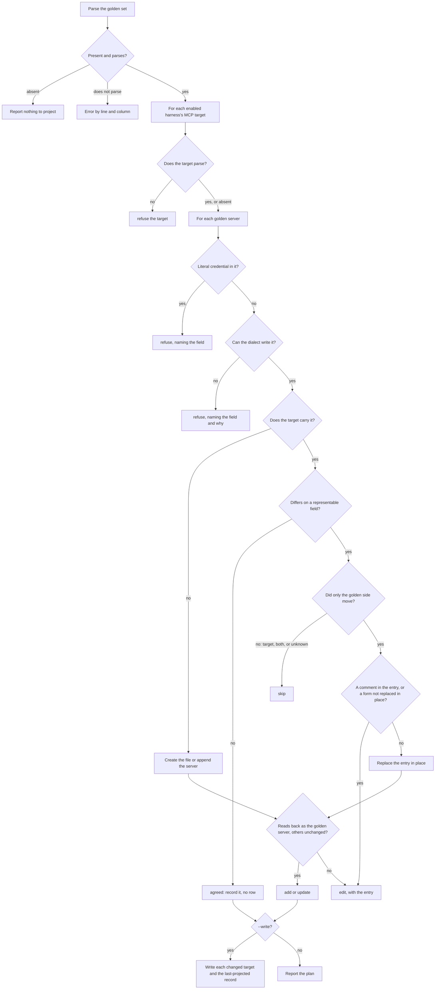

# mcp-projection

## What

`buddy-agent-harness mcp project`: writing the **golden MCP server set** into each enabled
harness's own project-scope MCP file, and recording what it wrote.

It is the forward half of the writers `mcp-diagnosis` names as its non-goal. The premise is the
golden set's: a field the user filled in is transcription, not invention. A field the user left
unset stays unset. When a target requires something the golden set does not say, or cannot hold
the server at all, that server is **refused by name**, and nothing half-built is written.

**The command writes only where the golden set is plainly ahead.** That means two cases: a server
the target does not carry yet, or a field the baseline says only the golden side changed. When a
harness-side change sits in the way, that server is held back. Overwriting it would throw away the
user's edit, and pulling it back into the golden set is reconcile's job, not this command's.

**Non-goals**

- **Reconciling.** Importing a target-side change into the golden set is per server and per field,
  and needs approval. It never auto-merges a three-way conflict, and it refuses a literal
  credential. This command reads the same baseline to know when to stay out of the way. It never
  writes the golden set.
- **User scope.** It does not read or write `~/.codex/config.toml`, `~/.claude.json`, or
  `claude_desktop_config.json`.
- **Removing a server.** If a server is in a target but not in the golden set, that is
  `mcp-undeclared`, and deciding which side is right is a person's call.
- **Approval.** The command has none of its own. It is a dry run unless `--write` is passed. The
  `repair` skill shows the dry run and passes `--write` only once the user approves.

**Key terms**

- **golden set**, **MCP target**, **canonical model**, **last-projected record**: as in
  `../mcp-diagnosis/README.md`.
- **dialect**: one harness's entry shape, read and written as a pair. It covers:
  - field names;
  - how the transport is chosen;
  - how an environment variable is referenced;
  - the timeout unit;
  - which golden fields the harness has a place for.

  `.research/mcp-canonical-location/` E-MCP-12 to E-MCP-16 back every mapping.
- **representable fields**: the golden fields a dialect has a place for. A field outside them is
  dropped on write and never compared. Dropping it is not invention, and comparing it would report
  drift on every server forever.
- **shared file**: a target that also holds settings other than MCP: `.gemini/settings.json` and
  `.codex/config.toml`.

## Use Cases

**Actors**

- **person authoring the golden set**: wants every harness to carry what they wrote, without
  retyping it in four syntaxes.
- **`repair` skill**: shows the plan, asks for approval, and applies the plan and any hand edits it
  lists.

**Entry point**

| Entry point | Trigger | Inputs | Outcome |
| --- | --- | --- | --- |
| `buddy-agent-harness mcp project` | a caller wants the harness MCP files brought up to the golden set | the repository root, and `--write` to apply | one row per server per target saying what was or would be done, the entries to apply by hand, and on `--write` the files and the last-projected record written |

**Surface**

- `--root`, `--format` as every command has.
- `--write`: without it nothing on disk changes.

The report has these sections:

- `golden`: the file the plan was made from.
- `mode`: a dry run or written.
- `actions`: one row per server per target that needs anything, as `target`, `server`, `action`,
  `detail`.
- `entries`: one per `add`, `update`, or `edit` row, as `target`, `server`, `action`, `entry`.
  `entry` is the server's entry as it would read in that target. It is the "after" the `repair`
  skill shows next to the file as it stands, and for an `edit` it is the text to apply by hand.
  Omitted when no row changes a server.
- `record`: the path written, or why nothing was.

A server already in agreement produces no row, so a run with nothing to do states its zero.

The actions are:

| Action | Meaning |
| --- | --- |
| `add` | the server is written into a target that did not carry it, creating the file if there was none |
| `update` | the fields only the golden side changed are rewritten in place |
| `edit` | the change is due, but this command will not make it byte-safely; the entry is listed for a person or the skill to apply |
| `skip` | the target moved, both sides moved, or no baseline can say, so nothing is written |
| `refuse` | the target cannot hold this server as written, or the golden set holds a literal credential; the detail names the field |

**Targets.** A target is every MCP file an enabled harness reads, chosen by the same rule
`doctor` uses. Claude Code and Cursor are always enabled. Codex and Gemini CLI are enabled when
their directory exists. A file that does not exist yet is created only for an enabled harness.

**Writes are byte-preserving.** Every byte of the file outside the entry being written is kept,
comments included:

- **JSON:** a new server is spliced in at the parse tree's offsets. An existing server's value is
  replaced at its offsets.
- **TOML:** a new table is appended. An existing server's `[mcp_servers.<name>]` table and every
  `[mcp_servers.<name>.*]` sub-table are replaced, wherever they sit. `smol-toml` keeps no source
  offsets, so `toml-eslint-parser` locates the tables.
- **Shared files** are written the same way. Every byte outside the entry is kept, so another
  tool's settings are never touched.
- An in-place change is an `update`, unless it cannot be made that way. Then it is an `edit`:
  - The entry holds a comment, a trailing comment on its last line included. The replacement
    would drop it, and where it belongs in the new entry is a person's call.
  - A TOML server is not a `[mcp_servers.<name>]` table: an inline table, dotted keys, a header
    only implied by a sub-table, or an array of tables inside it.

**A write must read back.** Every new text is parsed again through the target's dialect before it
is accepted. The server must come back equal to the golden server over the representable fields,
and every other server must come back unchanged. If not, the write becomes an `edit`.

**The last-projected record** is written on `--write`. For each target it records every server
that now agrees with the golden set, as its golden model, and keeps what was already recorded for
servers this run left alone. `doctor` reads it as the baseline.

**Dialects.**

| Concept | Claude Code | Cursor | Codex | Gemini CLI |
| --- | --- | --- | --- | --- |
| transport | `type` | `type: "stdio"` only; SSE and streamable HTTP are not told apart | from `command` vs `url`; **no SSE** | `command`; `url` is SSE; `httpUrl` is streamable HTTP |
| reference | `${NAME}` as written | `${env:NAME}`; no default form | no expansion: `env_vars`, `env_http_headers`, `bearer_token_env_var` | `${NAME}` as written, in every field |
| timeout | `timeout`, ms | none | `tool_timeout_sec`, seconds | `timeout`, ms |
| other | `description` | — | `enabled` | — |

The golden set writes a reference as `${NAME}`, and each dialect translates it.

**Extensions**

- **No golden set.** Nothing to project. The report states that, and exit is success.
- **The golden set does not parse.** An error by line and column only, and a failing exit. The
  parser's message quotes the line, and that line may hold a credential.
- **A target does not parse.** That target is refused and left alone. The others proceed.
- **The golden server holds a literal credential.** It is refused for every target, naming the
  field and never the value. Writing it would copy the credential into up to four more files.
- **The golden server has no command or url.** It is refused. There is nothing to run.
- **The target cannot hold the transport.** It is refused. Codex has no SSE (E-MCP-14).
- **A reference the target cannot expand.** It is refused, naming the field. Codex expands none.
  Sent literally, the reference would reach the server as the text `${NAME}`.
- **A variable renamed on the way into Codex.** `A = "${B}"` cannot be expressed by `env_vars`,
  which passes a variable through under its own name, so it is refused.
- **A JSON file with no object at its root, or a non-object under the MCP key.** There is no safe
  place to insert, so the change is an `edit`.

## Control Flow

## Scenario map

### `buddy-agent-harness mcp project`

| Edge | Path (Given) | Scenario |
| --- | --- | --- |
| B→Z0 | no golden set | `reports nothing to project without a golden set` |
| B→Z1 | a malformed golden set | `fails on an unreadable golden set by position only` |
| D→E | a target that does not parse | `refuses a target that does not parse and leaves it alone` |
| K→L | no target file for an enabled harness | `creates the MCP file of an enabled harness` |
| C | a harness whose directory is absent | `creates nothing for a harness that is not enabled` |
| K→L | a target missing one server | `appends a server to a JSON file without touching a byte of the rest` |
| K→L | a shared settings file with comments and no MCP key | `adds the MCP key to a shared settings file and keeps its comments` |
| K→L | a Codex file holding other settings | `appends a server table to a Codex file without touching a byte of the rest` |
| V→X | any plan, no `--write` | `writes nothing without --write` |
| V→W | a plan applied | `records what it projected` |
| V→W | an existing record | `keeps what the record holds for servers it did not touch` |
| M→N | a target already in agreement | `reports nothing for a server already in agreement` |
| G→H | a golden literal credential | `refuses a server whose golden entry holds a literal credential, without the value` |
| I→J | an SSE server and Codex | `refuses an SSE server for Codex` |
| I→J | a server with neither command nor url | `refuses a server with nothing to run` |
| I→J | a reference in a Gemini CLI header | `refuses a reference Gemini CLI would not expand` |
| I→J | a renamed variable for Codex | `refuses a variable Codex would have to rename` |
| O→P | the target moved since the record | `holds back a server the target changed` |
| O→P | both moved | `holds back a three-way conflict` |
| O→P | no baseline | `holds back a server when no baseline can say which side moved` |
| Q→S | the golden side moved, a file that is not shared | `updates in place a field only the golden set changed` |
| Q→S | the golden side moved, a shared settings file | `updates a server in place in a shared settings file and keeps its comments` |
| Q→S | the golden side moved, a Codex file | `updates a server table in place in a Codex file, byte-preserving outside it` |
| Q→R | the golden side moved, a comment in the entry | `hands over a change that would drop a comment as an edit` |
| Q→R | the golden side moved, a comment in a Codex table | `hands over a change to a Codex table holding a comment as an edit` |
| Q→R | the golden side moved, a Codex inline table | `hands over a change to a Codex server written as an inline table as an edit` |
| T→R | a JSON root that is not an object | `hands over an add it cannot place safely as an edit` |
| M | a golden field the target has no place for | `drops a field the target cannot hold rather than refusing` |
| F | the Claude Code dialect | `writes a Claude Code entry with its transport and timeout` |
| F | the Cursor dialect | `writes a Cursor reference in its own syntax` |
| F | the Codex dialect | `writes Codex headers and variables through its named fields` |
| F | the Gemini CLI dialect | `writes a Gemini CLI remote server under the field its transport needs` |

### `buddy-agent-harness doctor` (reading through the dialects)

| Edge | Path (Given) | Scenario |
| --- | --- | --- |
| — | a Gemini CLI `url` entry | `reads a Gemini CLI url as SSE` |
| — | a Codex bearer and env-header entry | `reads Codex headers and variables back as references` |
| — | a golden field Cursor has no place for | `reports no drift on a field the target cannot hold` |

## References

- `../mcp-diagnosis/README.md`: the golden set, the canonical model, the baseline, and the
  secret-handling rules this command inherits.
- `../../../../../../.research/mcp-canonical-location/`: E-MCP-12 to E-MCP-16 back every dialect
  mapping. E-MCP-13 is why Cursor holds no remote transport. E-MCP-14 is why Codex refuses SSE and
  every inline reference. E-MCP-15 is why Gemini CLI splits `url` and `httpUrl` and expands only in
  `env`.
