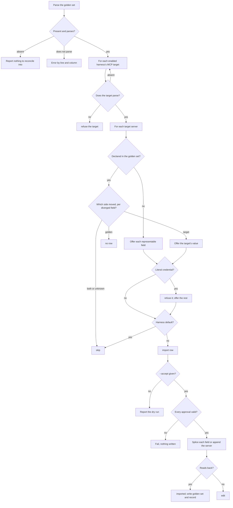

# mcp-reconcile

## What

`buddy-agent-harness mcp reconcile`: importing a change made in a harness's own MCP file back into
the **golden MCP server set**, one approved field at a time.

It is the reverse of `../mcp-projection/`. `mcp project` writes where the golden set is plainly
ahead. This command writes where the harness side is plainly ahead: a field only the harness copy
changed (`mcp-diverged-target`), or a server only a harness declares (`mcp-undeclared`).

**Each field is its own approval.** The command lists one row per field. It writes only the fields
`--accept` names, one locator each. There is no approve-all, and none should be added.

**Non-goals**

- **A three-way conflict.** A field both sides changed, or one no baseline can place, is reported
  and never imported, whatever is approved.
- **The golden side ahead.** That is `mcp project`'s, and it produces no row here.
- **Writing a harness file.** Only the golden set and the last-projected record are written.
- **A name only the harness carries in `env` or `headers`.** The golden set never compared it, so
  it never pulls it.
- **User scope.** As in `../mcp-projection/README.md`.

**Key terms**

- **golden set**, **MCP target**, **canonical model**, **last-projected record**, **dialect**: as in
  `../mcp-diagnosis/README.md` and `../mcp-projection/README.md`.
- **harness default**: a value a harness documents as what it uses when the field is unset. Codex's
  tool timeout is 60 seconds (E-MCP-14). Gemini CLI's is 600000 ms (E-MCP-15).

## Use Cases

**Actors**

- **person who edited a harness copy**: wants that edit kept, in the one file every harness is
  projected from.
- **`repair` skill**: offers each field on its own and passes `--accept` only for the approved ones.

**Entry point**

| Entry point | Trigger | Inputs | Outcome |
| --- | --- | --- | --- |
| `buddy-agent-harness mcp reconcile` | a caller wants a harness-side change in the golden set | the repository root, and one `--accept <path>` per approved field | one row per field; with `--accept`, those fields written into the golden set and the last-projected record |

**Surface**

- `--root`, `--format` as every command has.
- `--accept <path>`, repeatable. `path` is the locator the row lists, the same one `doctor`
  reports, such as `.mcp.json#servers.linear.command`. Without it nothing on disk changes.

The report has `golden`, `mode`, `fields`, and `record`. Each `fields` row has `path`, `action`,
`detail`, and for a row that changes a field, `value`: the field as it would read in the golden
set, or `(unset)` for a removal.

| Action | Meaning |
| --- | --- |
| `import` | offered; approving it writes the field |
| `imported` | approved and written |
| `edit` | approved, but the golden set writes it in a shape this command does not take apart; `value` is for a person to apply |
| `skip` | both sides moved, no baseline can say, or the value is the harness's default |
| `refuse` | the target does not parse, or the field holds a literal credential |

**What is offered**

- **A diverged field.** Only where the baseline says the target alone moved. A map offers the
  target's value for each name the golden set holds; a name the target dropped is removed.
- **An undeclared server.** Each field the target's dialect has a place for. A transport the golden
  set would infer from `command` or `url` is not offered.
- **Every value in golden form.** The dialect reads it back: Cursor's `${env:NAME}` and Codex's
  `bearer_token_env_var`, `env_vars`, and `env_http_headers` come back as `${NAME}`.

**Approval fails whole.** Any of these writes nothing and exits with a failure naming the reason:

- a path no row lists, or a row that is not `import`;
- one field approved from two targets with different values;
- a new server approved without its `command` or `url`.

**Writes are byte-preserving.** The golden set is edited at the parse tree's offsets through
`src/config-edit/`. A changed value replaces only its value text. A new field goes after the
table's last key. A removed field takes its line. A new server is appended as a table with every
value inline. Every comment survives. A field spread over a sub-table or dotted keys, or a server
not written as its own `[servers.<name>]` table, becomes an `edit`.

**A write must read back.** The new text must parse to the expected server with every other server
unchanged, or it becomes an `edit`.

**The last-projected record.** An imported field now agrees on both sides, so it is recorded for
the target it came from. A new server is recorded whole. A server the record lacks is recorded only
when every other field's baseline is known; otherwise the record is left alone rather than claim an
agreement no baseline supports.

**Extensions**

- **No golden set.** Nothing to reconcile into. The report states that, and exit is success.
- **The golden set does not parse.** An error by line and column only, and a failing exit.
- **A target does not parse.** It is refused. The others proceed.
- **A literal credential.** `env.NAME` or `headers.NAME` is refused by name, and the map's other
  names are still offered. Where the golden set already holds that name, its reference is kept. A
  `url` holding a credential, or an `args` holding a credential-named `--flag=value`, is refused
  whole. The value never appears in the report.
- **A harness default.** A value equal to the dialect's documented default is `skip`: a harness
  restating its default is indistinguishable from a user's edit.

## Control Flow

## Scenario map

| Edge | Path (Given) | Scenario |
| --- | --- | --- |
| B→Z0 | no golden set | `reports nothing to reconcile into without a golden set` |
| B→Z1 | a malformed golden set | `fails on an unreadable golden set by position only` |
| D→E | a target that does not parse | `refuses a target that does not parse` |
| Q→R | a target-side change, no `--accept` | `offers a field only the harness changed, and writes nothing without approval` |
| V→W | one approved field | `imports an approved field in place, keeping every comment, and records the agreement` |
| S→U | two offered fields, one approved | `imports only the approved field of several` |
| L | the harness dropped a field | `imports a field the harness removed by removing it from the golden set` |
| L | a map with a changed and an extra name | `takes only the names the golden set speaks for in a map` |
| L | a map emptied of the golden names | `removes a map the harness emptied of every name the golden set speaks for` |
| L | a map dropped | `removes a map the harness dropped altogether` |
| I→J | the golden side moved | `leaves a change only the golden side made to mcp project` |
| I→K, S→T | both moved, and approved | `keeps a three-way conflict report-only, and refuses its approval` |
| I→K | no baseline | `keeps a divergence no baseline can place report-only` |
| S→T | an unknown path | `refuses an approval naming no field it offered` |
| G→H | an undeclared server | `offers each field of a server only the harness declares, without the transport it implies` |
| G→H | a stated transport the golden set would not infer | `offers a transport the harness states against what the golden set would infer` |
| V→W | an approved undeclared server | `adds an approved server as a new table and records it` |
| V→W | one server from two agreeing targets | `adds a server offered by two harnesses once, when they agree` |
| S→T | a new server without command or url | `refuses to add a server with nothing to run` |
| S→T | two targets, two values | `refuses two approvals of one field with different values` |
| V→X | a field in a sub-table | `hands over a field the golden set spreads over a sub-table as an edit` |
| V→X | servers declared inline | `hands over an added server as an edit when the golden set declares its servers inline` |
| M→N | a literal header beside another | `imports the server and refuses the literal, never showing its value` |
| M→N | a map of only a literal | `offers nothing for a map holding only a literal` |
| M→N | a literal over a golden reference | `keeps the golden reference where the harness pasted a literal over it` |
| M→N | only the literal changed | `offers nothing when the literal was the only change` |
| M→N | a credential in `url` and in `args` | `refuses a url or an argument holding a literal whole` |
| O→K | Gemini CLI's default timeout | `does not take a timeout Gemini CLI fills in by default for the user’s` |
| F | the Cursor dialect | `translates a Cursor reference back into the golden form` |
| F, O→K | the Codex dialect | `translates a Codex bearer token and its default timeout` |
| W | no record, a git baseline | `records a server the record lacks from the baseline of each field` |
| W | no record, a field no baseline places | `leaves the record alone for a server another field of which no baseline can place` |

## References

- `../mcp-diagnosis/README.md`: the golden set, the baseline, and the secret-handling rules.
- `../mcp-projection/README.md`: the forward direction, the dialects, and the last-projected record.
- `../../../../../../.research/mcp-canonical-location/`: E-MCP-14 and E-MCP-15 give the two
  documented timeout defaults; E-MCP-12 to E-MCP-16 back each dialect's reading.
