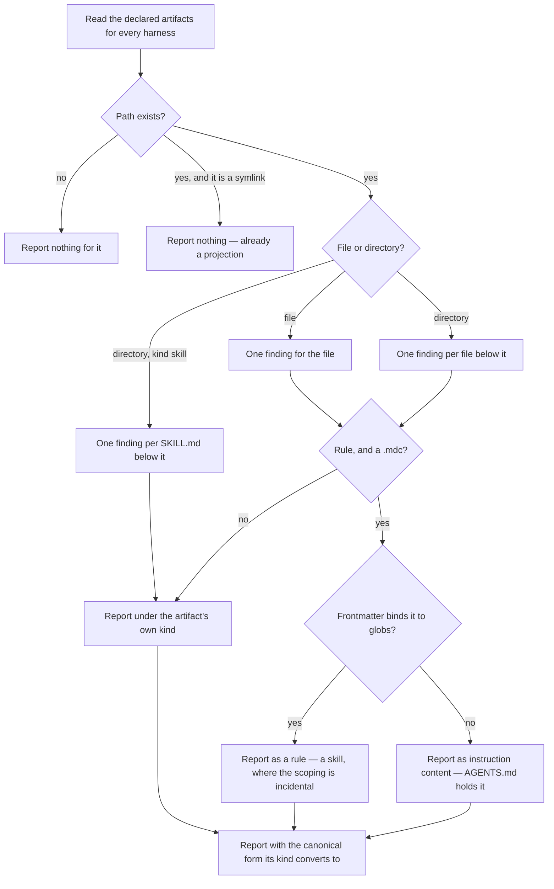

# nonstandard-configuration

## What

The `doctor` command's fifth finding family: agent configuration that **works, for exactly one harness**.

The other four families each answer a question about whether something is broken — a bridge that no longer resolves, a harness that cannot read `AGENTS.md`, configuration that is present and wrong, an MCP set that has drifted. This one answers a question none of them asks: **how far does what is here reach?** A `.cursor/rules/*.mdc` does exactly what it says, in Cursor, and nowhere else. Nothing is wrong with it. The repository is nonetheless carrying guidance that one tool sees and the others do not, and nobody finds out except by noticing an agent behave differently somewhere else.

Each finding names the **canonical form it converts to**. Surfacing without a destination is a list of files somebody already knows about; the finding is worth its noise only if it says where the content should end up. The direction is always the same — move content to a canonical source, and let the harness file be **generated** from it rather than authored beside it.

**Detection has one home** — `../../workflows/detect-and-repair/` owns that property. What it means here: this family is detected in the `doctor` command like every other, and repaired nowhere in it.

**Zero of these is a direction, not a gate.** A repository is not failing while it has them, and nothing in the tool blocks on the count. The count going down is the point.

**Non-goals**

- **Repairing.** The command never writes. Every conversion here moves content a person authored, so every one of them is offered by a skill and approved before it lands.
- **Offering a runnable command.** Every finding in this family is judgment about content, so none carries a `command`. A conversion expressible as one invocation would mean the content needed no judgment, which no member of this family satisfies.
- **Deciding that a conversion is right.** Two of them are explicitly conditional — see the extensions below. The finding states the candidate; whether it applies is the owner's.
- **Correctness.** Whether the content is *good*, or even true, is nobody's business here. This family is decided by where a file lives and what reads it, never by weighing what it says.
- **Absence.** Guidance a repository lacks is `enhance`'s. Every finding here is something present.
- **Wrongness.** Configuration that is present and wrong is `../configuration-diagnosis/`'s, and repairs through `repair`. Nothing here is wrong, which is why nothing here is `repair`'s.
- **Hooks, LSP settings, and output styles.** Their event names and shapes differ per harness with no safe projection, so no candidate canonical form can be stated. Left out deliberately rather than half-reported.

**Key terms**

- **non-standard artifact** — configuration at a path only one harness reads, declared per harness in the registry beside that harness's other paths.
- **kind** — what the artifact is, and therefore what it converts to: `instructions`, `rule`, `command`, `skill`, `subagent`. The finding routes on it.
- **reach** — how many harnesses can read a piece of configuration. The property this family reports on, and the only one that distinguishes it from the four that report faults.
- **canonical form** — where the content belongs so that every harness reads it: `AGENTS.md` for prose, `.agents/skills/` for a capability.
- **generated bridge** — what replaces the harness file after conversion. The file may still exist; it stops being the source.

## Use Cases

| Entry point | Trigger | Inputs | Outcome |
| --- | --- | --- | --- |
| `buddy-agent-harness doctor` | an agent or a person asks what this repository's configuration looks like | the repository root | every non-standard artifact reported with its path, its kind, and the canonical form it converts to |

**Actors**

- **invoking agent** — runs the command and routes each finding to the skill that owns its conversion.
- **repository owner** — approves each conversion; the only actor whose consent moves authored content.
- **downstream agent** — every session on a harness that cannot read the artifact. Affected without invoking anything, and the reason the reach matters at all.

## Control Flow

A path named by two harnesses is one artifact and yields one finding. The enabled harness set is not consulted: reach is a property of the file, not of which tools this repository happens to use.

## Extensions

- **A path-scoped rule may have nowhere to go.** `AGENTS.md` scopes by directory nesting and a skill is loaded on relevance; neither reproduces "these globs and no others". Where the scoping is incidental a skill carries the guidance everywhere; where it is the point, the artifact stays and the finding is the record of why.
- **A subagent has no portable form at all.** No cross-harness format exists. The finding names no skill and reports the gap, because promising a conversion that does not exist is worse than reporting that none does.
- **An artifact whose harness is not enabled is still reported.** Enablement says which tools a repository uses; reach says where content lands.
- **A harness directory that is a symlink is not reported.** It is a projection someone already made, and reporting it would ask a repository to redo what it has done.

## Scenario map

### `buddy-agent-harness doctor`

| Edge | Path (Given) | Scenario |
| --- | --- | --- |
| B→C | a repository whose configuration is all canonical | `reports nothing for a repository with no harness-exclusive configuration` |
| F | a legacy instruction file only one harness reads | `reports an instruction file only one harness reads` |
| K→M | an always-on `.mdc` rule | `reads an always-on rule as instruction content` |
| K→L | a `.mdc` rule bound to globs | `reads a globbed rule as a rule rather than as prose` |
| K→M | a `.mdc` rule whose globs entry is empty | `reads an empty globs entry as no scoping at all` |
| H | a harness command file | `reports a harness command as work a skill would carry everywhere` |
| G | a skill kept under a harness directory | `reports a harness-directory skill once, by its SKILL.md` |
| J | a subagent definition | `names no skill for a subagent, because no portable form exists` |
| D | a harness directory that is a symlink | `reports no harness directory that is a symlink` |
| D | a skills projection target `init` writes | `reports no skills projection target` |
| B | an artifact whose harness the repository never enabled | `reports an artifact whose harness the repository never enabled` |
| N | any finding | `carries the reported path into the repair rather than a placeholder` |

## References

- `../../../../src/harness-registry/nonstandard-artifact.ts` declares the artifact shape and the five kinds; the per-harness lists live beside each harness's other paths in `../../../../src/harness-registry/harness-registry.ts`.
- `../../../../skills/init/references/detection.md` is where these dispositions were first written down, as the survey `init` runs. This node reports the same classes from the read-only side.
