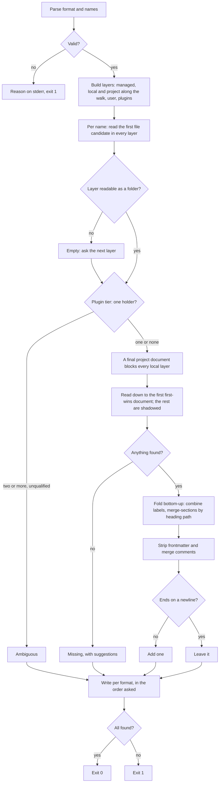
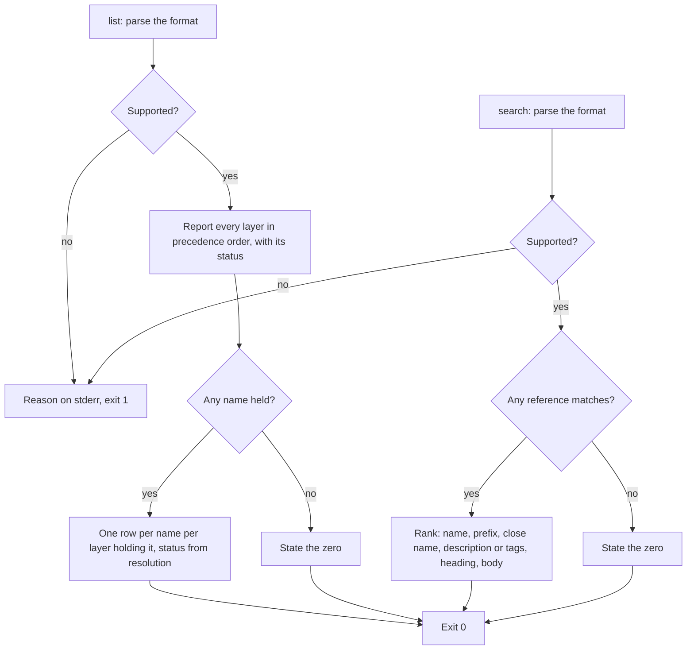

# references

## What

How a caller reads a **reference** by name, finds one it cannot name, and learns which layer answered.

A reference is a Markdown document an agent reads on demand: a style guide, a playbook, a checklist,
a governance. It is the counterpart of a skill. A harness loads every skill's frontmatter at session
start, so a skill costs context before it is used. A reference costs nothing until it is fetched.

A reference can exist in several places at once — a machine owner's copy, a person's, a repository's,
a package's — and the command combines them. The **higher layer decides how**, in its own
frontmatter. Nothing here compares prose: when two layers disagree, the merge mode chosen by the
higher one settles it, and reconciling meaning is left to whoever reads the result.

This node owns the tiers, the file names, the merge modes, and the three commands over them. It
replaces `governance-overrides` as the read path; that command stays, unchanged, as a deprecated alias
(`../governance-overrides/`).

**Key terms**

- **reference** — a Markdown document addressed by a name that is a file stem, optionally qualified by
  a plugin: `<name>` or `<plugin>/<name>`.
- **tier** — one kind of place a reference comes from: `managed`, `local`, `project`, `user`, `plugin`,
  in that order of precedence.
- **layer** — one folder inside a tier. A tier can hold several: a legacy `governances/` beside
  a `references/`, one per folder of the monorepo walk, a plugin each.
- **monorepo walk** — `--root` and each folder above it up to the repository root: the first folder
  holding `.git`, `pnpm-workspace.yaml`, or a `package.json` with `workspaces`.
- **merge mode** — how a document combines with the layers below it: `first-wins`, `combine`, or
  `merge-sections`, read from the higher document's frontmatter.
- **section path** — a heading and the headings above it, `Testing > Fixtures`; how `merge-sections`
  matches one document's section to another's.

**Non-goals**

- **Harness-managed folders and enabled-plugin discovery.** Both need harness detection, which is a
  separate change. The managed tier here is this package's machine-wide folder only; the plugin tier
  is this package and the repository's declared dependencies.
- **Loading a reference from inside a skill.** That is the `load-reference` skill, a separate change
  that builds on the `show` contract below.
- **Recording each fetch.** `show` is the single read path so a record can be added there later.
- **Reconciling contradictory prose.** Semantic work, not the resolver's.
- **The encoder.** `../command-output/`.

## Use Cases

**Actors**

- **an agent following instructions** — told to read `testing` and `release-checklist` before it
  starts; wants the documents on stdout, in the order asked, and a clear signal when one is missing.
- **a skill** — the future `load-reference` skill runs `show` on behalf of every skill that needs a
  reference; it reads the exit code first and the documents second.
- **an agent that cannot name what it needs** — knows the subject, not the file; runs `search`.
- **person at a shell** — writes a local, project, or user override and wants to see that it took
  effect, or why it did not: `list` and `show --trace`.
- **repository owner** — ships project references for every contributor, at the repository root or
  in one package of a monorepo, and marks one `final` when no contributor may override it locally.
- **machine owner** — installs references every repository on the machine should see.
- **package author** — ships `references/` in a package so every repository depending on it can read
  them.

**Goals, and where each is served**

| Actor | Goal | Entry point |
| --- | --- | --- |
| an agent | read several references in one call, in the order asked | `show a b c` |
| an agent | know which of them is missing without losing the rest | the missing marker, stderr, and the exit code |
| a skill | a stable shape to build on | `show --format json` |
| an agent | find a reference by subject | `search <query>` |
| person at a shell | override one section of a reference, not the whole of it | `merge: merge-sections` |
| person at a shell | see which layer answered and what it shadowed | `show --trace`, `list` |
| person at a shell | override a repository's reference for themselves alone | the local tier |
| repository owner | give every contributor the same references | the project tier |
| repository owner | give one package of a monorepo its own references | the monorepo walk |
| repository owner | a reference no contributor overrides locally | `final: true` |
| machine owner | a reference no repository can override | the managed tier |
| package author | ship references a dependent repository can read and override | the plugin tier |
| machine owner, repository owner | keep documents written for `governance` working | the legacy `governances/` layers |

**Entry points**

| Entry point | Trigger | Inputs | Outcome |
| --- | --- | --- | --- |
| `reference show <name>...` | a caller needs one or more references | names, `--root`, `--format`, `--trace` | each document, in order; exit 0 when all were found, 1 otherwise |
| `reference list` | a caller asks what is in play and what is shadowed | `--root`, `--format` | every layer, every name at every layer that holds it with its status, exit 0 |
| `reference search <query>` | a caller cannot name the reference | the query, `--root`, `--format` | matches ranked, one compact row each, exit 0 |

**Surface.** Names (`show`), a query (`search`), `--root` and `--format` (all three), and `--trace`
(`show` only — `list` already reports every layer's status, and `search` ranks rather than resolves).
`--root` names the directory the local and project tiers walk up from; `--format` serves the agent that parses (`toon`, `json`) and the
person who reads (`text`); `--trace` serves the person asking why a layer did not answer.

### Tiers, highest precedence first

| Tier | Layers, in order |
| --- | --- |
| `managed` | this package's machine-wide `references/`, then its `governances/`, then the one `universal-plugin` wrote (deprecated) |
| `local` | `<dir>/.agents/references.local/` for each `<dir>` of the monorepo walk, nearest first |
| `project` | `<dir>/.agents/references/`, then `<dir>/.agents/governances/`, for each `<dir>` of the monorepo walk, nearest first |
| `user` | `~/.agents/references/`, then `~/.agents/governances/` |
| `plugin` | this package's own `references/` and `governances/` as the plugin `buddy-agent-harness`, and each declared dependency that ships `references/` |

The machine-wide root per platform is `/etc/buddy-agent-harness`, `/Library/Application
Support/BuddyAgentHarness`, or `%ProgramData%\BuddyAgentHarness`; the deprecated one is the
`universal-plugin` root `governance` already reads.

**The monorepo walk.** The local and project tiers are read at `--root` (default: the working
directory) and at each folder above it, up to and including the repository root. The nearest folder's
layer ranks first. With no repository root above `--root`, the tiers are read at `--root` alone, so a
folder outside any repository never reads its ancestors.

**The local tier.** `.agents/references.local/` is one person's copy. It is meant to be gitignored,
and nothing here checks that it is. It ranks above every project layer and below managed, so a
person can override a repository's reference for themselves and a machine owner still overrides both.

**The plugin tier.** The dependencies and devDependencies of the nearest `package.json` from `--root`,
resolved the way Node resolves a package. Only declared dependencies: a transitive package is never a
plugin. A plugin is named by its package name, or by its `plugin.json` name when it has one. A plugin
is not a stack: an unqualified name held by two plugins is **ambiguous**, and `show` names both and
asks for `<plugin>/<name>`. A qualified name selects that plugin's layer; every tier above it still
resolves the bare `<name>`, so a project can override a plugin's reference without naming the plugin.

### File names

In each layer the first of these that exists answers:

1. `<name>.md`
2. `<name>/README.md`, then `<name>/index.md`
3. `<name>/SKILL.md` — a skill folder served as a reference.

Two candidates in one layer resolve in that order; `list` and `show` warn that the other is ignored.

### Frontmatter

Read as YAML. `merge`, `final`, `description`, and `tags` mean something here; the rest is passed
through. Frontmatter is never part of the text output. `json` and `toon` return it as `metadata`.

### Merge modes

The higher document chooses. Resolution reads down from the highest layer holding the name and stops
at the first `first-wins` document; every layer below it is **shadowed**.

- **`first-wins`** (the default) — the document is returned whole.
- **`combine`** — the document and everything it sits on are returned whole, highest first, each
  under a `<!-- layer: <tier> <path> -->` label, after one note saying the first layer wins on
  conflict.
- **`merge-sections`** — the document merges into what it sits on, heading by heading.
  - A section is its heading path. Matching ignores case and surrounding whitespace. Headings inside
    code fences are not headings. Text before the first heading is the preamble, a section of its own;
    an empty preamble replaces nothing.
  - A matched section is **replaced**, subsections and all. A `<!-- merge: combine -->` line directly
    under the heading keeps both bodies and merges their subsections the same way.
    `<!-- merge: remove -->` drops the section.
  - A section with no match is appended after its last sibling. Base order is kept.
  - `combine` or `remove` that matches nothing warns. A heading path that appears twice matches the
    first and warns.
  - Merge comments never reach the output.
- Over a `combine` stack, `merge-sections` merges into the stack's bodies joined in order.
- An unknown `merge` value warns and counts as `first-wins`.
- Layers apply bottom-up: plugin, user, project farthest first, local, managed.

### `final`

`final: true` in a project document blocks every local layer holding the name. The blocked layers are
not read into the result, and their trace step and `list` row read `blocked by final in project`. Any
project layer of the walk can set it; it blocks local only, so a nearer project layer and the managed
tier still override it. Outside the project tier `final` is ignored with a warning — a plugin cannot
stop the repository that depends on it from overriding locally. A value that is not `true` or `false`
warns and counts as `false`.

### Output contract of `show`

- **Exit code**: 0 when every name resolved; 1 when any name is missing or ambiguous, or the input is
  rejected before anything is read.
- **`text`** (default), one name: the document itself, nothing else on stdout.
- **`text`**, several names: each in order as `<reference name="…" tier="…">` … `</reference>`; a
  missing or ambiguous one as `<reference name="…" status="missing|ambiguous" />` in its place.
- **Missing or ambiguous**: the reason on stderr, one line per name. A miss suggests up to three
  names from `search`. `show` never answers with a fuzzy match.
- **`json` / `toon`**: always an array, one entry per name in order: `name`, `status`
  (`found` | `missing` | `ambiguous`), and for a found one `tier`, `path`, `merge`, `metadata`,
  `content`, and the `layers` used; `warnings`; `suggestions` for a miss; `plugins` for an ambiguity;
  `trace` with `--trace`.
- **`--trace`**: every path checked, per name, with the candidate file that matched, the merge mode
  applied, and why a layer was not used — `shadowed by project (first-wins)`, `blocked by final in project`. Carried as `trace` in `json`/`toon`, and written to stderr in `text` so stdout stays the
  document.
- **Warnings** go to stderr in `text`, and into `warnings` otherwise.

### `list` and `search`

`list` reports every layer in precedence order, then one row per name per layer that holds it:
`name`, `tier`, `plugin`, `path`, `status` (`used`, `shadowed by <tier> (first-wins)`, `blocked by final in project`, `ambiguous`), `description`. A healthy empty run states its zero. The legacy and
deprecated layers carry a status saying where their documents belong.

`search` ranks: exact name, name prefix, a name close to the query, `description` or `tags`, a
heading, the body. Each match is one row — `name`, `tier`, `match`, `description` — best first, then
by name. No match states its zero and exits 0.

**Extensions**

- **A name that is a path.** Rejected before anything is read, as `governance` does. A plugin
  qualifier is matched against known plugin names and never becomes a path.
- **A layer that is missing, unreadable, or not a directory.** Empty; never ends the run.
- **A document that does not end in a newline.** One is added.
- **A qualified name for a plugin that is not a dependency.** That layer is missing; the tiers above
  still answer.

## Control Flow

`list` and `search` build the same layers and resolve every name the layers hold through the same
path (D to K above), so a row's status and a `show --trace` for the same name never disagree.

## Scenario map

### `reference show` — tiers

| Edge | Path (Given) | Scenario |
| --- | --- | --- |
| E→K | a name in every tier | `resolves managed over project over user over plugin` |
| E→K | a name only in lower tiers | `falls through to the highest tier that holds the name` |
| E→K | a name in all three managed layers | `orders the managed layers references, then governances, then the deprecated one` |
| E1→E2 | a layer path that is a file | `passes over a layer that is not a folder and asks the next` |
| E→K | a name in the managed, local, and project tiers | `resolves local above project and below managed` |
| D | a root below a `pnpm-workspace.yaml` | `walks the project tier up to the workspace root, the nearest layer first` |
| D | a root below `.git` or a `package.json` with `workspaces` | `stops the walk at the git root or a package.json declaring workspaces` |
| D | no repository root above the root | `reads the root alone when no repository root is above it` |
| D | a local layer at the workspace root | `reads a local layer at every level of the walk, above every project layer` |
| D | a declared dependency shipping `references/` | `reads a declared dependency's references as a plugin` |
| D | an installed package nobody declared | `never reads a package the repository did not declare` |
| F→G | one name in two plugins, unqualified | `reports a name two plugins hold as ambiguous, naming both` |
| F→H | `<plugin>/<name>` naming a dependency | `resolves a qualified name at that plugin, with the tiers above still overriding it` |
| F→H | `<plugin>/<name>` naming no dependency | `answers a qualified name from the tiers above when the plugin is not a dependency` |

### `reference show` — file names

| Edge | Path (Given) | Scenario |
| --- | --- | --- |
| E | each candidate file name | `resolves each file-name candidate` |
| E | two candidates in one layer | `prefers the earlier candidate in one layer and warns` |

### `reference show` — merge modes

| Edge | Path (Given) | Scenario |
| --- | --- | --- |
| K | `first-wins` over a lower layer | `returns the highest document whole and shadows the rest` |
| K | an unknown merge value | `treats an unknown merge mode as first-wins, with a warning` |
| N | `combine` over a lower layer | `returns every layer whole, labeled, highest first` |
| N | `merge-sections`, a matched section | `replaces a matched section and its subsections` |
| N | `<!-- merge: combine -->` | `keeps both bodies and merges subsections when a section says combine` |
| N | `<!-- merge: remove -->` | `drops a section marked remove` |
| N | an unmatched section | `appends a new section after its last sibling, keeping base order` |
| N | a heading in a code fence | `ignores headings inside code fences` |
| N | headings differing in case and spacing | `matches headings regardless of case and surrounding whitespace` |
| N | text before the first heading | `treats text before the first heading as its own section` |
| N | combine or remove with no match; a repeated path | `warns when a merge comment matches nothing or a heading path repeats` |
| N | three layers, two of them merge-sections | `applies layers bottom-up` |
| O1→O2 | a document with no trailing newline | `adds a trailing newline when the document has none` |
| O1→O3 | a document ending on a newline | `adds no second newline when the document has one` |
| O | frontmatter and a merge comment | `strips frontmatter and merge comments from text output and returns frontmatter as metadata` |

### `reference show` — the monorepo walk and `final`

| Edge | Path (Given) | Scenario |
| --- | --- | --- |
| N | `merge-sections` along the walk and in local | `merges project layers farthest first, then local` |
| F2 | a `final` project document and a local one | `blocks a local override of a final project reference, and says so in the trace and the listing` |
| F2 | a `final` project document farther up the walk | `blocks a local override when any project layer of the walk is final` |
| F2 | a `final` project document and a managed one | `leaves the managed tier above a final project reference` |
| E | `final` in a plugin document | `ignores final outside the project tier, with a warning` |
| E | a `final` that is not a boolean | `reads a final that is not true or false as false, with a warning` |

### `reference show` — output

| Edge | Path (Given) | Scenario |
| --- | --- | --- |
| P→R | one name, text | `writes a single document and nothing else` |
| P→R | several names, text | `writes several documents between delimiters in the order asked` |
| P→S | several names, one missing, text | `reports a missing name in place and exits non-zero` |
| P | several names, json | `returns an array in the order asked` |
| M | a near miss | `suggests close names on a miss and never answers with one` |
| P | `--trace`, json | `traces every path checked, the candidate, the merge mode, and why a layer was dropped` |
| P | `--trace`, text | `writes the trace to stderr in text so stdout stays the document` |
| B→C | a name that is a path | `rejects a name that is a path` |
| B→C, T→U, Y→Z | an unsupported format, any command | `rejects an unsupported output format` |

### `reference list`

| Edge | Path (Given) | Scenario |
| --- | --- | --- |
| V | any run | `lists every layer in precedence order, with the legacy layers marked` |
| W | a name in a project and a user layer | `marks shadowed layers in the listing` |
| X | no layer holds a reference | `states the zero when no layer holds a reference` |

### `reference search`

| Edge | Path (Given) | Scenario |
| --- | --- | --- |
| AA | matches of every kind | `ranks exact name, prefix, close name, description, heading, then body` |
| AB | nothing matches | `states the zero when nothing matches` |

### legacy and the deprecated command

| Edge | Path (Given) | Scenario |
| --- | --- | --- |
| E | a project `governances/` document | `reads legacy governances folders below references in the same tier` |
| — | the `governance` command | `keeps the governance command working, with a deprecation note` |

## References

- `../../../../src/references/` is the implementation: layers, documents and merge, resolution,
  search, and the command.
- `../governance-overrides/` is the deprecated command this replaces as the read path.
- `../command-output/` owns the encoder and the verbatim document write.
- Issue #153 is the source proposal; #152 the epic; #122 and its comment the decisions it revises.
