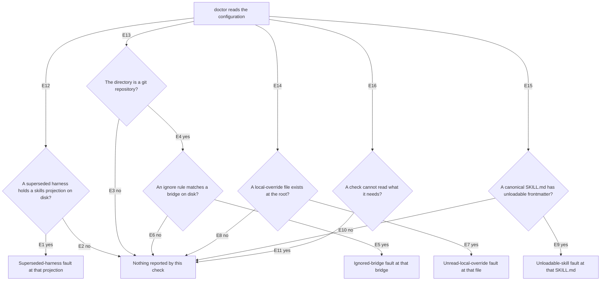

# Configuration diagnosis: decision graph

The four checks are independent. Each reads the repository on its own, so one run reports as many faults as it finds.

```mermaid
flowchart TD
  S[doctor reads the configuration] -->|E12| B{A superseded harness holds a skills projection on disk?}
  B -->|E1 yes| O1[Superseded-harness fault at that projection]
  B -->|E2 no| N[Nothing reported by this check]
  S -->|E13| G{The directory is a git repository?}
  G -->|E3 no| N
  G -->|E4 yes| G2{An ignore rule matches a bridge on disk?}
  G2 -->|E5 yes| O2[Ignored-bridge fault at that bridge]
  G2 -->|E6 no| N
  S -->|E14| L{A local-override file exists at the root?}
  L -->|E7 yes| O3[Unread-local-override fault at that file]
  L -->|E8 no| N
  S -->|E15| K{A canonical SKILL.md has unloadable frontmatter?}
  K -->|E9 yes| O4[Unloadable-skill fault at that SKILL.md]
  K -->|E10 no| N
  S -->|E16| X{A check cannot read what it needs?}
  X -->|E11 yes| N
```
