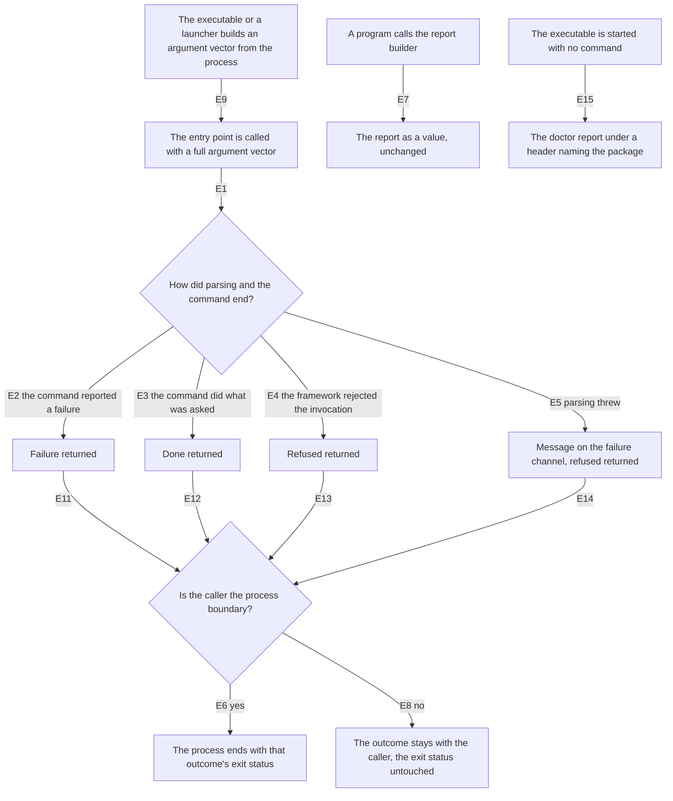

# Entry point: decision graph

How one call's outcome is decided, and where it goes. The report builder is a separate call with no branch.

```mermaid
flowchart TD
  A[The executable or a launcher builds an argument vector from the process] -->|E9| B
  B[The entry point is called with a full argument vector] -->|E1| P{How did parsing and the command end?}
  P -->|E2 the command reported a failure| O1[Failure returned]
  P -->|E3 the command did what was asked| O2[Done returned]
  P -->|E4 the framework rejected the invocation| O3[Refused returned]
  P -->|E5 parsing threw| O4[Message on the failure channel, refused returned]
  O1 -->|E11| K{Is the caller the process boundary?}
  O2 -->|E12| K
  O3 -->|E13| K
  O4 -->|E14| K
  K -->|E6 yes| O5[The process ends with that outcome's exit status]
  K -->|E8 no| O6[The outcome stays with the caller, the exit status untouched]
  RB[A program calls the report builder] -->|E7| O7[The report as a value, unchanged]
  BI[The executable is started with no command] -->|E15| O8[The doctor report under a header naming the package]
```
