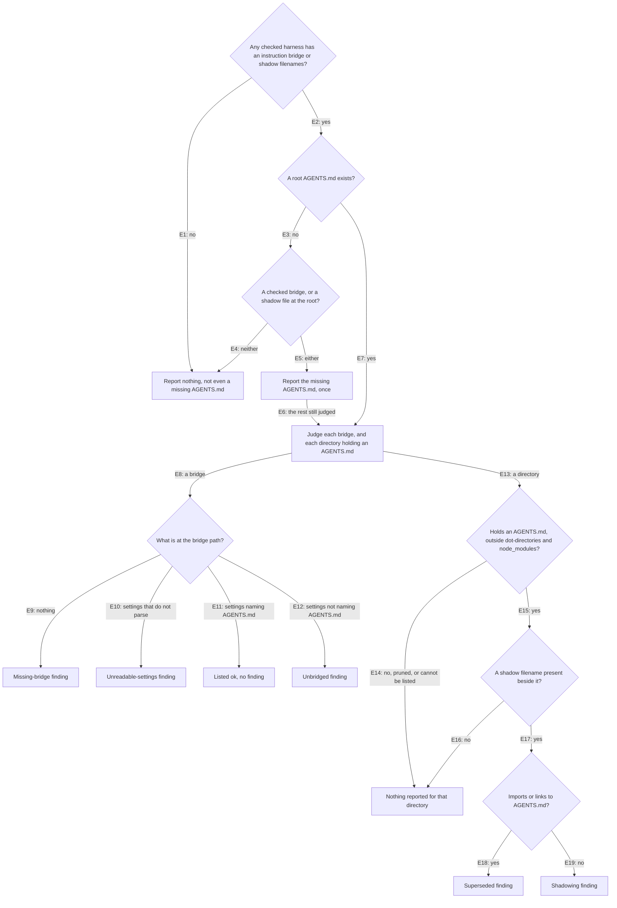

# Instruction bridges: decision graph

From `J` onward each bridge and each directory is judged on its own. No branch writes.

```mermaid
flowchart TD
  D1{Any checked harness has an instruction bridge or shadow filenames?}
  D1 -->|E1: no| O1[Report nothing, not even a missing AGENTS.md]
  D1 -->|E2: yes| D2{A root AGENTS.md exists?}
  D2 -->|E3: no| D3{A checked bridge, or a shadow file at the root?}
  D3 -->|E4: neither| O1
  D3 -->|E5: either| O2[Report the missing AGENTS.md, once]
  O2 -->|E6: the rest still judged| J[Judge each bridge, and each directory holding an AGENTS.md]
  D2 -->|E7: yes| J
  J -->|E8: a bridge| D4{What is at the bridge path?}
  D4 -->|E9: nothing| O3[Missing-bridge finding]
  D4 -->|E10: settings that do not parse| O4[Unreadable-settings finding]
  D4 -->|E11: settings naming AGENTS.md| OK[Listed ok, no finding]
  D4 -->|E12: settings not naming AGENTS.md| O5[Unbridged finding]
  J -->|E13: a directory| D5{Holds an AGENTS.md, outside dot-directories and node_modules?}
  D5 -->|E14: no, pruned, or cannot be listed| O6[Nothing reported for that directory]
  D5 -->|E15: yes| D6{A shadow filename present beside it?}
  D6 -->|E16: no| O6
  D6 -->|E17: yes| D7{Imports or links to AGENTS.md?}
  D7 -->|E18: yes| O7[Superseded finding]
  D7 -->|E19: no| O8[Shadowing finding]
```
