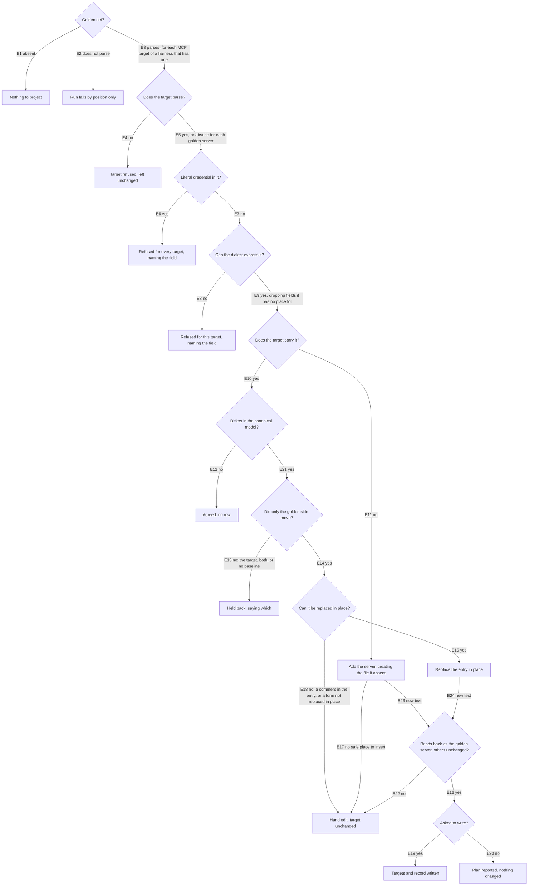

# MCP projection: decision graph

```mermaid
flowchart TD
  G{Golden set?} -->|E1 absent| O1[Nothing to project]
  G -->|E2 does not parse| O2[Run fails by position only]
  G -->|E3 parses: for each MCP target of a harness that has one| T{Does the target parse?}
  T -->|E4 no| O3[Target refused, left unchanged]
  T -->|E5 yes, or absent: for each golden server| C{Literal credential in it?}
  C -->|E6 yes| O4[Refused for every target, naming the field]
  C -->|E7 no| X{Can the dialect express it?}
  X -->|E8 no| O5[Refused for this target, naming the field]
  X -->|E9 yes, dropping fields it has no place for| K{Does the target carry it?}
  K -->|E11 no| L[Add the server, creating the file if absent]
  K -->|E10 yes| M{Differs in the canonical model?}
  M -->|E12 no| O6[Agreed: no row]
  M -->|E21 yes| O{Did only the golden side move?}
  O -->|E13 no: the target, both, or no baseline| O7[Held back, saying which]
  O -->|E14 yes| Q{Can it be replaced in place?}
  Q -->|E15 yes| S[Replace the entry in place]
  Q -->|E18 no: a comment in the entry, or a form not replaced in place| O8[Hand edit, target unchanged]
  L -->|E23 new text| B{Reads back as the golden server, others unchanged?}
  S -->|E24 new text| B
  L -->|E17 no safe place to insert| O8
  B -->|E16 yes| V{Asked to write?}
  B -->|E22 no| O8
  V -->|E19 yes| O9[Targets and record written]
  V -->|E20 no| O10[Plan reported, nothing changed]
```
