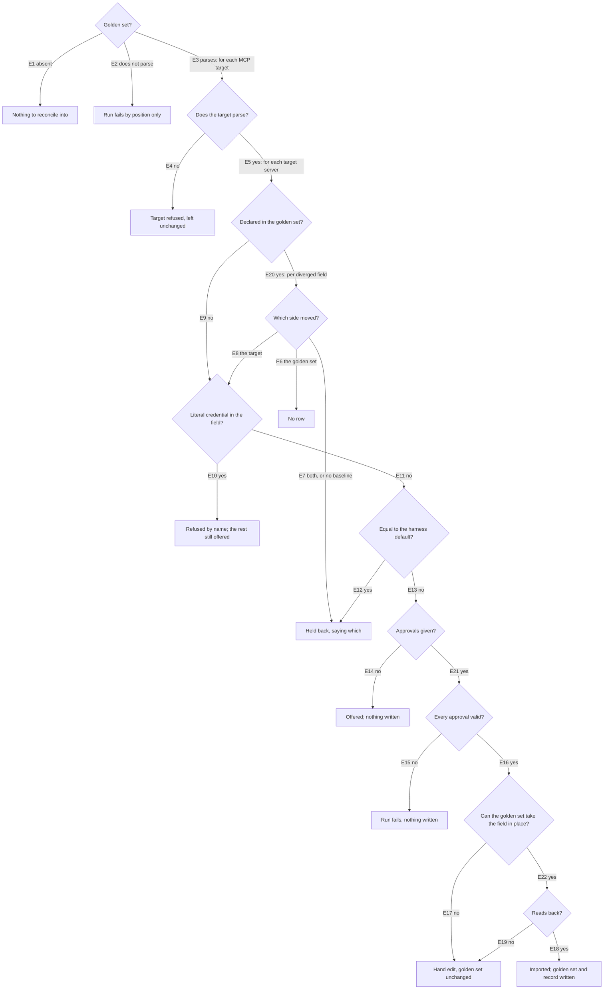

# MCP reconcile: decision graph

```mermaid
flowchart TD
  G{Golden set?} -->|E1 absent| O1[Nothing to reconcile into]
  G -->|E2 does not parse| O2[Run fails by position only]
  G -->|E3 parses: for each MCP target| T{Does the target parse?}
  T -->|E4 no| O3[Target refused, left unchanged]
  T -->|E5 yes: for each target server| D{Declared in the golden set?}
  D -->|E9 no| M{Literal credential in the field?}
  D -->|E20 yes: per diverged field| W{Which side moved?}
  W -->|E6 the golden set| O4[No row]
  W -->|E7 both, or no baseline| O5[Held back, saying which]
  W -->|E8 the target| M
  M -->|E10 yes| O6[Refused by name; the rest still offered]
  M -->|E11 no| H{Equal to the harness default?}
  H -->|E12 yes| O5
  H -->|E13 no| Q{Approvals given?}
  Q -->|E14 no| O7[Offered; nothing written]
  Q -->|E21 yes| A{Every approval valid?}
  A -->|E15 no| O8[Run fails, nothing written]
  A -->|E16 yes| S{Can the golden set take the field in place?}
  S -->|E17 no| O9[Hand edit, golden set unchanged]
  S -->|E22 yes| B{Reads back?}
  B -->|E18 yes| O10[Imported; golden set and record written]
  B -->|E19 no| O9
```
