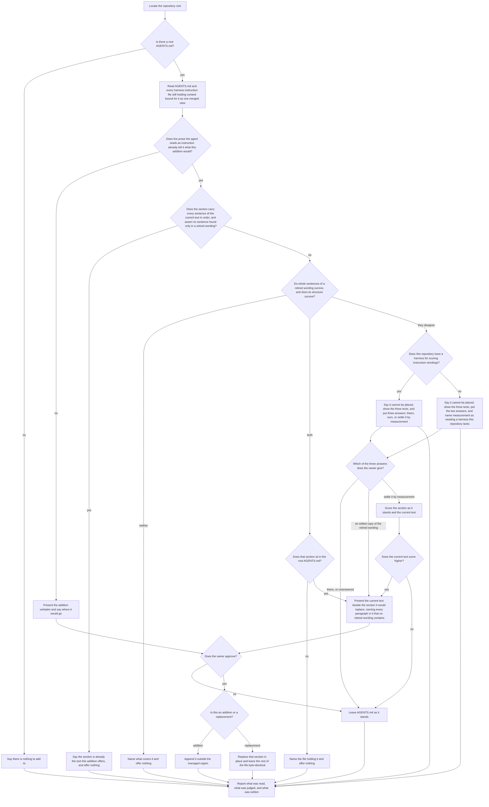
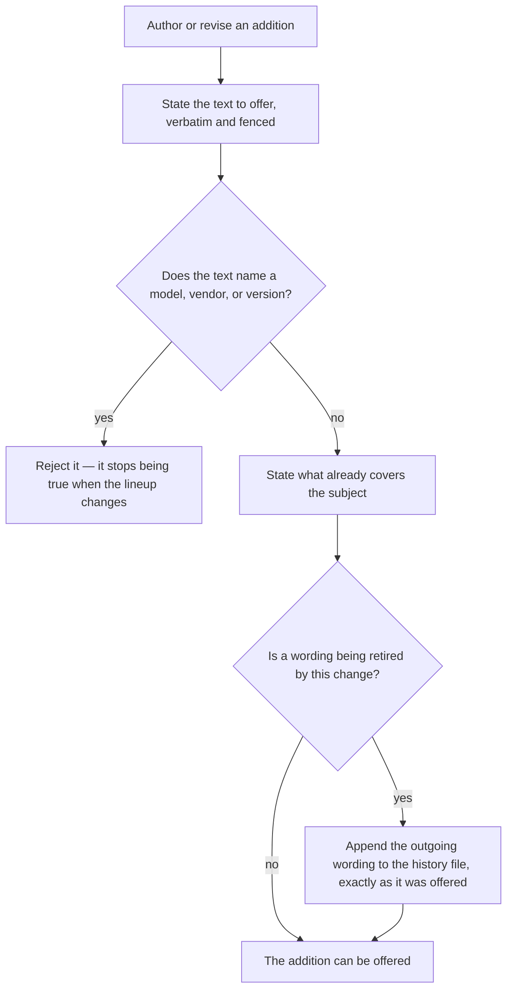

# enhance

## What

The `enhance` skill's conduct: which vetted sections it offers to a repository that already has an `AGENTS.md`, when it offers the **current** wording of a section the repository already carries in an **older** form, and what it will not write without being told to.

`../init/` consolidates what a repository already has and invents nothing, so it is safe to run anywhere. This skill is the opposite half by design: every section it carries is an opinion, and an opinion is worth having only where its subject is missing — or where the repository took an earlier version of it and never heard that the wording moved. Keeping the two apart is what lets `init` stay unopinionated.

Three properties make it a node rather than a paragraph inside `../init/`.

**It writes material content, and material content needs a person's word.** A section here asserts something about how the repository is worked in — it stays true whether or not this tool ever ran — so it falls on the material side of the discriminator `../init/` applies, and nothing here is ever written on sight. `../init/` may create an absent file unasked; this skill may not add a sentence unasked.

**Its detection has five outcomes, not two.** A repository can be **missing** a subject; can **cover** it in the owner's own words; can already carry the **text the addition would offer**; can carry a **wording this addition has since retired**, edits and all; or can carry something the skill genuinely **cannot place** between the last two. Absent is offered as an addition, a retired wording as a replacement, the owner's own and the already-current left alone, and the undecidable **put to the owner**. Already-current and the owner's own reach the same silence by different routes, and the report says which: a section this package wrote is not credited to the person reading the report.

**The undecidable outcome is the whole safety of the feature.** Replacing an owner's own delegation guidance with this package's wording is a worse failure than never offering at all — but silently skipping a genuinely outdated section is the failure this node exists to fix, so neither direction is a safe default for a case that could be either. An honest "I cannot tell whose this is" costs the owner one question and cannot get it wrong.

**Provenance is decided against a stored artifact, not a description of one.** Each addition keeps every wording it has retired, exactly as it was offered. A whole retired passage does not turn up in prose someone wrote themselves, which is what makes the comparison sound; a memorable phrase does, which is why no phrase decides it.

**Key terms**

- **addition** — a named block of instruction content this skill can offer, shipped as a reference file carrying the text to offer, the criterion for the subject already being present, and the criterion that compares a present section against the wordings this addition has retired. One addition ships today: `## Delegation`.
- **merged view** — the root `AGENTS.md` together with every harness instruction file whose content still belongs in it. It is the text a downstream agent effectively reads, so guidance sitting in a Cursor always-on rule counts as present.
- **covered** — the merged view already tells the agent what the addition would tell it, judged by meaning rather than by heading or wording.
- **retired wording** — a text an addition used to offer, kept verbatim beside it after a revision. A present section is checked for containment of the current text first; to decide whether it is stale, it is compared against these, never weighed against the text that would be offered.
- **from a retired wording** — the section could be produced by a handful of edits to one of them. Semantic closeness is coverage; provenance is a question about whole passages.
- **managed region** — the marked block `../init/` maintains for its own bookkeeping. Additions are the owner's content and never go inside it.

**Non-goals**

- **Consolidating harness instruction files.** This skill reads them into the merged view and moves none of them; consolidation has one home, `../init/`. Where a run finds content that should be consolidated it says so and recommends that skill.
- **The wording of any addition.** What the `## Delegation` text says was settled by blind A/B evaluation and is fixed; the repo-private `eval-delegation` skill owns it. This node specifies **when the current text is surfaced**, never what it says.
- **Correcting agent configuration that is present and wrong.** `../repair/`. A stale addition is not a fault in the repository — it is this package's wording having moved.
- **Creating an `AGENTS.md`.** `../init/`'s. A repository without one is reported and left alone.
- **Anything outside local agent configuration.** Workflows, repository settings, and project source are out of reach whatever a run finds in them — a bar the suite asserts as a barred scenario rather than a path, since no decision in the graph can reach them.
- **Deciding activation.** Which of the shipped skills a request reaches is co-owned across four descriptions and the harness that matches them. Not this node's.

## Use Cases

**Fit:** partial

The skill is judged on **conduct**, not on activation: its routing against `init`, `repair`, and `doctor` is co-owned across a seam this node holds one side of, so the suite asserts no firing and carries no near-miss. What is graded is the five-way detection, the approval gate that governs both an addition and a replacement, and what an addition reference has to state before it can be offered at all.

**Actors**

- **invoking agent** — runs the skill, reads the merged view, classifies each addition, and writes only what was approved.
- **repository owner** — approves or declines each offer; the only actor whose consent puts material content into `AGENTS.md`, or takes any out.
- **addition author** — a maintainer of this package adding an addition or revising one's wording. Reaches the capability through the reference file rather than through a run, and is the actor whose change is what makes a consumer's copy stale.
- **downstream agent** — every later session that loads `AGENTS.md`. Never invokes the skill, is affected by every run's outcome, and is the reason an outdated section costs something: it reads the superseded instruction on every session until someone notices. It is also whose behavior the evaluation harness measures, which is what makes a score an answer about this actor rather than about taste.
- **`init` skill** — finishes a consolidation and offers to continue here. A sibling capability that reaches this one without being its owner.

**Goals, and where each is served**

| Actor | Goal | Entry point |
| --- | --- | --- |
| invoking agent | leave the repository carrying the current wording of every addition whose subject it needs | `/buddy-agent-harness:enhance` |
| repository owner | nothing is added to my file, and nothing of mine is replaced, without my word | the approval on each offer |
| addition author | revise a shipped wording and have repositories on the old one told, rather than silently kept there | the addition's reference file |
| downstream agent | the guidance I load is whichever wording actually serves me better, not merely whichever is newer | the outcome of a run, and the evaluation when one is asked for |
| `init` skill | hand a freshly consolidated repository over and have the sections it does not own considered | the offer at the end of `init`'s report |

**Entry points**

| Entry point | Trigger | Inputs | Outcome |
| --- | --- | --- | --- |
| `/buddy-agent-harness:enhance` | an agent is asked to improve a repository's agent configuration, or `init` has just finished and the owner accepted its offer to continue | the repository root, and the merged view read from it | every uncovered addition offered, every stale one offered as a replacement, the approved ones written, and a report either way |
| an addition's reference file | a maintainer adds an addition or revises one's wording | the text to offer and the two criteria that classify a repository against it | a reference a run can classify against, or a rejection naming what disqualifies it |

**Surface**

The skill takes one argument, `--root <dir>`, naming the repository to work on; a run given none locates the Git repository root itself. It is required by the invoking agent's goal in the one case that goal cannot otherwise be reached — a repository that is not the working directory. There are no other elements and no forbidden combinations. A run given one judges and writes inside that directory only.

**Extensions**

For `/buddy-agent-harness:enhance`:

- **No root `AGENTS.md`.** Reported and stopped. This skill adds to a file that exists; creating one is `../init/`'s.
- **Harness instruction files still hold content bound for `AGENTS.md`.** Read into the merged view and left where they are. The run says they should be consolidated and recommends `../init/`, then carries on with its judgment rather than blocking on it.
- **The addition's own heading appears inside a fenced code block.** Not coverage. A fenced block is an example of a file rather than part of this one — and since every addition is *shown* as a fenced block, a repository documenting this tool carries the exact heading while remaining entirely uncovered.
- **The merged view carries only a thin line on the subject.** Covered, and the run names the line. Doubt at the coverage question resolves toward covered and says why — a missed offer costs nothing, a duplicate section teaches every future agent that the file repeats itself.
- **The subject is covered in the owner's own words.** Offered nothing, and the run names what covers it. Coverage is judged by meaning, so a repository covering delegation under `## Working with subagents`, or in three sentences of a longer section, is covered.
- **A section on the subject matches no retired wording in sentences or order.** Left alone, and the run names it as the owner's own.
- **A section's sentences do a retired wording's jobs in its order, but none of them verbatim.** Neither branch is taken. It is as likely a reword of ours as prose that happened to take the order the subject naturally takes, so it goes to the owner with the other undecidable case.
- **A section quotes a sentence of a retired wording in order to argue against it.** The owner's own, and left alone. A quoted sentence is shown rather than followed, and quoting one to reject it is the clearest sign the surrounding prose is theirs.
- **A section carries part of a retired wording inside prose the owner clearly wrote.** Neither branch is taken. The run says it cannot place the section, shows the owner all three texts, and puts three answers: it is theirs, it came from here, or settle it by measurement. An unanswered question writes nothing, and so does an answer of "mine".
- **The owner asks for measurement.** The evaluation harness scores the section as it stands against the current text, both scores are reported, and the replacement is offered only if the current text wins. A section that scores level or better is kept and said to be kept.
- **A retired wording sits outside the root `AGENTS.md`** — in a `CLAUDE.md` or a `.cursorrules`. Reported by file and not replaced. This skill writes one file, and replacing the root copy while a contradicting older copy stays in a harness file would leave the repository worse than it started.
- **An offer is declined.** Nothing is written, for a replacement exactly as for an addition.
- **The section was approved on an earlier run and has since been deleted.** It reads as absent and is offered again. Absence is the whole state; the skill keeps no memory of a run.

For an addition's reference file:

- **The text names a model, vendor, or version.** Rejected rather than shipped. A wording anchored to a model lineup stops being true when the lineup changes, and every consumer carries the wrong instruction until someone edits it.
- **A revision replaces the offered text.** The outgoing wording is appended to the addition's history file in the same change, and the change adds scenarios for its revision shape and passes the gate against the new pair. A revision that skips the first leaves every repository on the old text unreachable; one that skips the second ships a comparison nobody checked against the wordings it now compares.

## Control Flow

### A run

The decision at `E` is unchanged from the skill as it shipped: coverage is judged by meaning, and doubt resolves as covered, because a missed offer costs the user nothing while a duplicate section teaches every future agent that the file repeats itself.

What `G` adds is a second question asked **only of text that already read as covered**, and it is a question about **provenance** rather than about meaning: did this text come from the addition, at a wording it used to ship? It is answered by comparing the section against those retired wordings, which the addition keeps verbatim, and never by weighing it against the text that would be offered — a section differing from the current wording is evidence of nothing, since differing is what a rewrite produces.

`G` asks two questions — do whole sentences of a retired wording survive, and does its structure survive — and **their agreement is the decision**. Both yes, and the section is that wording edited. Both no, and it is the owner's. **Disagreeing is not a gap in the test**: it is the test reporting that the evidence points both ways, and the third branch is where that is said out loud rather than resolved by improvisation. The first draft of this enumerated three of the four combinations and left the fourth — their words in our shape — with no rule at all, which cost an impl-gate round: three independent runs met it, had nothing to apply, and each invented the same answer. A whole retired passage does not appear in someone's independent prose, so a section reproducing one, edits and all, is safely placed; a section sharing nothing but a turn of phrase is safely the owner's. Between those sits real ambiguity — half of a retired wording carried into prose the owner clearly wrote — and there the node **declines to decide**. It says so and asks. That is not doubt resolving toward inaction: leaving a genuinely stale section unmentioned and replacing a person's own words are both wrong, so the branch that admits it cannot tell is the only honest one.

The approval gate is what makes asking safe. Nothing at `P1` writes anything; the owner answers, and an unanswered question leaves the file exactly as it stands.

The third answer at `P2` exists because **the owner may not know either**, and because provenance was never what they actually cared about. "Where did this text come from" is a stand-in for "which of these serves me better", and when the stand-in fails the node asks the real question instead of pressing a memory that is not there. `P3` is the repository's own evaluation harness, which scores wordings against a fixed backlog — the same instrument that settled the offered text in the first place.

`GC` asks whether the section **carries** the text the node would offer — every sentence, in order, owner paragraphs allowed around and between them — and asserts nothing found only in a retired wording. That is containment, not the two resemblance questions. Resemblance is exactly what a revision preserves: one that tightens a sentence leaves the retired wording matching the current one sentence for sentence but one, so a resemblance test cannot tell a repository holding the newest text from one holding the text just retired. The previous draft of `GC` used the two questions and shielded the stale case for that reason. Containment also lets an owner's added paragraphs sit around the current text without the section losing its standing. Its outcome is its own — **already current** — and not folded into the owner's own, because the two differ in who wrote the words even where they agree on what to do about them. The text to offer is a stored artifact exactly as the retired wordings are, so it is compared the same way; a section that **is** it, edits and all, has nothing better available and the comparison stops there.

**Revisions are verified when they happen, not in advance.** How a sentence-level comparison behaves depends on how two wordings differ — a revision can rewrite a sentence, drop one, or add one, and each shape moves `GC` and `G` differently. Those shapes are not knowable until a revision is made, and a revision is a single reviewable change. So the node specifies the comparison against the wordings that exist, and binds the addition author: a change that retires a wording adds scenarios for its revision shape and passes the gate against the new pair. Three attempts to make the comparison correct in advance for every possible revision each held for the shapes considered and failed on the next one.

Two earlier drafts got this wrong in ways worth keeping. The first took a section mentioning what model a subagent inherits to be the current text and skipped the comparison — keying on the **subject a section talks about** rather than on where it came from, so appending one such sentence to a retired wording silenced the refresh entirely. The second deleted the guard outright, on the reasoning that a section which is the current text answers no to both questions anyway. That is true of today's two wordings and of nothing else: it holds only because the current text and the one retired wording share no whole sentence, which is a fact about two paragraphs rather than about the rule, and it expires at the next revision.

`P0` is checked before the third answer is put, not after. Offering a route the repository cannot take wastes the owner's turn and teaches them the skill does not know what is installed; where there is no harness the node says so and puts the two answers it can honour.

`P4` is what that answer buys, and it is the one branch that can conclude **keep yours**. A section that outscores the text this package would offer is not something to replace, whatever its history. Every other path through `G` can only ever offer or stay silent; this is the only one where the repository's own wording can be found better and said so. The evaluation is never run unasked — it is many model runs, and the owner pays for them.

`G1` exists because the merged view spans files and the write does not. The classification is worth making across every instruction file the agent reads, but the only file this skill writes is the root `AGENTS.md`; a stale section anywhere else is a finding to report, not an edit to offer.

Every path reaches `Z`. A run that offers nothing still reports, because a silent run is indistinguishable from one that did not look — which is the failure this whole node exists downstream of.

### An addition's reference file

`R` is a regression guard. The wording the `## Delegation` section replaced named models, and produced a plan assigning work to a model the session could not spawn — on the roster of the day, before any drift.

`U1` is what makes the run's `G` answerable at all, and it is deliberately mechanical. Nobody authors a criterion describing what an outdated copy looks like — that was tried and it does not work, because any description short enough to write is also short enough for someone to arrive at independently. The author's whole duty is to keep the outgoing text, and the comparison is then against the artifact itself.

`T` and `U` answer different questions: `T` decides whether the subject is present at all, `U` supplies what a present section is compared against.

## Scenario map

### `/buddy-agent-harness:enhance`

| Edge | Path (Given) | Scenario |
| --- | --- | --- |
| B→C | the repository has no root instruction file | `reports and stops when there is no instruction file to add to` |
| D | a `.cursorrules` holds delegation guidance that was never consolidated | `judges coverage across instructions that are not yet consolidated` |
| E→F | an `AGENTS.md` whose prose says nothing about handing work to a subagent | `offers an addition the merged view does not cover` |
| E→F | an `AGENTS.md` that quotes the addition inside a fenced block | `treats a heading inside a fenced block as an example rather than as coverage` |
| E→F | an `AGENTS.md` that carried the section and no longer does | `offers again once an approved section is removed` |
| G→H | an `AGENTS.md` covering the subject under the owner's own heading | `withholds an offer the owner's own words already cover` |
| G→H | an `AGENTS.md` whose only subagent guidance is a single line under an unrelated heading | `treats thin guidance as covering the subject and says why` |
| GC→HC | an `AGENTS.md` carrying the addition's current text | `offers nothing where the file already carries the current text` |
| GC→HC | the same file, judged for what the report calls it | `reports an already-current section as current rather than as the owner's` |
| GC→HC | the current text contained whole, with an owner paragraph added under the heading | `treats the current text with the owner's own paragraphs added as already current` |
| GC→HC | the current text split by an owner paragraph between its two paragraphs | `treats the current text split by an owner's paragraph as already current` |
| GC→G | the current text plus a sentence found only in a retired wording | `does not call a section current while it still asserts a retired sentence` |
| G→H | a section under the addition's heading matching no retired wording in sentences or in order | `leaves alone a section written from scratch on the same subject` |
| G→H | a section quoting one sentence of a retired wording inside quotation marks, in a sentence disputing it | `does not count a sentence the section quotes in order to reject it` |
| G1→I | a section carrying two sentences of a retired wording verbatim, in that wording's order, with its remaining sentences that wording's reworded | `offers the current wording where a retired wording was edited in place` |
| P0→P1 | a section carrying one sentence of a retired wording inside prose that wording does not contain, in a repository that has a scoring harness | `puts a section it cannot place to the owner instead of deciding` |
| G→P0 | a section whose sentences do the jobs of a retired wording's, in its order, none of them verbatim | `puts a reworded retired wording to the owner instead of deciding` |
| P0→P1N | the same section, in a repository that has none | `names measurement as unavailable where the repository has no harness` |
| P2→K | the owner answers that the section is theirs | `leaves the file alone when the owner says the section is theirs` |
| P4→I | the owner asked for measurement and the current text scores higher | `replaces the section when measurement puts the current wording ahead` |
| P4→K | the owner asked for measurement and the section scores level or higher | `keeps the owner's wording when measurement does not put ours ahead` |
| P2 | an unplaceable section and no answer from the owner | `runs no evaluation the owner did not ask for` |
| P2→I | the owner answers that the section is an edited copy | `offers the replacement when the owner says the section came from this package` |
| P1 | a question on the table at the end of a run | `writes nothing while the question is unanswered` |
| G1→I | a root `AGENTS.md` carrying a retired wording verbatim | `offers the current wording where the file carries a retired one verbatim` |
| G1→G2 | a `CLAUDE.md` carrying a retired wording and a root `AGENTS.md` that does not | `reports a retired wording outside the root file rather than replacing it` |
| F | an addition about to be presented | `shows the addition verbatim rather than a summary of it` |
| I | a replacement about to be presented | `shows the current text beside the section it would replace` |
| J→K | any offer on the table | `reports the decline and leaves the instruction file unchanged` |
| L→M | an approved addition and an `AGENTS.md` holding a managed region | `appends an approved addition outside the managed region` |
| I | a stale section carrying paragraphs the owner added under the same heading | `names the owner's own paragraphs a replacement would remove` |
| L→N | an approved replacement | `replaces only that section and leaves the rest of the file byte-identical` |
| A | a repository at a path that is not the working directory | `works on the directory the invocation named` |
| Z | a run that reached any of its outcomes | `reports the run whichever way it went` |
| barred | a nested `AGENTS.md` carrying a retired wording | `writes to no file other than the root AGENTS.md` |
| barred | a repository whose CI workflow names an agent harness | `changes no file outside the repository's agent configuration` |
| barred | an addition whose wording would sit better in this repository reworded | `offers the text as written rather than adapted to the repository` |

A run following a **declined** offer gets no row of its own. The repository it leaves behind is byte-identical to one that was never offered anything — the skill records nothing — so it reaches `E→F` by the same path class as `offers an addition the merged view does not cover` and would be a duplicate rather than a permutation. The rule that covers both is stated once, at `E`: detection decides every run, and absence is the whole state.

### an addition's reference file

| Edge | Path (Given) | Scenario |
| --- | --- | --- |
| R→S | an addition whose text names a model | `rejects an addition whose text names a model` |
| R→T | an addition whose text names no model, vendor, or version | `accepts an addition whose text survives a changing model lineup` |
| T | an addition that can be offered | `states what already covers its subject` |
| U→U1 | an addition that can be offered | `keeps every wording it has retired` |
| U1 | a revision replacing an addition's offered text | `stores a retired wording exactly as it was offered` |
| U→X | a new addition shipping its first wording | `leaves an addition that has never been revised with an empty history` |

## References

- `../../../../skills/enhance/SKILL.md` is the shipped skill: the merged view, the five-way detection, and the approval gate this node specifies.
- `../../../../skills/enhance/references/delegation.md` is the one addition shipped today; its sibling `delegation.history.md` holds the wordings it has retired, which is the artifact `G` compares against.
- `../init/` owns consolidation and the material/non-material discriminator this skill's approval rule rests on.
- [AGENTS.md](https://agents.md/) defines the open, project-level instruction format every addition is written into.
