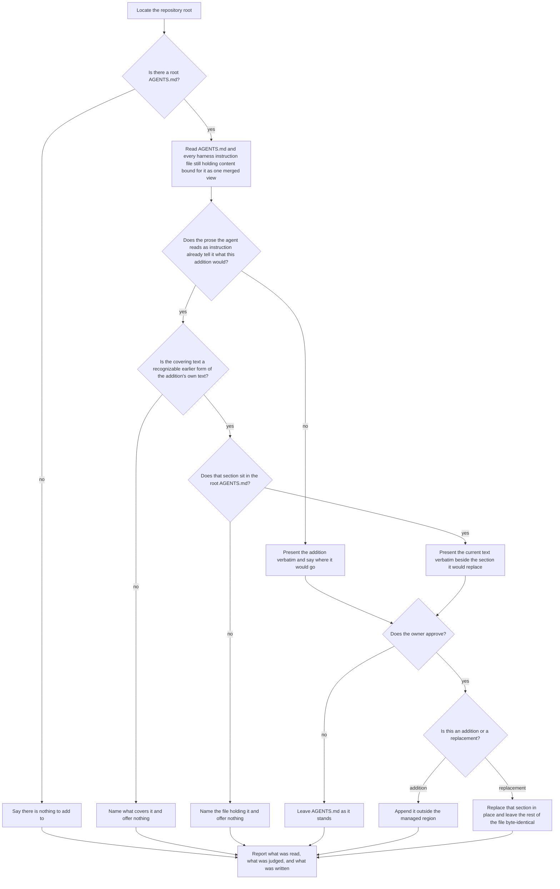
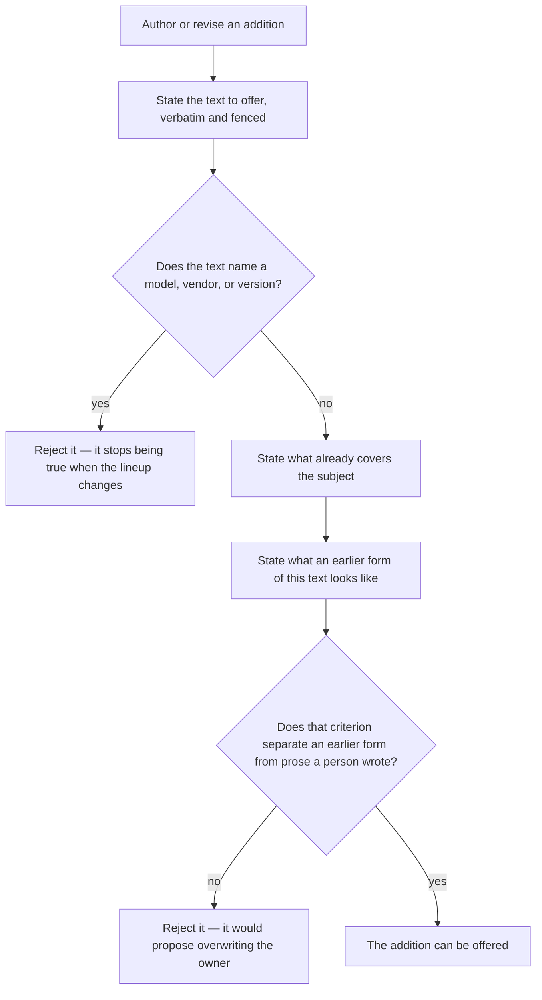

# enhance

## What

The `enhance` skill's conduct: which vetted sections it offers to a repository that already has an `AGENTS.md`, when it offers the **current** wording of a section the repository already carries in an **older** form, and what it will not write without being told to.

`../init/` consolidates what a repository already has and invents nothing, so it is safe to run anywhere. This skill is the opposite half by design: every section it carries is an opinion, and an opinion is worth having only where its subject is missing — or where the repository took an earlier version of it and never heard that the wording moved. Keeping the two apart is what lets `init` stay unopinionated.

Three properties make it a node rather than a paragraph inside `../init/`.

**It writes material content, and material content needs a person's word.** A section here asserts something about how the repository is worked in — it stays true whether or not this tool ever ran — so it falls on the material side of the discriminator `../init/` applies, and nothing here is ever written on sight. `../init/` may create an absent file unasked; this skill may not add a sentence unasked.

**Its detection has three outcomes, not two.** A repository can be **missing** a subject, can **cover** it in the owner's own words, or can carry a **recognizable earlier form** of the very text this skill ships. The first is offered as an addition, the third as a replacement, and the second is left alone. Collapsing the third into the second is what let outdated prose sit unnoticed while the reference file moved on.

**The line between the third case and the second is the whole safety of the feature.** Replacing an owner's own delegation guidance with this package's wording, because the two mean roughly the same thing, is a worse failure than never offering at all. So a section is stale only when it is an **earlier form of this text**, never when it is merely close in meaning.

**Key terms**

- **addition** — a named block of instruction content this skill can offer, shipped as a reference file carrying the text to offer, the criterion for the subject already being present, and the criterion for an earlier form of the text. One addition ships today: `## Delegation`.
- **merged view** — the root `AGENTS.md` together with every harness instruction file whose content still belongs in it. It is the text a downstream agent effectively reads, so guidance sitting in a Cursor always-on rule counts as present.
- **covered** — the merged view already tells the agent what the addition would tell it, judged by meaning rather than by heading or wording.
- **stale** — the merged view carries a **recognizable earlier form of the addition's own text**, distinguishable from prose a person wrote. Semantic closeness alone is coverage, never staleness.
- **managed region** — the marked block `../init/` maintains for its own bookkeeping. Additions are the owner's content and never go inside it.

**Non-goals**

- **Consolidating harness instruction files.** This skill reads them into the merged view and moves none of them; consolidation has one home, `../init/`. Where a run finds content that should be consolidated it says so and recommends that skill.
- **The wording of any addition.** What the `## Delegation` text says was settled by blind A/B evaluation and is fixed; the repo-private `eval-delegation` skill owns it. This node specifies **when the current text is surfaced**, never what it says.
- **Correcting agent configuration that is present and wrong.** `../repair/`. A stale addition is not a fault in the repository — it is this package's wording having moved.
- **Creating an `AGENTS.md`.** `../init/`'s. A repository without one is reported and left alone.
- **Anything outside local agent configuration.** Workflows, repository settings, and project source are out of reach whatever a run finds in them — a bar the suite asserts as a barred scenario rather than a path, since no decision in the graph can reach them.
- **Deciding activation.** Which of the shipped skills a request reaches is co-owned across four descriptions and the harness that matches them. Not this node's.

## Use Cases

**Fit:** partial

The skill is judged on **conduct**, not on activation: its routing against `init`, `repair`, and `doctor` is co-owned across a seam this node holds one side of, so the suite asserts no firing and carries no near-miss. What is graded is the three-way detection, the approval gate that governs both an addition and a replacement, and what an addition reference has to state before it can be offered at all.

**Actors**

- **invoking agent** — runs the skill, reads the merged view, classifies each addition, and writes only what was approved.
- **repository owner** — approves or declines each offer; the only actor whose consent puts material content into `AGENTS.md`, or takes any out.
- **addition author** — a maintainer of this package adding an addition or revising one's wording. Reaches the capability through the reference file rather than through a run, and is the actor whose change is what makes a consumer's copy stale.
- **downstream agent** — every later session that loads `AGENTS.md`. Never invokes the skill, is affected by every run's outcome, and is the reason a stale section costs something: it reads the outdated instruction on every session until someone notices.
- **`init` skill** — finishes a consolidation and offers to continue here. A sibling capability that reaches this one without being its owner.

**Goals, and where each is served**

| Actor | Goal | Entry point |
| --- | --- | --- |
| invoking agent | leave the repository carrying the current wording of every addition whose subject it needs | `/buddy-agent-harness:enhance` |
| repository owner | nothing is added to my file, and nothing of mine is replaced, without my word | the approval on each offer |
| addition author | revise a shipped wording and have repositories on the old one told, rather than silently kept there | the addition's reference file |
| downstream agent | the guidance I load is this package's current guidance, not the version this repository took two releases ago | the outcome of a run |
| `init` skill | hand a freshly consolidated repository over and have the sections it does not own considered | the offer at the end of `init`'s report |

**Entry points**

| Entry point | Trigger | Inputs | Outcome |
| --- | --- | --- | --- |
| `/buddy-agent-harness:enhance` | an agent is asked to improve a repository's agent configuration, or `init` has just finished and the owner accepted its offer to continue | the repository root, and the merged view read from it | every uncovered addition offered, every stale one offered as a replacement, the approved ones written, and a report either way |
| an addition's reference file | a maintainer adds an addition or revises one's wording | the text to offer and the two criteria that classify a repository against it | a reference a run can classify against, or a rejection naming what disqualifies it |

**Surface**

The skill takes one argument, `--root <dir>`, naming the repository to work on; a run given none locates the Git repository root itself. It is required by the invoking agent's goal in the one case that goal cannot otherwise be reached — a repository that is not the working directory. There are no other elements and no forbidden combinations.

**Extensions**

For `/buddy-agent-harness:enhance`:

- **No root `AGENTS.md`.** Reported and stopped. This skill adds to a file that exists; creating one is `../init/`'s.
- **Harness instruction files still hold content bound for `AGENTS.md`.** Read into the merged view and left where they are. The run says they should be consolidated and recommends `../init/`, then carries on with its judgment rather than blocking on it.
- **The addition's own heading appears inside a fenced code block.** Not coverage. A fenced block is an example of a file rather than part of this one — and since every addition is *shown* as a fenced block, a repository documenting this tool carries the exact heading while remaining entirely uncovered.
- **The merged view carries only a thin line on the subject.** Covered, and the run names the line. Doubt at the coverage question resolves toward covered and says why — a missed offer costs nothing, a duplicate section teaches every future agent that the file repeats itself.
- **The subject is covered in the owner's own words.** Offered nothing, and the run names what covers it. Coverage is judged by meaning, so a repository covering delegation under `## Working with subagents`, or in three sentences of a longer section, is covered.
- **A section sits under the addition's own heading and matches neither the current text nor the earlier form.** Left alone. Where the two cannot be told apart the section is the owner's, and the run says it made that call.
- **The earlier form sits outside the root `AGENTS.md`** — in a `CLAUDE.md` or a `.cursorrules`. Reported by file and not replaced. This skill writes one file, and replacing the root copy while a contradicting older copy stays in a harness file would leave the repository worse than it started.
- **An offer is declined.** Nothing is written, for a replacement exactly as for an addition.
- **The section was approved on an earlier run and has since been deleted.** It reads as absent and is offered again. Absence is the whole state; the skill keeps no memory of a run.

For an addition's reference file:

- **The text names a model, vendor, or version.** Rejected rather than shipped. A wording anchored to a model lineup stops being true when the lineup changes, and every consumer carries the wrong instruction until someone edits it.
- **The stale criterion would also match prose a person wrote.** Rejected. A criterion that cannot separate an earlier form of this text from the owner's own words turns every run into a proposal to overwrite the owner.

## Control Flow

### A run

The decision at `E` is unchanged from the skill as it shipped: coverage is judged by meaning, and doubt resolves as covered, because a missed offer costs the user nothing while a duplicate section teaches every future agent that the file repeats itself.

What `G` adds is a second question asked **only of text that already read as covered**. That ordering is the safety property. Coverage is the broad judgment and staleness the narrow one, so nothing can be offered as a replacement that was not first found to be covering the subject — and a section covering it in the owner's own words falls out at `G` rather than being weighed against this package's wording at all. Doubt at `G` resolves the same direction as at `E`: toward leaving the file alone.

`G1` exists because the merged view spans files and the write does not. The classification is worth making across every instruction file the agent reads, but the only file this skill writes is the root `AGENTS.md`; a stale section anywhere else is a finding to report, not an edit to offer.

Every path reaches `Z`. A run that offers nothing still reports, because a silent run is indistinguishable from one that did not look — which is the failure this whole node exists downstream of.

### An addition's reference file

`R` is a regression guard. The wording the `## Delegation` section replaced named models, and produced a plan assigning work to a model the session could not spawn — on the roster of the day, before any drift.

`V` is the same guard one level up, aimed at the new failure the replacement path introduces. `T` and `U` answer different questions about the same repository and both have to be stated: `T` decides whether the subject is present at all, `U` decides whether what is present is this package's own text at an earlier version.

## Scenario map

### `/buddy-agent-harness:enhance`

| Edge | Path (Given) | Scenario |
| --- | --- | --- |
| B→C | the repository has no root instruction file | `reports and stops when there is no instruction file to add to` |
| D | a `.cursorrules` holds delegation guidance that was never consolidated | `judges coverage across instructions that are not yet consolidated` |
| E→F | an `AGENTS.md` whose prose says nothing about handing work to a subagent | `offers an addition the merged view does not cover` |
| E→F | an `AGENTS.md` that quotes the addition inside a fenced block | `treats a heading inside a fenced block as an example rather than as coverage` |
| E→F | an `AGENTS.md` that carried the section and no longer does | `offers again once an approved section is removed` |
| G→H | an `AGENTS.md` covering the subject under the owner's own heading | `withholds an offer the owner's own words already cover` |
| G→H | an `AGENTS.md` whose only subagent guidance is a single line under an unrelated heading | `treats thin guidance as covering the subject and says why` |
| G→H | an `AGENTS.md` carrying the addition's current text | `offers nothing where the file already carries the current text` |
| G→H | a section under the addition's heading matching neither the current text nor the earlier form | `leaves alone a section it cannot tell from the owner's own words` |
| G1→I | a root `AGENTS.md` carrying the earlier form of the addition's text | `offers the current wording where the file carries an earlier form of it` |
| G1→G2 | a `CLAUDE.md` carrying the earlier form and a root `AGENTS.md` that does not | `reports an earlier form outside the root file rather than replacing it` |
| F | an addition about to be presented | `shows the addition verbatim rather than a summary of it` |
| I | a replacement about to be presented | `shows the current text beside the section it would replace` |
| J→K | any offer on the table | `reports the decline and leaves the instruction file unchanged` |
| L→M | an approved addition and an `AGENTS.md` holding a managed region | `appends an approved addition outside the managed region` |
| L→N | an approved replacement | `replaces only that section and leaves the rest of the file byte-identical` |
| Z | a run that reached any of its outcomes | `reports the run whichever way it went` |
| barred | a nested `AGENTS.md` carrying the earlier form | `writes to no file other than the root AGENTS.md` |
| barred | a repository whose CI workflow names an agent harness | `changes no file outside the repository's agent configuration` |
| barred | an addition whose wording would sit better in this repository reworded | `offers the text as written rather than adapted to the repository` |

A run following a **declined** offer gets no row of its own. The repository it leaves behind is byte-identical to one that was never offered anything — the skill records nothing — so it reaches `E→F` by the same path class as `offers an addition the merged view does not cover` and would be a duplicate rather than a permutation. The rule that covers both is stated once, at `E`: detection decides every run, and absence is the whole state.

### an addition's reference file

| Edge | Path (Given) | Scenario |
| --- | --- | --- |
| R→S | an addition whose text names a model | `rejects an addition whose text names a model` |
| R→T | an addition whose text names no model, vendor, or version | `accepts an addition whose text survives a changing model lineup` |
| T | an addition that can be offered | `states what already covers its subject` |
| U | an addition that can be offered | `states what an earlier form of its own text looks like` |
| V→W | a stale criterion that any delegation guidance would match | `rejects a stale criterion that cannot be told from the owner's own words` |
| V→X | a stale criterion naming properties only an earlier form of the text has | `accepts a stale criterion that separates an earlier form from the owner's own words` |

## References

- `../../../../skills/enhance/SKILL.md` is the shipped skill: the merged view, the three-way detection, and the approval gate this node specifies.
- `../../../../skills/enhance/references/delegation.md` is the one addition shipped today, and carries the `## Covered when` and `## Stale when` criteria `T` and `U` require.
- `../init/` owns consolidation and the material/non-material discriminator this skill's approval rule rests on.
- [AGENTS.md](https://agents.md/) defines the open, project-level instruction format every addition is written into.
