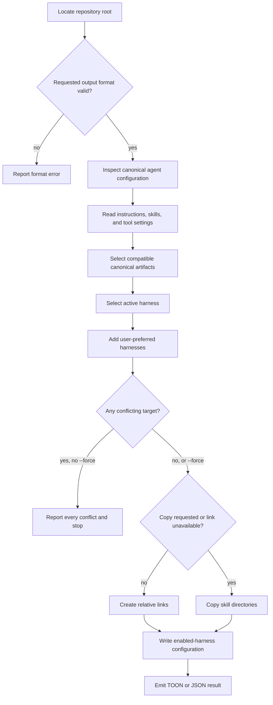

# harness-init

## What

`harness-init` initializes or updates one consumer repository's standards-based agent configuration so it can be used effectively by multiple coding-agent harnesses. The canonical configuration is the repository root's `AGENTS.md` and `.agents/` tree: shared behavior lives in `.agents/AGENTS.md`, reusable capabilities live in `.agents/skills/**/SKILL.md`, and tool settings remain separately named artifacts. Vendor files are projections of compatible canonical artifacts, not competing sources of truth. The active harness is always enabled; explicit user preferences may add other supported harnesses.

The skill is for local agent-configuration setup only. It preserves user-authored policy and does not invent instructions, rewrite unsupported tool settings, change CI, repository settings, security scanning, branch rules, or unrelated project files.

**Key terms**

- **canonical skills directory** — `.agents/skills/` in the selected consumer repository; each skill directory below it is the source that harness directories receive.
- **canonical instructions** — root `AGENTS.md` and `.agents/AGENTS.md`, which guide agent behavior and remain user-authored.
- **tool settings** — separately named configuration artifacts that declare external tools; they are projected only when a supported mapping exists.
- **active harness** — the harness that invokes initialization.
- **enabled harness** — the active harness and any additional supported harnesses the user explicitly prefers.
- **consumer root** — the Git repository root.

## Use Cases

| Entry point                              | Trigger                                      | Inputs                                         | Outcome                                                                         |
| ---------------------------------------- | -------------------------------------------- | ---------------------------------------------- | ------------------------------------------------------------------------------- |
| `buddy-agent-harness init`               | An agent is asked to initialize local agent configuration | Consumer root, active harness, and user preferences | Creates or updates compatible projections and records enabled harnesses |
| `buddy-agent-harness init --copy`        | Copying is explicitly required               | Consumer root and canonical skills             | Materializes copies instead of links                                            |
| `buddy-agent-harness init --format json` | Another program needs the result             | Consumer root                                  | Emits the initialization result as JSON                                         |

## Control Flow

The consumer root is always the repository root, including in a monorepo. The active harness is selected unconditionally; a user preference can add other supported harnesses. Existing vendor directories do not themselves express installation intent. The initializer preserves canonical instructions and projects only artifacts with a supported harness mapping. Only immediate directory entries in `.agents/skills/`, sorted by name, are canonical skills.

## Scenario map

### `buddy-agent-harness init`

| Edge                       | Path (Given)                                             | Scenario                                                                 |
| -------------------------- | -------------------------------------------------------- | ------------------------------------------------------------------------ |
| Ensure canonical directory | default consumer root                                    | `creates the canonical directory at the consumer root`                   |
| Locate repository root     | command is invoked from a package in a monorepo          | `initializes the repository root when invoked from a nested package`     |
| Preserve canonical instructions | user-authored `AGENTS.md` files exist | `preserves user-authored canonical instructions` |
| Select compatible artifacts | a canonical tool setting has no harness mapping | `leaves unsupported tool settings canonical only` |
| Select enabled harnesses   | no additional user preference exists                     | `configures the active harness by default` |
| Select enabled harnesses   | the user prefers additional supported harnesses           | `configures the active harness and preferred harnesses` |
| Reject conflict            | one or more targets differ from expected canonical links | `preflights every conflict before writing initialization output`         |
| Replace conflict           | targets conflict and force is requested                  | `replaces conflicting skill targets when force is requested`             |
| Link or copy               | links are available and copy is not requested            | `creates relative links for canonical skills`                            |
| Link or copy               | copy is requested or links are unavailable               | `copies canonical skills when links cannot be used`                      |
| Preserve concurrent target | a target appears during a failed link attempt            | `preserves a target that appears during link fallback`                   |
| Write configuration        | canonical skills may be empty                            | `records enabled harnesses even when no skills exist`                    |
| Select canonical skills    | files and directories share the canonical directory      | `selects only immediate canonical skill directories in sorted order`     |
| Write result               | default output requested                                 | `reports the initialization result as TOON by default`                   |
| Write result               | JSON output requested                                    | `reports the requested copy option as JSON`                              |
| Reject format              | an unsupported output format is requested                | `rejects an unsupported output format`                                   |

## References

- [Agents Standard](https://agentsstandard.com/) supports the separation used here: agent behavior in `AGENTS.md`, capabilities in `skills/**/SKILL.md`, and tool settings as distinct configuration artifacts.
