# init

## What

The `init` **skill**'s conduct: what it consolidates, what it declines to invent, and which of its writes need a person's word first.

The **command** is a different subject and has its own node. `buddy-agent-harness init` links `.agents/skills` into the harnesses that need it and reports the enabled set — its options, its formats, and its conflict behavior are `../harness-init/`'s. The skill is the five-phase job that command is **one step of**: survey what agent configuration a repository already has, classify each artifact, confirm the plan, apply it, and verify what landed. Everything below is the skill's; nothing below re-states the command's.

Two properties are why it is a node rather than a paragraph inside the command's.

**It is the owner every instruction repair routes to.** `../../cli/instruction-bridges/` names this skill as the owner of all four of its problems, and `../../workflows/detect-and-repair/` states that every instruction finding repairs through it. Both said so on the strength of behavior nothing described. A finding handed to an owner whose conduct is unwritten is a route to nowhere: the consumer learns which skill to call and not what that skill will do when it arrives.

**Its approval rule is the one that differs from the other writing skill's.** `../repair/` gates **every** correction on approval, and says so by contrasting itself with this skill. The contrast is only meaningful if this side is written down: `init` writes the `CLAUDE.md` import stub **without asking**, and asks about everything a person authored. One write cannot have two homes and two contradictory approval rules, so the rule lives on the side that does the writing.

**The discriminator is authorship, not the kind of file.** What decides whether a write needs approval is whether the bytes being replaced were written by a person, not whether the write is a bridge, a directory, or a line of instruction. Creating a file that is absent asks nobody; rewriting one that exists asks first. That is why the `CLAUDE.md` stub and the `.gemini/settings.json` entry — both instruction bridges, both this skill's to write — behave differently the moment the settings file already exists: the stub is a file this skill owns end to end, and the settings file is a person's, holding keys this skill never came for.

**Key terms**

- **canonical configuration** — the root `AGENTS.md` and the `.agents/` tree; the one source every harness is pointed at.
- **consolidate** — move instruction content a person wrote into `AGENTS.md`, preserving their wording, and leave a pointer behind only where that was approved.
- **canonical-only** — an artifact with no cross-harness format to convert into, or none that is lossless: subagents, rules, hooks, output styles, MCP server definitions. Reported, never converted.
- **bridge** — what a harness that cannot read the canonical source is given instead: a skills projection (the command's write) or an instruction bridge — a `CLAUDE.md` importing `AGENTS.md`, or an `AGENTS.md` entry in `.gemini/settings.json` (this skill's write).
- **material** — content that stays true whether or not this tool ever ran. Material content is the user's: derived, approved, and never invented.
- **non-material region** — the marked block in `AGENTS.md` describing the bridges this run created. Written and re-written unasked, because every line in it stops being true when the tool's output is removed.
- **existing instruction content** — a file a **person** authored **carrying content**. A file a previous run wrote, and a file holding nothing but a heading, are both absent for this purpose.

**Non-goals**

- **The `init` command.** Its options, its output formats, its conflict preflight, its enabled set: `../harness-init/`. This node states only what the skill does *around* that call — when it runs it, what it does with a conflict it reports, and what it writes that the command does not.
- **Detecting.** The skill inspects a repository to plan a consolidation, not to report faults. Every fault in an existing configuration is the `doctor` command's: `../../cli/`.
- **Correcting configuration that is present and wrong.** `../repair/`. This skill's writes are additive or approved; it does not exist to fix what is broken.
- **Offering guidance the repository lacks.** `enhance`'s, and the skill hands off to it rather than deciding for it.
- **What the command guarantees about the artifacts it touches.** That the command preserves canonical instructions and leaves an unmapped tool setting alone is `../harness-init/`'s. What is stated here is the **classification** the skill performs before the command is ever called, including the one case a mapping exists for and is still refused.
- **Deciding activation.** Which of the four shipped skills a request reaches is co-owned across four descriptions and the harness that matches them. Not this node's.

## Use Cases

**Fit:** partial

The skill is judged on **conduct**, not on activation. Its routing against `repair`, `enhance`, and `doctor` is co-owned across a seam this node holds one side of, so the suite asserts no firing and carries no near-miss; under the partial tier that absence is the correct shape rather than a gap. What is graded is the approval rule, the invention line, and the bridges it writes.

**Actors**

- **invoking agent** — runs the skill, surveys, composes the plan, and applies what was approved.
- **repository owner** — approves or declines each step that touches what they wrote; the only actor whose consent moves a user-authored byte.
- **`doctor` skill and `repair` skill** — hand this skill every instruction finding and every bridge finding a rebuild repairs. They are the reason the conduct has to be written down: they route on the promise that arriving here fixes the bridge.
- **downstream agent** — every later session in a harness the repository configured. It never invokes the skill and is what the bridges exist for: without them it reads none of the repository's instructions and says nothing about it.

**Goals, and where each is served**

| Actor | Goal | Entry point |
| --- | --- | --- |
| invoking agent | leave the repository with one canonical configuration every enabled harness can reach | `/buddy-agent-harness:init` |
| repository owner | nothing I wrote is replaced without my word, and nothing is asserted about my project that I did not say | the approval on each step of the plan |
| `doctor` and `repair` | hand over an instruction finding and have the bridge actually written | the finding's repair, which names this skill |
| downstream agent | the instructions and skills I load are the ones the repository meant | the outcome of a run |

**Entry point**

| Entry point | Trigger | Inputs | Outcome |
| --- | --- | --- | --- |
| `/buddy-agent-harness:init` | an agent is asked to initialize, adopt, or migrate a repository's agent configuration, or arrives holding an instruction-bridge finding | the repository root, the harnesses to enable, and the flags the invocation carried | one canonical configuration, the bridges the enabled harnesses need, and a report of what was created, consolidated, linked, and left alone |

**Surface**

The skill's arguments are the **command's own flags**, read from the invocation as text rather than from a placeholder: `--root`, `--harness`, `--copy`, `--force`, `--format`. What each does is the command's (`../harness-init/`); what this node owns is what the skill does with one.

Three rules, and each closes a different failure:

- **Read them from the invocation, never from a substitution.** Only one harness substitutes an arguments placeholder, and a body that relied on it would resolve there and stay literal everywhere else. Prose carries the same weight as a flag: "links are unavailable here" is `--copy`.
- **An argument never skips a phase.** `--force` is a flag on the command and still needs the plan's approval, because what `--force` replaces is a target that already holds something.
- **Never guess.** An unrecognized argument is named in the report and the run carries on; a guessed flag writes something nobody asked for.

**Extensions**

- **No `.gemini/settings.json` at all, and Gemini CLI enabled.** The file is created with the entry in it and nobody is asked, because nothing a person wrote is being replaced. The same edit against a file that already exists is presented for approval — the discriminator is authorship, and it is the only thing that separates the two.
- **A `CLAUDE.md` whose whole body is the import, or a symlink already resolving into `.agents/`.** Not content, and not a conflict — a previous run's work. Skipped, which is what makes a re-run idempotent.
- **A root `AGENTS.md` holding nothing but a heading.** A placeholder, treated as absent: derive against it and confirm before filling it. A file that carries authored content is never rewritten, whatever else the run does.
- **Nothing survives derivation.** Write the heading and one line stating what the repository is, and stop. Padding a file that is read on every session costs context on every session.
- **A nested `AGENTS.md`.** Left where it is and never merged upward — merging changes which files it governs. Bridged in place with the same stub, and reported by name as judged additive rather than counted.
- **A nested `AGENTS.md` that reverses a root rule.** The one creation that stops to ask, even though it only creates a file. Bridging hands Claude Code two instructions and no rule for choosing between them, so the three options are put to the owner: bridge it anyway, reword it as additive, or leave it unbridged. The rest are bridged without waiting on the answer.
- **The command reports a conflict.** Resolve the named target and retry. `--force` is reached for only to replace that exact projection — the flag itself replaces every conflicting target, so the narrowness is the skill's discipline rather than the command's guarantee (issue #80). `--copy` is a snapshot rather than a live projection, and a run that falls back to one says so.
- **Every enabled harness reads the canonical directory natively.** No bridge exists, so no non-material region is written: a warning about a path this repository does not have teaches the next agent to distrust the rest of the file. This is a rule the skill states rather than a state a default run reaches — Claude Code is enabled unconditionally and needs both bridges — and it is specified as it ships rather than normalized away.
- **The non-material region's markers are present and empty.** A deliberate opt-out; left empty. Markers that are **gone** are not an opt-out — the region is far more often lost to a rewrite or a merge than removed on purpose — so it is restored.
- **The repository has a formatter.** It is run over the written files and the run says so. The skill is not itself a formatter.

## Control Flow

```mermaid
flowchart TD
  A[Survey: locate the repository root and inventory the canonical and harness artifacts] --> B[Classify each finding into exactly one bucket]
  B --> B1{Deriving against an absent AGENTS.md: does any candidate line survive?}
  B1 -->|yes| C[Present the plan: what is created, what moves, what is left alone and why]
  B1 -->|no| B2[Plan a heading and one line stating what the repository is]
  B2 --> C
  C --> D{Would the step replace bytes a person wrote?}
  D -->|yes| E[Ask for that step]
  D -->|no| F[Write it and report it]
  E --> G{Approved?}
  G -->|no| H[Leave it as it stands and carry on]
  G -->|yes| F
  H --> I[Scaffold the baseline and move the approved skills and commands]
  F --> I
  I --> J[Append the approved instruction content to AGENTS.md]
  J --> K[Run the init command to write the skills projections]
  K --> L{A conflict reported?}
  L -->|yes| M[Resolve the named target and retry]
  L -->|no| N[Write the instruction bridges the command does not]
  M --> N
  N --> O{Does the repository now have a bridge?}
  O -->|yes| P[Write or restore the non-material region in AGENTS.md]
  O -->|no| Q[Verify every projection resolves and every migrated skill parses]
  P --> Q
  Q --> Q1{Does the repository have a formatter of its own?}
  Q1 -->|yes| Q2[Run it over the written files and say so]
  Q1 -->|no| R
  Q2 --> R[Report what was created, consolidated, linked, and left canonical-only, then offer enhance once]
```

The survey and the classification write nothing, which is what makes the plan at `C` worth presenting: it is composed from what is on disk rather than from what has already happened to it. The branch at `D` is per step rather than per run — the approval is asked for *any* step that replaces what a person wrote — so one run can create a directory unasked, replace a file on approval, and leave a third alone because the owner declined it.

The graph rejoins at `I` after a decline, and that edge is the shipped skill's **structure** rather than a rule it states: the skill gates each step and never says what a decline does to the steps already approved. The scenario at `G→H` therefore asserts only what is written down — the declined file is left alone — and the continuation is reported as a gap rather than specified as behavior (issue #79).

## Scenario map

### `/buddy-agent-harness:init`

| Edge | Path (Given) | Scenario |
| --- | --- | --- |
| A | a repository holding harness artifacts | `writes nothing while surveying the repository` |
| B | a `CLAUDE.md` whose whole body is the import | `skips a bridge a previous run already wrote` |
| B | a root `AGENTS.md` holding nothing but a heading | `treats a heading-only AGENTS.md as absent and derives against it` |
| B | a `.claude/agents/` directory and a `.cursor/rules/` directory | `reports a subagent and a rule directory rather than converting either` |
| B | an MCP server defined in a harness settings file | `refuses an MCP conversion the mapping cannot carry losslessly` |
| B | a nested `AGENTS.md` under a package | `leaves a nested AGENTS.md where it is rather than merging it upward` |
| C | frontmatter derived for a skill that has none | `shows the derived name and description verbatim before writing either` |
| B1→C | a candidate line that survives the test | `shows every derived line beside its source and writes only what was approved` |
| B1→B2 | no candidate survives the test | `writes a heading and one line when nothing survives derivation` |
| D→E | a `.cursorrules` a person wrote | `asks before replacing an authored instruction file with a pointer` |
| D→E | a `.gemini/settings.json` a person wrote | `asks before editing a settings file a person wrote` |
| D→E | a nested `AGENTS.md` that reverses a root rule | `asks before bridging a nested file that reverses a root rule` |
| D→F | no `.agents/` directory and no root `AGENTS.md` | `creates a missing directory and a missing AGENTS.md without asking` |
| D→F | Claude Code enabled and no `CLAUDE.md` | `writes the CLAUDE.md import stub without asking` |
| D→F | Gemini CLI enabled and no `.gemini/settings.json` | `writes the Gemini entry unasked where no settings file exists` |
| D→F | two packages holding a nested `AGENTS.md` each | `bridges every additive nested file unasked and names each one it judged` |
| G→H | a presented step replacing an authored instruction file | `leaves a declined step's file as it stands` |
| I | a skill directory moving into the canonical directory | `preserves the history of a skill it moves` |
| I | a skill whose `description` carries an unquoted colon | `fixes the frontmatter that decides whether a harness loads the skill` |
| J | a `.cursorrules` whose consolidation was approved | `appends consolidated content rather than restructuring what a person wrote` |
| G→F | an approved edit to a settings file carrying comments | `edits a settings file in place and leaves the rest of it byte-identical` |
| L→M | the command reports a conflicting target | `resolves the named target and retries rather than forcing every conflict` |
| D→E | an invocation naming `--force` over a conflicting target | `applies a flag from the invocation without letting it skip the plan` |
| R | an invocation naming something that is not a flag | `names what it did not recognize rather than guessing at a flag` |
| K | links are unavailable and the run copies instead | `reports a copy as a snapshot rather than as a live projection` |
| O→P | a skills bridge and no instruction bridge | `names only the bridges the repository actually has` |
| O→P | an `AGENTS.md` whose non-material region was removed | `restores a removed region and rewrites an existing one in place` |
| O→P | an `AGENTS.md` whose region markers are present and empty | `leaves emptied markers empty` |
| O→Q | a repository whose every enabled harness reads the canonical directory | `writes no region into a repository that has no bridge` |
| Q | projections written and skills migrated | `verifies that every projection resolves and every migrated skill parses` |
| Q1→Q2 | a repository that has a formatter | `runs the repository's own formatter over what it wrote` |
| Q1→R | a repository that has none | `imposes no formatter on a repository that has none` |
| R | a run that created, consolidated, linked, and left artifacts alone | `reports what was created, consolidated, linked, and left canonical-only` |
| R | a run that has finished reporting | `offers the enhance skill once and takes the answer` |
| barred | a repository with no `.agents/` tree | `invents no canonical directory beyond the one convention` |
| barred | a request to keep personal instructions out of version control | `writes no AGENTS.local.md` |
| barred | a repository whose CI workflow names a harness | `changes no file outside the repository's agent configuration` |

## References

- `../../../../skills/init/SKILL.md` is the shipped skill: the five phases, the argument rules, and the approval carve-out this node specifies.
- `../../../../skills/init/references/agents-md.md` draws the material line, holds the non-material region's five properties, and carries the nested-`AGENTS.md` rule.
- `../../../../skills/init/references/frontmatter.md` backs the frontmatter repair: a missing `description` and unparseable YAML are the only two frontmatter faults that cost a harness the skill, which is why a colon is quoted and a mismatched `name` is only aligned.
- `../../cli/instruction-bridges/` and `../../workflows/detect-and-repair/` are the other side of the seam: they route every instruction repair here, and this node states what arriving here does.
