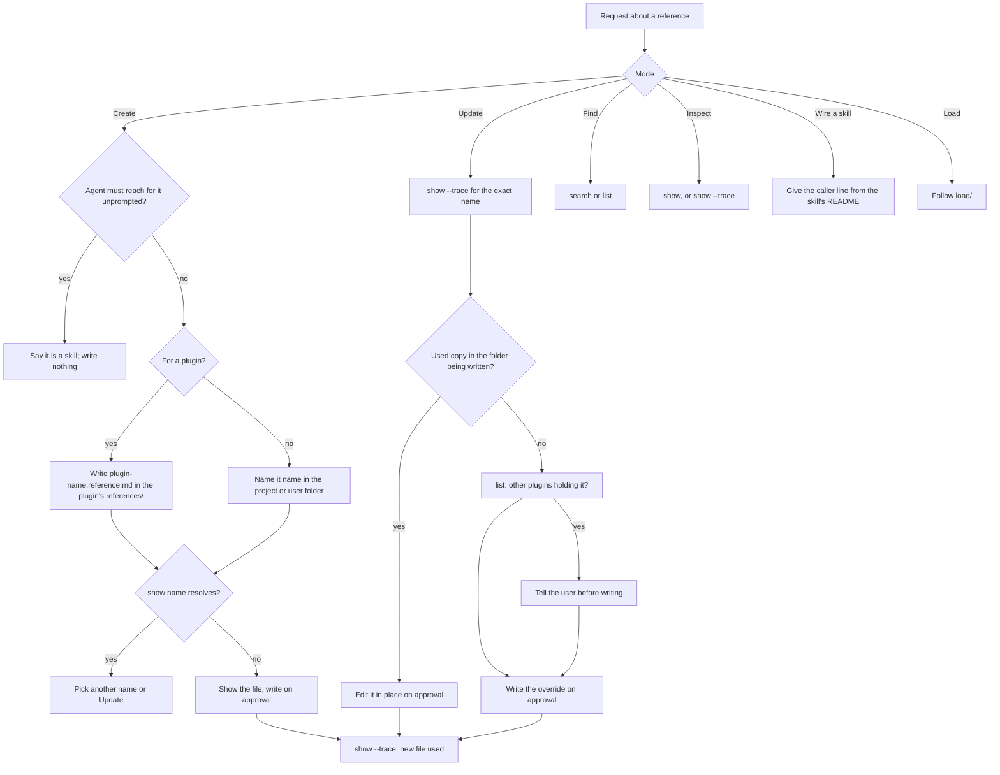

# reference

## What

`reference` is the one skill for everything done with a reference: a **skill** loading one, and a
**person** writing one, updating one (their own in place, or a plugin's by an override), finding one,
or learning why a name resolved to the copy it did. It is a routing skill. It picks one mode from the
request, runs the matching `reference` subcommand (`../../cli/references/`), and adds what the command
cannot do: it writes a document, which the read-only command never does, and it falls back to a
caller's own copy when loading. Load is specified in `load/`.

It exists because the naming rule a plugin must follow is written on the docs site and nowhere an agent
reads while working. A plugin that ships an unprefixed name lets a project override of that name replace
every plugin's copy silently. The skill carries the rule into the moment a reference is created.

One skill carries every mode, so the plugin costs one description at session start for references,
and a calling skill and a person name the same skill.

**Key terms**

- **mode** — one of Load, Create, Update, Find, Inspect, and Wire a skill.
- **prefixed name** — `<plugin name>.<reference>`, the form a plugin ships every reference under, in the
  file `<plugin name>.<reference>.md`.

**Non-goals**

- **Resolution.** Tiers, file names, merge modes and ambiguity are `../../cli/references/`'s. This skill
  never reads a tier folder to decide which copy answers.
- **Renaming shipped references.** A rename breaks every caller; the skill refuses it.
- **A write subcommand.** The command stays read-only; the skill writes the file itself.

## Use Cases

**Fit:** full

**Actors**

- **plugin author** — ships references with a plugin; needs the prefix rule when naming one.
- **repository owner** — writes project references and overrides plugin ones.
- **user** — keeps personal references in `~/.agents/references/`.
- **invoking agent** — routes the request, runs the command, writes only what is approved.

**Goals, and where each is served**

| Actor | Goal | Mode |
| --- | --- | --- |
| plugin author | ship a reference no project override silently replaces | Create, with the prefixed name |
| repository owner | write a reference the repository's agents read | Create |
| repository owner | change the repository's own reference | Update, in place |
| repository owner | change one plugin's reference for this repository | Update, by an override |
| user | find a reference for a topic | Find |
| user | learn why a name resolved to the copy it did | Inspect |
| plugin author | have a skill load a reference | Wire a skill, then Load when the skill runs |

**Entry point**

| Entry point | Trigger | Outcome |
| --- | --- | --- |
| the `reference` skill | a caller line naming it, or a request to write, update, find, or inspect a reference | one mode followed; the command's output reported; a file written only on approval |

**The command line.**

```sh
node <this skill's folder>/scripts/reference.mjs <subcommand> ... --root <repository root>
```

Outside Load, the skill follows the launcher rule in `../../cli/entry-point/`: a missing launcher
falls back to the pinned `npx` invocation, because a person asked for the work and no caller's copy
exists to fall back to. Load never does (`load/`).

**Extensions**

- **Create, for a plugin.** The file is `<plugin name>.<reference>.md`, in the plugin's `references/` folder.
- **Create, a name that already resolves.** Pick another name or switch to Update.
- **Create, something the agent must reach for unprompted.** It is a skill, not a reference; say so and
  write nothing.
- **Update, a copy in the folder being written.** Edit it in place; no override is written.
- **Update, a name another plugin also holds.** The override replaces every plugin's copy; the user
  is told before anything is written.
- **Update, an ambiguous name.** Ask which `<plugin>/<name>` is meant.
- **Find, nothing matches.** Say so; never guess a name.

## Control Flow



## Scenario map

| Edge | Path (Given) | Scenario |
| --- | --- | --- |
| A→B | a request to write a plugin reference | `activates on a request to create a reference` |
| D→E | a plugin author creating a reference | `prefixes a reference a plugin ships with the plugin's name` |
| D→F | a project reference | `writes a project reference unprefixed in .agents/references` |
| C→C1 | a request the agent must act on unprompted | `redirects to a skill when nothing would name the reference` |
| G→G1 | a name that already resolves | `does not create over a name that already resolves` |
| J→J1→J2 | the project's own reference | `updates the repository's own reference in place` |
| J→J1→K→K1 | an override of a name two plugins hold | `warns that an override replaces every plugin's copy` |
| B→M | a topic with no match | `says nothing matched rather than guessing a name` |
| B→N | a question about which copy answered | `explains a resolution from show --trace` |
| B→O | a skill author wanting to load a reference | `gives a skill author the caller line` |
| B→P | a caller line naming the skill | the scenarios in `load/load.feature` |
| H | any write | `writes nothing without approval` |

## Verification

The conduct scenarios are judged by `aced-impl-judge` on blind runs against the shipped `SKILL.md`.
The skill's structure — the launcher line, the routing table, the shipped create procedure, the prefix
rule — is checked by `src/skill-scripts/reference-skill.test.ts`, and the launcher by
`scripts/pack-check.ts`.

## References

- `../../cli/references/` owns the command this skill routes to.
- `load/` specifies Load mode.
- `../../cli/entry-point/` owns the launcher rule.
- PR #193 adds the naming rule to the docs site.
