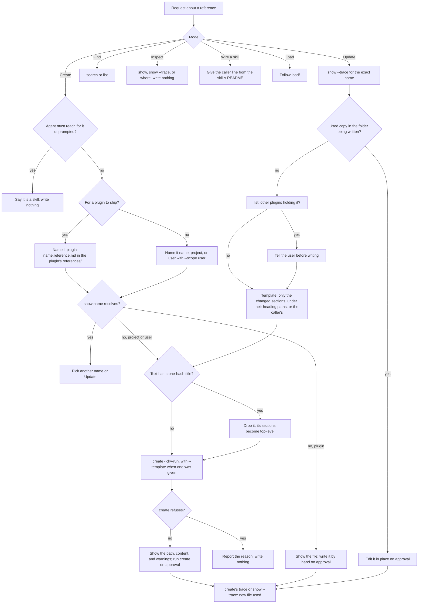

# reference

## What

`reference` is the one skill for everything done with a reference: a **skill** loading one, and a
**person** writing one, updating one (their own in place, or a plugin's by an override), finding one,
or learning why a name resolved to the copy it did. It is a routing skill. It picks one mode from the
request, runs the matching `reference` subcommand (`../../cli/references/`), and adds what the command
cannot do: it decides what a new reference is called, where it lives, and what it says, shows the
person the file before it exists, and falls back to a caller's own copy when loading. The file itself
is written by `reference create`, except a plugin's own shipped reference and an edit in place, which
the command never writes. Load is specified in `load/`.

It exists because the naming rule a plugin must follow is written on the docs site and nowhere an agent
reads while working. A plugin that ships an unprefixed name lets a project override of that name replace
every plugin's copy silently. The skill carries the rule into the moment a reference is created.

It also carries the shape rule. `merge-sections` matches sections by their full heading path, so a
reference with a `#` title holds every section under that one heading: an override that repeats the
title replaces the whole document, and one that leaves it out is appended as a duplicate. A reference
is written as top-level `##` sections with no `#` title.

One skill carries every mode, so the plugin costs one description at session start for references,
and a calling skill and a person name the same skill.

**Key terms**

- **mode** — one of Load, Create, Update, Find, Inspect, and Wire a skill.
- **prefixed name** — `<plugin name>.<reference>`, the form a plugin ships every reference under, in the
  file `<plugin name>.<reference>.md`.
- **dry run** — `reference create --dry-run`: the path and the exact content the command would write,
  with nothing written.
- **override** — a project or user copy of a name a lower layer already holds.

**Non-goals**

- **Resolution.** Tiers, file names, merge modes and ambiguity are `../../cli/references/`'s. This skill
  never reads a tier folder to decide which copy answers.
- **Placing and marking a new file.** The target path, the refusal of an existing file, and the
  `merge: merge-sections` marking of an override are `create`'s. The skill never writes a new project
  or user reference by hand.
- **Renaming shipped references.** A rename breaks every caller; the skill refuses it.

## Use Cases

**Fit:** full

**Actors**

- **plugin author** — ships references with a plugin; needs the prefix rule when naming one.
- **repository owner** — writes project references and overrides plugin ones.
- **user** — keeps personal references in `~/.agents/references/`.
- **calling plugin** — a skill in a plugin that hands Create or Update a template, such as its own
  shipped reference, to start a repository's copy from.
- **invoking agent** — routes the request, runs the command, writes only what is approved.
- **later reader** — an agent reading the merged reference; never invokes the skill, and is hurt by a
  `#` title that makes an override replace or duplicate the document.

**Goals, and where each is served**

| Actor | Goal | Mode |
| --- | --- | --- |
| plugin author | ship a reference no project override silently replaces | Create, with the prefixed name |
| repository owner | write a reference the repository's agents read | Create, through `create` |
| user | write a reference that follows them into every repository | Create, through `create --scope user` |
| repository owner | see the exact file before it is written | Create and Update, through `create --dry-run` |
| calling plugin | start a repository's copy from its own text | Create or Update, with `--template` |
| repository owner | change the repository's own reference | Update, in place |
| repository owner | change one plugin's reference for this repository | Update, by an override `create` starts |
| later reader | a merged reference with no replaced or duplicated document | Create and Update, top-level `##` sections and no `#` title |
| user | find a reference for a topic | Find |
| user | learn why a name resolved to the copy it did | Inspect |
| user | learn where the agent looks for a reference and where to put an override | Inspect, with `where` |
| plugin author | have a skill load a reference | Wire a skill, then Load when the skill runs |

**Entry point**

| Entry point | Trigger | Outcome |
| --- | --- | --- |
| the `reference` skill | a caller line naming it, or a request to write, update, find, or inspect a reference | one mode followed; the command's output reported; a file written only on approval |

**The command line.**

```sh
node <this skill's folder>/scripts/reference.mjs <subcommand> ... --root <repository root>
```

Outside Load, the skill follows the launcher rule in `../../cli/entry-point/`: a missing launcher
falls back to the pinned `npx` invocation, because a person asked for the work and no caller's copy
exists to fall back to. Load never does (`load/`).

**Writing a reference.** Create and Update write a new project or user file only through the command:

1. `create <name> --dry-run`, with `--scope user` for the user alone and `--template <path>` when a
   calling plugin or the person supplies one.
2. Show the person the path and the content from the dry run, with any warning it gave.
3. On approval, run the same command without `--dry-run`. Its output must report the new file `used`.

A reference is top-level `##` sections, no `#` title, and a `description` in its frontmatter. Other
frontmatter keys are allowed. `show --format json` returns them under `metadata`, merged key by key
across the layers used, the higher layer winning a key.

An override that `create` starts holds only the sections it changes, each under the heading path the
section has in the copy below. A section that repeats the copy below unchanged would stop that copy's
later changes from reaching the reader.

**Extensions**

- **Create, for a plugin.** The file is `<plugin name>.<reference>.md`, in the plugin's `references/`
  folder. `create` never writes into a plugin, so the skill writes this file itself, under the same
  shape rule.
- **Create, a name that already resolves.** Pick another name or switch to Update.
- **Create, something the agent must reach for unprompted.** It is a skill, not a reference; say so and
  write nothing.
- **Create or Update, text with a `#` title.** The title is dropped and the sections under it become
  top-level `##` sections before the dry run.
- **Create or Update, a warning from the dry run.** Reported to the person with the content, before
  approval.
- **Create or Update, `create` refuses.** Report its reason. Nothing is written by hand in its place;
  an existing target sends the person to Update.
- **Update, a copy in the folder being written.** Edit it in place; no override is written.
- **Update, no copy in the folder being written.** `create` starts the override from a template that
  holds only the changed sections, or from the calling plugin's template.
- **Update, a name another plugin also holds.** The override replaces every plugin's copy; the user
  is told before anything is written.
- **Update, an ambiguous name.** Ask which `<plugin>/<name>` is meant.
- **Find, nothing matches.** Say so; never guess a name.
- **Inspect with `where`, a name nothing holds.** Report the slots anyway; the user may be about to create it.

## Control Flow



## Scenario map

| Edge | Path (Given) | Scenario |
| --- | --- | --- |
| A→B | a request to write a plugin reference | `activates on a request to create a reference` |
| D→E | a plugin author creating a reference | `prefixes a reference a plugin ships with the plugin's name` |
| D→F | a project reference | `writes a project reference unprefixed in .agents/references` |
| D→F | a reference for the user alone | `creates a user reference with --scope user` |
| C→C1 | a request the agent must act on unprompted | `redirects to a skill when nothing would name the reference` |
| G→G1 | a name that already resolves | `does not create over a name that already resolves` |
| R→S | a new project reference | `shows the dry run before running create` |
| R | a calling plugin's template | `passes a calling plugin's template to create` |
| T→T1 | the person's text with a `#` title | `writes a new reference with no one-hash title` |
| S | a template with an extra frontmatter key | `keeps extra frontmatter keys and says where they come back` |
| R1→R2 | `create` refusing | `reports a refusal from create and writes nothing by hand` |
| J→J1→J2 | the project's own reference | `updates the repository's own reference in place` |
| J→J1→K→K1 | an override of a name two plugins hold | `warns that an override replaces every plugin's copy` |
| K→L→T | an override of one section of a plugin's reference | `starts an override with create, holding only the changed sections` |
| B→M | a topic with no match | `says nothing matched rather than guessing a name` |
| B→N | a question about which copy answered | `explains a resolution from show --trace` |
| B→N | a question about where to put an override | `reports where a copy can live without writing one` |
| B→O | a skill author wanting to load a reference | `gives a skill author the caller line` |
| H, S | any write | `writes nothing without approval` |
| I | the shipped `SKILL.md` | `validates a created reference's headings before reporting done` |

The B→P edge, Load, is covered by the scenarios in `load/load.feature`.

## Verification

The conduct scenarios are judged by `aced-impl-judge` on blind runs against the shipped `SKILL.md`.
The skill's structure — the launcher line, the routing table, the shipped create procedure, the prefix
rule, the `create` steps, and the Validate assertions — is checked by
`src/skill-scripts/reference-skill.test.ts`, and the launcher by `scripts/pack-check.ts`.

## References

- `../../cli/references/` owns the command this skill routes to, `create` included.
- `load/` specifies Load mode.
- `../../cli/entry-point/` owns the launcher rule.
- PR #193 adds the naming rule to the docs site.
