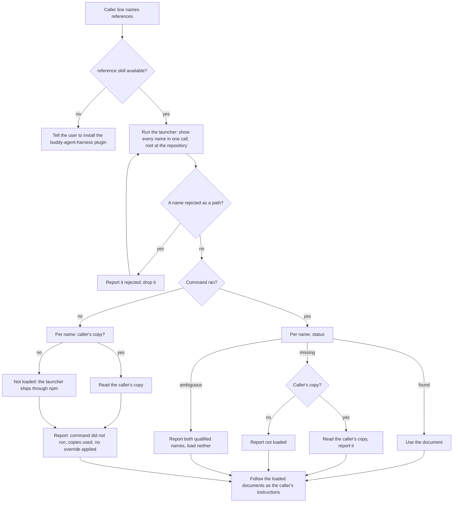

# reference — Load mode

## What

Load is the `reference` skill's mode for a **skill** loading a reference (`../README.md` routes to it).
It is the one way a skill loads one. A calling skill names the references it needs in one line of
prose; the agent loads the `reference` skill, which routes to Load, runs `reference show` from a
launcher bundled in its own folder, and hands the documents back to the caller. The procedure ships as
the skill's `references/load.md`.

Resolution belongs to the command (`../../../cli/references/`): which tier answers, how layers merge,
what is missing. This skill adds none of it. It adds three things the command cannot do from the
outside: it runs without `npx` or the network, it falls back to the caller's own copy of a reference
when the command cannot run or has no copy anywhere, and it tells the user what happened when a
reference could not be loaded.

The caller's line names the plugin as well as the skill:

> Load `skill-design` and `agent-tool-output` with the `reference` skill in the
> `buddy-agent-harness` plugin.

Naming the plugin is what lets an agent without this skill tell the user what to install. Only Claude
Code has plugin dependencies; on the other harnesses the line is the only thing that says so.

The canonical caller line ships in the skill folder's `README.md`, so a calling skill's author copies
it from the package rather than from memory.

**How each harness names the skill.** The caller line names the skill in words, which every harness
reads. The typed form differs: `/buddy-agent-harness:reference` in Claude Code, `/reference`
in Cursor, `$reference` in Codex, and no typed form in several others. The `README.md` carries a
table of these forms, one row per harness `@cyberuni/agent-harness` knows, generated from its
`skillInvocation` and regenerated by `pnpm skill:gen`, so the forms cannot drift from the facts. A
skill written for one harness may add that harness's form after the skill's name; the portable line
stays in words, because a form that leaves out the plugin lets two plugins' skills of one name collide.

The skill costs one description at session start, however many references its callers load, and that
description also serves the modes a person reaches for. A caller names the skill, so Load needs no
handle in it.

**Two departures from the issue.** The launcher is bundled into this skill's folder rather than run
from the plugin's `bin/` (`<skill dir>/../../bin/<cli>.mjs`), so the folder works when copied out alone,
as every other shipped launcher does; the `bin/` script also needs the uncommitted `dist/`, so neither
form exists in a plugin installed from git. And the caller's copy answers a name the command reports
missing as well as a command that cannot run: a caller's default copy is the bottom of its own lookup,
and no tier reads a caller's folder.

**A rejected name is settled before the command counts as run.** The command rejects the whole call
for one bad name, so that output accounts for no other name; the rejection is handled first and the
command re-run, and only that run is tested for whether the command ran.

**One deliberate exception to the launcher rule.** `../../../cli/entry-point/` has a shipped skill fall
back to a pinned `npx` invocation when its launcher is missing. The skill's other modes do; Load does not: the proposal
requires no package runner and no network, so a missing launcher falls back to the caller's copies
instead, and the user is told why.

**Key terms**

- **caller** — the skill whose instructions name the references to load.
- **caller's copy** — a reference the caller ships in its own folder: `references/<name>.md`, or the
  legacy `references/governances/<name>.md`.
- **launcher** — `scripts/reference.mjs` in this skill's folder: the package's `reference` command
  bundled into one file, with every dependency inlined.
- **caller line** — the one sentence in a caller that names the references, this skill, and this
  plugin.

**Non-goals**

- **Resolution.** Tiers, file names, merge modes and ambiguity are `../../../cli/references/`'s. This
  skill never reads a tier folder itself.
- **Callers outside a skill.** A person or an agent working outside a skill runs `reference show`
  directly.
- **Harness detection.** The command detects the harness and reads its managed and enabled-plugin
  layers (`../../../cli/references/`); the skill passes nothing about it.
- **Recording each load.** No load is recorded yet. When recording lands in `reference show`, the
  fallback stays the one load it cannot see.
- **The `universal-plugin` governance copy step** that writes callers' copies. A separate change.
- **The caller's copy as a layer.** It is a fallback, not a tier: a project override of a name the
  command finds answers alone, whatever its merge mode, and the caller's copy is not merged beneath
  it. A caller from a plugin that is neither a declared npm dependency nor enabled in the harness is
  therefore served its own copy only when no tier holds the name.
- **Migrating callers.** No skill in this package loads a reference yet; each caller adopts the line
  in its own change.

## Use Cases

**Fit:** partial

Nothing matches Load to a situation: a caller names the skill. The suite therefore asserts conduct
after it is loaded and carries no activation scenario; the skill's activation is graded in
`../reference.feature`. The one situation graded before the skill loads is the caller line read
where the skill is not installed, because that is the only moment the plugin name does its work.

**Actors**

- **calling skill's author** — writes the caller line and, optionally, ships copies of the references
  the skill needs; wants one line to maintain and no resolution logic of their own.
- **invoking agent** — reads the caller line, loads this skill, runs the launcher, and follows what it
  returns as part of the caller's instructions.
- **user** — installs plugins and reads what the agent reports; affected when a reference could not
  be loaded, and the only one who can install what is missing.
- **repository owner** — overrides a reference in the project tier and expects every skill loading it
  to see the override; affected without invoking anything.

**Goals, and where each is served**

| Actor | Goal | Entry point |
| --- | --- | --- |
| calling skill's author | load several references with one line and no lookup logic | the caller line |
| calling skill's author | still work where the command cannot run | the caller's copy |
| invoking agent | get every document the caller named, in the order named | the launcher run |
| user | learn what to install when a reference cannot be loaded | the caller line naming the plugin; the report |
| user | know when a reference came from a fallback rather than the command | the report |
| repository owner | an override in `.agents/references/` reaches every caller | the launcher run with `--root` at the repository |

**Entry points**

| Entry point | Trigger | Inputs | Outcome |
| --- | --- | --- | --- |
| the `reference` skill, Load mode | a caller line names it | the names, the caller's folder, the repository root | each document loaded in order; every name not loaded reported with why |
| the caller line, where the skill is absent | an agent reads a caller line and has no such skill | the plugin name in the line | the user is told which plugin to install |

**Surface.** The skill takes names and nothing else. The root is the repository the agent is working
in; the caller's folder is the folder of the skill whose line named the references. Neither is an
option a caller writes: both are facts the agent already has.

**The command line.**

```sh
node <this skill's folder>/scripts/reference.mjs show <name>... --root <repository root>
```

Default text output: one name prints the document; several print each wrapped in
`<reference name="…" tier="…">`, and a missing or ambiguous one as `<reference name="…"
status="missing|ambiguous" />` in its place. Every missing or ambiguous name also gets an `error:`
line on stderr naming it. Exit 0 when every name resolved, 1 otherwise.

**The command ran** when every name asked for is accounted for in that output: a document, a
`status=` marker, or an `error:` line naming it; a single name that resolved prints a bare document and
exits 0. Anything else — the launcher missing, `node`
missing, a stack trace, a module that cannot be found — means it did not run.

**Extensions**

- **A name the command reports missing.** Read the caller's copy of it if the caller has one;
  otherwise report it as not loaded. The names that resolved are still used.
- **A name the command reports ambiguous.** Two plugins ship it. Report both qualified names and load
  neither, and do not fall back to the caller's copy: the ambiguity is a fact about the installed
  plugins that the user must settle.
- **The command did not run.** Read the caller's copy of every name. Report that the command did not
  run and why, and that these references came from the caller's copies, so no override applied.
- **The command did not run and the caller has no copy of a name.** Report it as not loaded, and say
  that the launcher ships through the npm package: a plugin installed from git has none.
- **The caller line is read where this skill is not installed.** Tell the user to install the
  `buddy-agent-harness` plugin, naming it.
- **A name that is a path.** The command rejects the whole call and reads nothing, with an `error:`
  line naming it. The name is **rejected**: report it, never read the path, and look for no copy of
  it. Run the command again without it; the other names are resolved by that run. If no name remains, it is not run again.
- **Every name came from the command.** The report says nothing about the load.

## Control Flow



## Scenario map

### loading

| Edge | Path (Given) | Scenario |
| --- | --- | --- |
| B→D | one name the project tier holds | `loads a reference by running the launcher bundled in the skill folder` |
| D | several names | `loads several references in one run, in the order named` |
| D | a project override of a plugin reference | `passes the repository as the root so a project override applies` |
| D | any run | `never reaches the network or a package runner` |
| D→J→K | the command answered | `reads no tier folder itself` |
| K→P | two documents loaded | `follows the loaded documents as the caller's instructions` |
| K→P | every name found | `says nothing about the load when every name came from the command` |
| D1→D2→D | a name that is a path | `drops a name rejected as a path and loads the rest` |

### missing and ambiguous

| Edge | Path (Given) | Scenario |
| --- | --- | --- |
| J→L→M | a missing name the caller ships | `reads the caller's copy of a name the command reports missing` |
| L→M | a missing name the caller ships in both places | `prefers the caller's references folder over its legacy governances folder` |
| J→L→N | a missing name with no copy | `reports a name missing everywhere and still uses the rest` |
| J→O | an ambiguous name | `reports an ambiguous name with both plugins and loads neither` |

### the command does not run

| Edge | Path (Given) | Scenario |
| --- | --- | --- |
| E→F→G | the launcher absent, the caller shipping copies | `reads the caller's copies when the command cannot run` |
| G→I | the launcher absent | `says the command did not run and that no override applied` |
| F→H | the launcher absent, no copy | `reports a name with no copy as not loaded when the command cannot run` |

### the caller line

| Edge | Path (Given) | Scenario |
| --- | --- | --- |
| — | the shipped caller line | `ships a caller line naming the skill and the plugin` |
| — | the shipped `README.md` | `lists how each harness names the skill, generated from agent-harness` |
| B→C | the shipped line, the skill not installed | `tells the user which plugin to install when the skill is missing` |

### shipping

| Edge | Path (Given) | Scenario |
| --- | --- | --- |
| D | the packed package | `ships the launcher in the skill folder and runs it with no node_modules` |
| — | `references/load.md` | `carries a Validate section checking the four report-and-read rules` |

## Verification

The loading, missing and fallback scenarios are conduct: judged by `aced-impl-judge` on blind runs
against the shipped `SKILL.md` and `references/load.md`. `tells the user which plugin to install` is judged on a blind run whose
caller carries the line shipped in the skill folder's `README.md`, with no `reference` skill
installed. The shipping and static scenarios are checked by the package's tests:
`scripts/pack-check.ts` for the launcher, a test reading the skill folder's `references/load.md` and
`README.md`, and `pnpm skill:gen:check` for the generated table.

## References

- `../../../cli/references/` owns the `show` contract this skill runs.
- `../../../cli/entry-point/` owns the launcher rule every shipped skill script follows.
- Issue #154 is the source proposal; #152 the epic; #153 the command.
