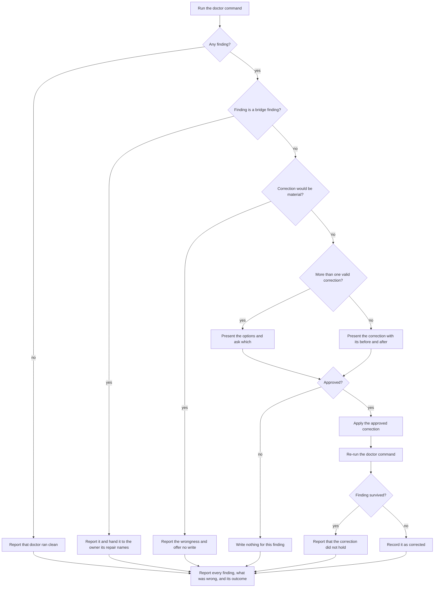

# repair

## What

`repair` corrects agent configuration a repository **already has** that is **wrong or outdated**. It does not look for that configuration itself: `doctor` reports what is wrong, and `repair` acts on the report.

The three other shipped skills each refuse this work by design. `init` consolidates what a repository has and invents nothing, so it never clobbers a file the user wrote. `enhance` offers guidance the repository is **missing**. `doctor` never writes, which is what makes it safe to run from a session-start hook. Configuration that is present but wrong therefore has no home: not missing, so `enhance` will not offer it; user-authored, so `init` will not rewrite it.

**Detection has one home** — `../../workflows/detect-and-repair/` owns that property and the reasoning behind it. What it means here: every check lives in the `doctor` command, and this skill adds none.

The contract between them is stated once, at `../../workflows/detect-and-repair/`, which owns the seam rather than either side of it. What it binds on this node: `repair` routes on the `problem` name and on the skill the repair names — never on `detail`, whose wording must stay free to improve.

Everything else it needs — the file's current text, the before-and-after it shows, whether more than one correction is valid — it derives by reading the named path and consulting `references/classes.md`. `doctor` never enumerates correction options, so no scenario here may assume it did.

`repair` acts only where correctness is the **tooling's** to decide — a harness name the registry retired, an instruction file that does not reach `AGENTS.md`, a skill a harness will not load. It never corrects what the repository **means**. The line is the discriminator `init` already applies (`../../../../skills/init/references/agents-md.md`): a statement that would stop being true if the tool's output were removed describes the tool's own artifact and is **non-material**. `repair` corrects non-material configuration and reports material wrongness without offering to write it.

Every correction is **offered with its before and after, and written only on approval** — the same shape `enhance` uses, for the same reason: the file belongs to the user.

**Non-goals**

- **Detecting.** Not this node's. A check written here would be a second home for one already in the command.
- **Any bridge, of either kind.** Every bridge finding is handed on, whoever owns it. Most are `init`'s: `init` writes the `AGENTS.md` import and the Gemini `context.fileName` entry itself, and writes the `CLAUDE.md` stub *without* asking, where every correction here needs approval — one write cannot have two homes and two contradictory approval rules. A few name no owner at all and are work for a person; those are handed on too, and named as needing a hand rather than a skill.
- **Adding what is absent.** A repository with no canonical configuration is `init`'s; guidance the repository lacks is `enhance`'s.
- **Correcting project policy.** `repair` never rewrites a statement about how the repository is worked in, even a false one.
- **Deciding activation.** Which of the four skills a request routes to is co-owned — the `description` prose this node holds, the harness that matches it, and the sibling descriptions it competes with. That is not this node's to freeze. What this node owns is its **remit**: what it does with a finding `doctor` handed it.

**Key terms**

- **canonical configuration** — the root `AGENTS.md` and the `.agents/` tree; the one source every harness is pointed at.
- **bridge** — what a harness that cannot read `.agents/` is given instead: a skills projection (`.claude/skills`) or an instruction bridge (`CLAUDE.md`, `.gemini/settings.json`).
- **bridge finding** — a `doctor` finding about a bridge, whether it has stopped resolving or was never completed. **Never repaired here.** Its owner is whatever its repair names — usually `init`, sometimes nobody; see `../../workflows/detect-and-repair/`.
- **configuration finding** — a `doctor` finding that configuration around the bridges is present and wrong. Repaired here.
- **material** — content that stays true whether or not this tool ever ran. Material content is the user's; `repair` reports it and writes none of it.

## Use Cases

**Fit:** partial

`repair` is judged on conduct, not on activation. Its routing against `init`, `enhance`, and `doctor` is co-owned across a seam this node holds one side of (see Non-goals), so the suite asserts no firing and carries no near-miss — under the partial tier their absence is the correct shape, not a gap. What is graded is the family guard, the material discriminator, and the approval rule, all of which the node owns outright.

**Actors**

- **invoking agent** — runs the skill, runs `doctor`, composes each offer, and applies what was approved.
- **repository owner** — approves or declines each correction; the only actor whose consent changes a tracked file.
- **downstream agent** — every later session that loads the repository's configuration. Affected by the outcome without ever invoking the skill, and the reason the findings are worth correcting: a git-ignored bridge swallows edits silently, and the session that suffers it is not the session that ran the skill.

A **diff reviewer** — someone reading the resulting change without having run the skill — was considered and deliberately left off. Their need is real: they want each correction's reason legible from the change alone. But this skill's only durable output is the corrected files themselves, and a one-line `.gitignore` edit carries no room for its own justification. Serving that actor would mean inventing an artifact (a written report, a commit-message contract) that no other actor needs, and commit hygiene is not this node's to specify. The need is real and unserved; it is recorded here rather than half-served by a goal the run report cannot meet.

**Goals, and where each is served**

| Actor | Goal | Entry point |
| --- | --- | --- |
| invoking agent | leave the repository's configuration doing what it was written to do | `/buddy-agent-harness:repair` |
| repository owner | nothing lands that I did not see and approve | the approval on each offer |
| downstream agent | the configuration I load is the configuration the repository meant | the outcome of a run |

**Entry point**

| Entry point | Trigger | Inputs | Outcome |
| --- | --- | --- | --- |
| `/buddy-agent-harness:repair` | an agent is asked to correct agent configuration that is wrong or outdated | the repository root, and the `doctor` report read from it | approved corrections applied; every finding reported with its path, what was wrong, and its outcome |

**Surface**

The skill exposes **no options**. Every write is approval-gated and the repository is the working directory, so no use case needs a flag; a flag that skipped approval would contradict the skill's one rule. Nothing on the surface is therefore unaccounted for.

**Extensions**

- **`doctor` reports nothing wrong.** Say so and stop.
- **The finding is a bridge finding**, of either kind. Out of remit. Report it and hand it to `init`.
- **The correction would invent material content.** A skill with no `description` cannot be given one without asserting what it does. Report it and ask.
- **More than one valid correction.** Present the options from `references/classes.md`; the choice is the owner's.
- **The correction is declined.** Write nothing for that finding; keep going with the rest.
- **The correction does not hold on the re-run.** Report that it did not hold rather than claiming it landed.

## Control Flow

Detection is the command's, so a run holds no state of its own and there is no first-run path. The graph from `D` down runs once per finding, so one run can hand one finding to `init`, report a second, and apply a third.

## Scenario map

### `/buddy-agent-harness:repair`

| Edge | Path (Given) | Scenario |
| --- | --- | --- |
| A | any | `runs the doctor command rather than detecting anything itself` |
| B→C | doctor reports zero problems | `reports that doctor ran clean and stops` |
| D→E | doctor reports a degraded bridge | `hands a bridge finding to init and writes nothing` |
| D→E | doctor reports a diverged bridge on both sides | `hands a two-sided divergence on without picking a side` |
| D→E | doctor reports an instruction bridge that names AGENTS.md nowhere | `hands an unbridged instruction file to init rather than adding the import` |
| F→G | doctor reports an unloadable-skill finding with no description to quote | `reports a missing description rather than inventing one` |
| H→I | doctor reports an unread-local-override finding | `presents the options and leaves the choice to the owner` |

| H→J | doctor reports an ignored-bridge finding | `presents the correction with its before and after` |
| K→L | a correction has been presented | `writes nothing when the correction is declined` |
| K→M | a correction has been presented | `applies the approved correction and leaves the rest of the file unchanged` |
| K→M | two corrections are presented and only one is approved | `applies only the approved correction when several are offered` |
| K→M | the approved correction removes a path rather than editing a file | `deletes a projection rather than editing a file` |
| K→M | the approved correction quotes a value inside a file | `quotes a description that breaks its own frontmatter` |
| N | an approved correction has been applied | `re-runs doctor after applying a correction` |
| O→P | the re-run still reports the finding | `reports that a correction did not hold rather than claiming it landed` |
| O→Q | the re-run no longer reports the finding | `records a correction as corrected once the re-run is clean` |
| →R | any | `reports every finding with its path and its outcome` |
| barred | any | `offers no way to apply a correction without approval` |
| barred | a finding names a retired harness that also appears in a workflow file | `corrects no file outside the repository's agent configuration` |

## References

- `../../../../skills/init/references/frontmatter.md` backs the `unloadable-skill` corrections: of the frontmatter problems a harness can meet, only unparseable YAML and a missing `description` make it skip the skill, which is why a mismatched `name` is neither reported nor corrected.
