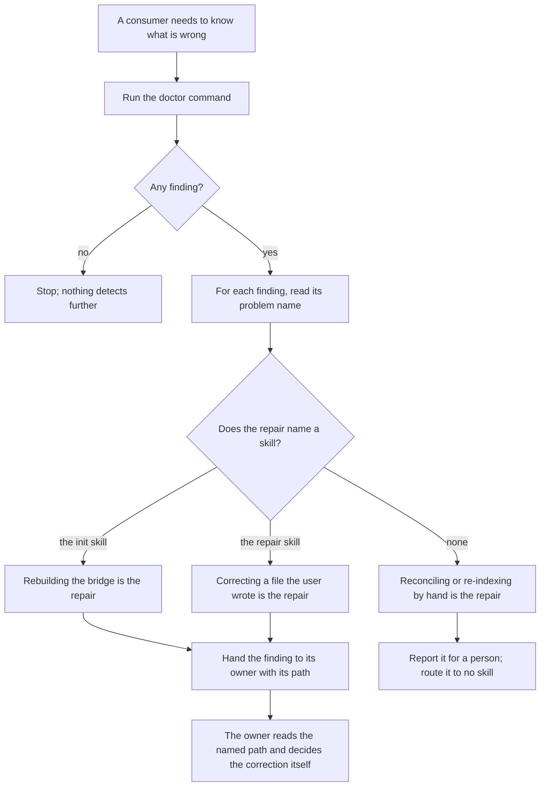

# detect-and-repair

## What

The contract between the surface that **finds** wrong agent configuration and the surfaces that **correct** it.

`doctor` is a read-only CLI command. `init` and `repair` are skills that write. Neither half works alone: a detector that cannot hand its findings on is a report nobody acts on, and a repairer that detects for itself is a second detector free to drift from the first. What makes the pair work is the narrow thing passed between them, and until now that was written as a paragraph inside one of the two nodes — which is the wrong home the moment a second cross-surface flow appears.

This node owns **the seam and nothing else**. What each finding means is the detecting node's (`../../cli/bridge-resolution/`, `../../cli/instruction-bridges/`, `../../cli/configuration-diagnosis/`, `../../cli/mcp-diagnosis/`). What a repairing skill does once it holds a finding is that skill's (`../../skills/repair/`). What lives here is what crosses: the fields a consumer may rely on, which surface owns each repair, and the properties that keep the split honest.

**Detection has exactly one home.** Every check lives in the `doctor` command. That is what lets the finding set grow without touching a skill, and it is why `doctor` refuses to carry repairs: the moment it writes, it stops being safe to run from a session-start hook, and the hook is the only thing that notices a broken bridge before a person does.

**Repair has an owner per finding where one exists, and the finding names it.** Two families are uniform: every instruction-bridge finding repairs through **`init`**, which writes those bridges in the first place, and every configuration finding repairs through **`repair`**, because no `init` flag corrects a file the user already wrote. The MCP family is uniform the other way — none of its ten problems names a skill, because correcting a drifted server set is the user's judgment about which side is right.

The bridge-resolution family is **not** uniform, and that is a property of the seam rather than an oversight. Six of its nine problems repair by rebuilding the bridge, and name `init`. Three name **no skill at all**:

- `diverged-both` and `diverged-unknown` — rebuilding would discard whichever side holds the newer edit, and which side that is cannot be decided from the filesystem. The repair is a reconciliation by hand, and handing it to a skill that rebuilds is the one thing that must not happen.
- `unpinned-copy` — the bridge resolves. What is wrong is the **git index**, not the bridge, and the repair is a `git update-index` invocation that no skill owns.

So a consumer's question is not "which of the two skills?" but "does this finding name a skill, and which?" — a finding that names none is work for a person, not work to route. Across all twenty-seven problems the shipped skill's rendering names `init` for ten, `repair` for four, and nobody for thirteen.

**Key terms**

- **finding** — one reported fault, carrying a `problem` name, a `path`, a `detail` in prose, and a repair.
- **detecting surface** — the `doctor` command. The only place a check lives.
- **repairing surface** — the `init` skill or the `repair` skill. The only places a write happens.
- **family** — which detecting node a `problem` belongs to. Some families are uniform in their owner and some are not, and a family says nothing else about the finding.
- **routable field** — a field a consumer may branch on. There is exactly one: `problem`. `path` is an input to the repair rather than something to branch on, and `detail` is prose.

**Non-goals**

- **Adding a check.** A check belongs to a detecting node. Nothing here decides what is wrong.
- **Deciding how a correction is made.** The offer, the approval, the before-and-after: all `../../skills/repair/`.
- **The report's encoding.** Which sections exist, what a row holds, how it is formatted: `../../cli/diagnosis-report/`. This node states which of those fields may be **routed on**, which is a different claim from which fields exist.
- **Enumerating corrections.** `doctor` states one repair per problem and never a set to choose between. Where more than one correction is valid, the options are the repairing surface's own — derived by reading the named path and its reference material — so no scenario here may assume the report supplied them.
- **Activation.** Which skill a user's request reaches is co-owned across four skill descriptions and is not this node's.

## Use Cases

**Actors**

- **`doctor` skill** — reads the report and routes each finding to the skill that owns it. The consumer this contract is written for.
- **`repair` skill** — acts on the findings it owns and hands on the ones it does not.
- **`init` skill** — owns every instruction repair, and every bridge repair that rebuilding fixes.
- **person at a shell** — the consumer who routes by reading rather than by parsing, and for whom the repair must still be an instruction they can follow.
- **session-start hook** — never routes anything, and is the reason the detecting surface must stay read-only.

**Goals, and where each is served**

| Actor | Goal | Entry point |
| --- | --- | --- |
| `doctor` skill | send every finding to the surface that repairs it, or to a person where none does | the `problem` name |
| `repair` skill | tell a finding it owns from one it must hand on, without inspecting the repository | the `problem` name |
| `init` skill | receive the findings rebuilding repairs, and no other | the repair each finding carries |
| person at a shell | know what to do about a fault without running anything else | the repair each finding carries |
| session-start hook | run the detecting surface with no risk of a write | `buddy-agent-harness doctor` |

**Entry point**

| Entry point | Trigger | Inputs | Outcome |
| --- | --- | --- | --- |
| `buddy-agent-harness doctor`, read by a repairing skill | a skill is asked to correct configuration and needs to know what is wrong | the repository root | every fault reported once, each carrying the repair that resolves it |

**Surface**

The contract is **four things per finding**, and a consumer may rely on no others: `problem`, `path`, `detail`, and the repair. Three of them are on the finding row; the repair is lifted into `help`, so a consumer reading a row alone will not find one there. Of the four, `problem` is **routable**; `path` is an input to the repair; `detail` is **prose for a reader** and must never be branched on, because its wording stays free to improve and a consumer matching against it breaks the moment it does. Where each lives is `../../cli/diagnosis-report/`'s; that a consumer may rely on these and nothing else is this node's.

Every problem the command can report has exactly one repair, and every finding carries it. The two may not be separated: a fault reported without its repair asks a consumer to invent one, which is how a second, drifting classifier gets written.

That one repair is **rendered twice**, for the two consumers, and the renderings disagree about who acts. The **command** rendering is what `doctor` prints into `help`; the **skill** rendering is what the shipped `doctor` skill states. Both come from one table entry, so they cannot disagree about which problem they repair.

Where they part is the bridge family. The skill rendering sends every bridge problem a rebuild fixes to `/buddy-agent-harness:init`, because a skill must not run `init` itself. The command rendering gives those same problems a **runnable `command`** and names no skill at all, because a caller reading the command's output can simply run it. Neither is wrong; they answer different questions for different readers.

So **an owner is not something a consumer can always read off the report.** In `help`, the instruction names a skill for the eight problems in the instruction and configuration families and for none of the nineteen bridge and MCP problems. Route on `problem`, which every finding carries, rather than on a skill name in `help`.

**Extensions**

- **A new problem is added to a detecting node.** It joins the table with its own repair, and reaches both consumers without either being edited. That is the property the split exists for.
- **A whole new family is added.** The same, at a larger scale — and the families must still partition the table. A consumer that derives one family by excluding the others silently absorbs the new one and asserts the wrong owner for every problem in it, which is why the partition is asserted rather than assumed.
- **A finding names no skill.** Both consumers report it and route it nowhere. Inventing an owner for it is the failure mode the explicit naming exists to prevent: for `diverged-both`, the invented owner would be `init`, and rebuilding is precisely what destroys the work.
- **The detecting surface reports nothing.** The flow ends there. No repairing surface looks for anything itself.
- **A finding's repair is a matter of judgment rather than an invocation.** It is still stated in full, and the report says so in the data: the repair's runnable half is empty, which a consumer checks without reading a word of the prose. How that is carried is `../../cli/diagnosis-report/`'s.
- **A repair is applied and the finding survives the re-run.** The re-run is the proof, and its outcome is reported rather than assumed; the loop belongs to `../../skills/repair/`.

## Control Flow

Routing reads the `problem` name only. Nothing on this path reads `detail`, and nothing on it writes.

## Scenario map

### `buddy-agent-harness doctor`, read by a repairing skill

| Edge | Path (Given) | Scenario |
| --- | --- | --- |
| B | the set of problems the command can report | `has one repair for every problem it can report` |
| B | both renderings of one problem's repair | `renders every repair twice, and the two disagree about who acts` |
| B | a repository holding a fault from more than one family | `carries a repair with every finding it reports` |
| E | any reported fault | `keeps the routable name out of the prose detail` |
| F→G | a bridge-resolution problem repairable by rebuilding | `sends a bridge finding to the init skill wherever rebuilding is the repair` |
| F→G | an instruction-bridge problem | `sends every instruction finding to the init skill` |
| F→H | a configuration fault | `sends every configuration finding to the repair skill` |
| F→I | `diverged-both`, `diverged-unknown`, `unpinned-copy` | `names no skill for a finding that rebuilding would not repair` |
| F→I | an MCP problem | `names no skill for any MCP finding, in either rendering` |
| F | the families the report routes by | `accounts for every problem in exactly one family` |
| J | a repair the `init` command would satisfy | `never tells the skill to run the init command` |
| J | a repair naming the binary the command invokes for its own output | `never points the skill at a bare binary invocation` |
| L | any | `states exactly one repair per problem, never a set to choose between` |
| barred | any | `writes nothing while detecting, whatever it finds` |

## References

- `../../../../src/diagnose-bridges/doctor-guidance.ts` is the single table both surfaces are generated from: the command's `detail` and repair, and the shipped `doctor` skill's guidance, come from one source, so the report and the skill that reads it cannot drift.
- `../../skills/repair/` holds the other side of this seam — what a repairing skill does once it has a finding.
